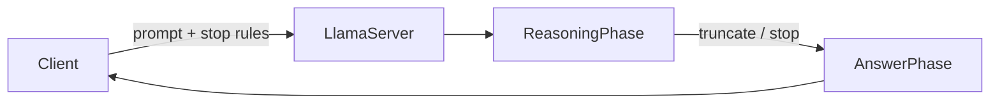

*[Photo by Tyler on Unsplash](https://unsplash.com/@tylergm?utm_source=blogmaker&utm_medium=referral)*

요 며칠 r/LocalLLaMA 를 훑다가 llama-server — 로컬에서 LLM 을 띄울 때 사실상 표준 비슷하게 굳어진 그 추론 서버 — 관련 글 세 개가 같은 결을 가지고 올라온 게 눈에 띄었어. 셋 다 따로 보면 다른 얘긴데, 묶어 보니 결국 한 가지로 모이더라고. "기능은 빠르게 늘어나는데, 그 안쪽을 어떻게 손대야 할지에 대한 합의는 아직 없다" 는 점.

첫 번째는 커스텀 샘플러를 플러그인처럼 끼울 수 있게 해 달라는 제안이었어. 샘플러(sampler) 라는 게 좀 낯설 수 있는데, 모델이 다음 토큰 후보들 중 하나를 뽑을 때 쓰는 규칙 — top-p, temperature, min-p 같은 것들 — 정도로 보면 돼. 새로운 샘플러 아이디어가 나올 때마다 llama.cpp 본체에 PR 을 넣거나 통째로 포크를 떠야 했는데, 그게 너무 무겁다는 거지. 작성자가 Qwen3 로 프로토타입까지 만들어 올렸더라. 솔직히 나도 한두 번 비슷한 충동을 느낀 적이 있어서 공감이 갔어.

*[Photo by Faraaz Zuberi on Unsplash](https://unsplash.com/@ffz_20?utm_source=blogmaker&utm_medium=referral)*

두 번째는 Nemotron 3 nano Omni 의 오디오 입력이 llama-server 에선 안 먹는다는 보고. Omni 모델 — 텍스트·이미지·오디오까지 같이 받는 멀티모달 — 이 점점 늘어나는데, 서버 쪽 입력 파이프가 거기 못 따라가는 그림이지. 이미지는 받는데 오디오만 거부한다는 게 묘하더라. mmproj(멀티모달 프로젝터) 까지 다 로드했는데도 그렇다니까, 단순한 사용자 실수보단 서버 쪽에서 오디오 modality 를 아직 정식으로 안 받아 주는 쪽일 가능성이 커 보였어. 이런 미세한 어긋남은 모델이 빠르게 나올수록 더 자주 일어나기 마련이고.

*[Photo by Aidan Tottori on Unsplash](https://unsplash.com/@atoto_photo?utm_source=blogmaker&utm_medium=referral)*

세 번째가 개인적으론 제일 재밌었어. Qwen 35B A3B — 35B 파라미터에 active 3B 인 MoE — 를 reasoning budget=-1, 그러니까 사고 토큰 무제한으로 띄워 놓고 쓰면 모델이 끝없이 혼잣말을 한다는 거. 근데 Pi 라는 코딩 에이전트로 같은 모델을 호출하면 짧게 끊고 답을 내놓더래. 어떻게 가능한 거냐는 질문이었지.

내 생각엔 budget 설정 한 단계로 끝낼 수 있는 문제는 아닐 것 같아. 추측인데, Pi 쪽이 시스템 프롬프트에서 "thinking 은 N 줄 안에" 같은 제약을 박아 두거나, `<think>` 토큰 스트림을 도중에 잘라내고 강제로 답변 페이즈로 넘기는 식의 후처리를 끼워 넣지 않았을까. 아니면 stop sequence 를 thinking 종료 토큰에 걸어 두는 방법도 있고. 정확한 건 Pi 코드를 까 보기 전엔 모를 일이고.

세 글을 묶어 보면, 로컬 추론 서버가 빠르게 production 가까운 위치로 올라간 만큼 — 샘플러 확장성, 새 modality 지원, reasoning 토큰 제어 — 각각이 다음 단계에서 풀려야 할 숙제로 떠오른 셈이지. 어느 쪽이 먼저 정리될진 좀 더 봐야 알겠고, 나도 이번 주말에 reasoning stop 쪽은 한 번 직접 만져 볼 생각이야.

***

**참고**

- [Extension idea: llama-server with custom samplers](https://www.reddit.com/r/LocalLLaMA/comments/1tewitj/extension_idea_llamaserver_with_custom_samplers/)
- [Audio input not accepted with llamacpp for Nemotron 3 nano Omni ?](https://www.reddit.com/r/LocalLLaMA/comments/1tetf8d/audio_input_not_accepted_with_llamacpp_for/)
- [How does Pi coding agent control Qwen's thinking verbosity? (Qwen 35B A3B, llama-server)](https://www.reddit.com/r/LocalLLaMA/comments/1tfh1wf/how_does_pi_coding_agent_control_qwens_thinking/)