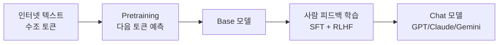

---
categories:
- llm
category_ko: llm
date: '2026-05-17T21:35:18+09:00'
description: AI 카테고리 'llm' 의 intro 수준 핵심 토픽 정리. 독자가 처음 접해도 따라올 수 있게 비유·예시·필요 시 다이어그램·코드
  스니펫 포함.
image:
  alt: LLM이란 무엇인가 한눈에 보기
  path: https://haangman.github.io/J-Blog-AI/assets/img/2026/05/llm이란-무엇인가-한눈에-보기-b1fb2b.jpg
layout: post
mermaid: true
slug: llm이란-무엇인가-한눈에-보기-b1fb2b
summary: AI 카테고리 'llm' 의 intro 수준 핵심 토픽 정리. 독자가 처음 접해도 따라올 수 있게 비유·예시·필요 시 다이어그램·코드
  스니펫 포함.
tags:
- llm
title: LLM이란 무엇인가 한눈에 보기
---

요즘 회사 들어온 신입한테 "LLM 이 뭐예요?" 라는 질문을 받았다. 평소엔 그냥 "GPT 같은 거" 라고 넘어가는데, 막상 한 줄로 설명하려니 좀 답답하더라. 그래서 내가 머릿속에 정리해둔 그림을 글로 한 번 풀어본다.

LLM 은 Large Language Model 의 약자. 그대로 옮기면 "큰 언어 모델". 근데 이 "큰"이 진짜로 크다. 우리가 흔히 들어본 GPT-4 나 Claude, Gemini 같은 모델이 다 여기 들어가는데, 매개변수(parameter, 모델이 학습하면서 조정하는 숫자들)가 수천억 개 단위.

이게 어떻게 일하는지 비유하자면, 엄청 많이 읽은 사람이 있는데 단어 하나하나 외워서 **다음에 올 단어를 확률적으로 찍는 게임**을 잘하는 거다. "오늘 날씨가" 다음에 "맑다" 가 올 확률이 높다는 걸 어마어마한 텍스트로부터 통계적으로 익혀놨다고 보면 된다. 그래서 사실은 LLM 이 뭘 "이해" 하는 게 아니라, "다음 토큰 예측" 을 정말 잘하는 기계라고 보는 쪽이 더 정확하다.

*[Photo by Amari James on Unsplash](https://unsplash.com/@greaterbythehour2020?utm_source=blogmaker&utm_medium=referral)*

근데 그게 어떻게 우리 질문에 답해주는 형태가 됐냐. 핵심은 두 단계로 학습한다는 점이다. 먼저 인터넷 텍스트 수조 토큰을 그냥 읽으면서 다음 단어 맞추기를 시키고(pretraining), 그다음에 사람이 직접 "이런 질문엔 이렇게 답해" 라는 예시를 보여주면서 다듬는다(SFT, RLHF). 1단계가 백과사전을 머리에 우겨넣는 거라면, 2단계는 대화 매너를 가르치는 단계.

내가 일하면서 체감한 건, 같은 LLM 도 이 2단계가 어떻게 됐냐에 따라 성격이 완전 다르다는 점이다. Claude 는 좀 신중하고 길게 풀어 쓰는 편, GPT 는 빠르게 정리해주는 편, 오픈소스 모델은 누가 fine-tuning 했냐에 따라 천차만별. 같은 base 라도 옷을 다르게 입힌 셈.

*[Photo by Lisa from Pexels on Pexels](https://www.pexels.com/@fotios-photos)*

솔직히 처음 LLM 만지면 신기한데, 좀 쓰다 보면 한계도 보인다. 학습 시점에 없던 정보는 모른다 — 이래서 검색 결합(RAG) 같은 기술이 따라붙는다. 자신감 있게 틀린 답을 내놓는 hallucination 도 여전하다. 내 환경에선 production 에 그냥 박는 건 좀 위험하더라. 출력 검증 로직을 꼭 한 겹은 둘러야 한다.

이게 도대체 어디까지 갈지는 나도 잘 모르겠다. 다만 매일 새 모델이 나오고 한 달 전 벤치마크가 무용지물이 되는 속도는 좀 무섭고. 지금 적은 이 글도 1년 뒤에 다시 보면 어색할 거란 건 거의 확실하다.