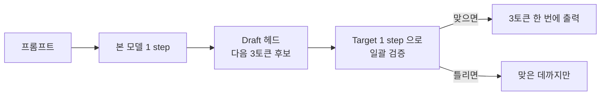

*[Photo by Thomas Foster on Unsplash](https://unsplash.com/@thomasfos?utm_source=blogmaker&utm_medium=referral)*

요 며칠 r/LocalLLaMA 글 목록이 거의 MTP 벤치마크로 도배됐다. 한쪽에서는 "27B 가 두 배 빨라졌다" 고 환호하고, 다른 쪽에서는 "35B 는 오히려 느려졌는데?" 라며 갸웃거리는 중. 시간이 좀 나서 흐름을 정리해봤다.

MTP — Multi-Token Prediction — 는 이름 그대로 한 번에 토큰 여러 개를 미리 뽑아두는 추론 가속 기법이다. 원래는 토큰을 한 개씩, 매 step 마다 모델 전체를 한 번씩 돌려서 뽑았다. 느릴 수밖에 없다. MTP 는 보조용 작은 헤드(draft) 가 다음 토큰 후보 몇 개를 먼저 던지고, 본 모델(target) 은 그걸 한 번에 검증만 한다. 맞으면 그대로 쓰고, 틀리면 거기서 끊는다. speculative decoding 의 변형이라고 봐도 무방한데, draft 가 모델 안에 내장돼 있어서 별도 작은 모델을 같이 안 띄워도 된다는 게 핵심.



이게 llama.cpp 본체에 머지된 게 이번 주. 그 직후 Qwen3.6(Qwen 의 최신 오픈 LLM 시리즈) MTP 빌드가 unsloth 쪽에서 풀렸고, reddit 사람들이 일제히 자기 환경에서 돌려봤다.


*[Photo by Mariia Shalabaieva on Unsplash](https://unsplash.com/@maria_shalabaieva?utm_source=blogmaker&utm_medium=referral)*


27B 결과는 깔끔하더라. 단일 RTX 3090, Strix Halo(AMD 의 미니 PC 용 APU), 둘 다 생성 속도가 거의 두 배. 한 측정에서는 7.6 t/s → 16.1 t/s 로 +111% 가 찍혔다. 체감이 확 달라지는 수준이다. PP — prompt processing, 입력을 처음 한 번 훑는 단계 — 쪽은 -12% 정도 손해지만, 전체 wall time 으로도 줄어든다.

근데 35B 부터 분위기가 달라진다. 듀얼 3090 환경에서 split layer 로 돌리던 사람이 "원래 120 t/g 나오던 게 MTP 켜니까 80 t/g 로 떨어졌다" 고 적었다. 122B 도 Strix Halo 에서 q5 양자화로 30 t/s 근처가 나와서 절대 수치는 좋지만, 정작 자기 워크플로우 안에서 이득인지 손해인지는 사람마다 갈린다.

왜 이렇게 갈릴까. 내가 본 한에선 두 가지 같다. 첫째, MTP 의 이득은 **생성 단계(t/g)** 에서 오는데 PP 쪽은 살짝 손해를 본다. 입력은 길고 생성은 짧은 워크로드(예: 긴 문서 요약) 면 손해가 이득을 잡아먹는다. 둘째, 모델이 크고 메모리 대역폭이 빠듯한 35B/122B 에서는 draft 검증 step 자체가 무거워서 추가 비용이 더 두드러진다.


*[Photo by Gabriel Heinzer on Unsplash](https://unsplash.com/@6heinz3r?utm_source=blogmaker&utm_medium=referral)*


지금 reddit 에서 돌고 있는 권장 설정은 대체로 이런 식.

```bash
llama-server -m Qwen3.6-27B-MTP-Q4_K_M.gguf \
  -c 65536 -ngl -1 -t 8 \
  --spec-type draft-mtp \
  --spec-draft-n-max 3 \
  --draft-p-min 0.6
```

`--spec-draft-n-max` 가 한 번에 미리 뽑을 토큰 수, `--draft-p-min` 이 draft 가 자기 추측에 가져야 할 최소 확신치. 이 둘을 어떻게 잡느냐로 t/s 가 꽤 출렁이는 듯하다.

나는 아직 직접 안 돌려봤다. 27B Q4 가 4080 16GB 에 들어가긴 할 거 같은데, MTP 빌드는 컨텍스트랑 kv cache 양자화 조합에 따라 VRAM 이 좀 더 든다는 얘기도 있어서 한 번 깔아보고 다시 정리해봐야겠다. 일단 지금 단계 잠정 인상은 — **27B 쓰는 사람한테는 거의 공짜 점심**, 35B 이상은 자기 워크로드 보고 켜고 끄고를 선택하는 옵션, 122B 는 절대 속도가 부족했던 사람들한테 새 선택지.

생각해보면 좀 웃긴 게, 1년 전까지 로컬에서 30B 급을 사람이 읽을 만한 속도로 굴리는 건 사실상 불가능에 가까웠다. 그게 지금은 단일 3090 한 장에 16 t/s. 이번 가속이 어디까지 더 갈진 좀 더 봐야 할 것 같다.

***

**참고**

- [Strix Halo Llama.cpp MTP Benchmarks: 27B Gets Much Faster, 35B Is Mixed](https://www.reddit.com/r/LocalLLaMA/comments/1teypb8/strix_halo_llamacpp_mtp_benchmarks_27b_gets_much/)
- [Qwen 27b MTP Config, Llama.cpp Single 3090](https://www.reddit.com/r/LocalLLaMA/comments/1tez37r/qwen_27b_mtp_config_llamacpp_single_3090/)
- [Qwen3.5-122B-Q5-MTP - Qwen3.5-122B-Q6-MTP](https://www.reddit.com/r/LocalLLaMA/comments/1tf6qeb/qwen35122bq5mtp_qwen35122bq6mtp/)
- [Llama.cpp MTP with Qwen3.6 27B on Headless RTX 3090](https://www.reddit.com/r/LocalLLaMA/comments/1tfilwx/llamacpp_mtp_with_qwen36_27b_on_headless_rtx_3090/)
- [Now that MTP is merged... What's the best outputs you're getting on Qwen 3.6 35B on 2x3090s?](https://www.reddit.com/r/LocalLLaMA/comments/1tf7auf/now_that_mtp_is_merged_whats_the_best_outputs/)