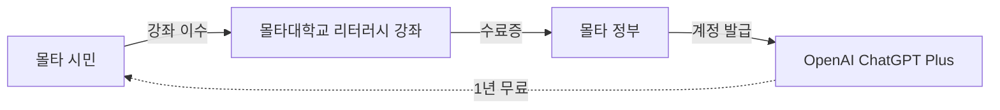

---
categories:
- industry
category_ko: industry
date: '2026-05-17T21:28:58+09:00'
description: 몰타 정부가 OpenAI와 손잡고 전 국민에게 ChatGPT Plus를 1년간 무료 제공하기로 했다. 이용 조건은 몰타대학교가
  자체 설계한 AI 리터러시 과정 이수로, 벤더가 아닌 공공기관이 교육을 맡았다는 점이 주목받고 있다. 국가 단위의 첫 사례라는 점에서 다른 정부의
  AI 도입 모델로 거론된다.
image:
  alt: 몰타, 전국민 ChatGPT Plus
  path: https://haangman.github.io/J-Blog-AI/assets/img/2026/05/몰타-전국민-chatgpt-plus-f190ed.jpg
layout: post
slug: 몰타-전국민-chatgpt-plus-f190ed
sources:
- title: OpenAI and Government of Malta partner to roll out ChatGPT Plus to all citizens
  url: https://openai.com/index/malta-chatgpt-plus-partnership/
summary: 몰타 정부가 OpenAI와 손잡고 전 국민에게 ChatGPT Plus를 1년간 무료 제공하기로 했다. 이용 조건은 몰타대학교가 자체
  설계한 AI 리터러시 과정 이수로, 벤더가 아닌 공공기관이 교육을 맡았다는 점이 주목받고 있다. 국가 단위의 첫 사례라는 점에서 다른 정부의 AI
  도입 모델로 거론된다.
tags:
- industry
title: 몰타, 전국민 ChatGPT Plus
---

*[Photo by Mike Nahlii on Unsplash](https://unsplash.com/@pixelcore?utm_source=blogmaker&utm_medium=referral)*

몰타가 전 국민한테 ChatGPT Plus 를 1년 무료로 깔아준다는 뉴스를 봤다. 처음에는 작은 나라 PR 인가 싶었는데, 한 번 더 읽으니 좀 다른 그림이었다.

몰타 — 지중해 한가운데, 인구 약 55만 명, 서울 송파구 정도 — 정부가 OpenAI 랑 직접 계약을 맺었다. 전 국민에게 ChatGPT Plus (월 20달러짜리 유료 플랜, 더 똑똑한 모델이랑 이미지·코드 기능 다 풀리는 그거) 를 1년 동안 그냥 준다. 다만 조건이 하나 붙는다 — **AI 리터러시 강좌 이수**. 이게 좀 흥미롭다.

내가 주목한 건 그 강좌를 **몰타대학교가 직접 설계**했다는 점이다. OpenAI 가 만든 게 아니라. 비유하자면 정수기를 코웨이가 깔아주는데, 사용법 매뉴얼은 코웨이가 아니라 동네 보건소가 쓴 셈이다. 벤더가 "이렇게 쓰면 우리 제품이 짱이에요" 가르치는 게 아니라, 공공기관이 한 발 떨어져서 "얘는 이런 거 잘하고 이런 건 못 한다" 를 알려준다는 얘기.

*[Photo by Matheus Frade on Unsplash](https://unsplash.com/@matheusfrade?utm_source=blogmaker&utm_medium=referral)*

사실은 이 구도가 의외로 드물다. 회사에서 사내 AI 교육 자료 만들어본 적이 있는데, 벤더가 주는 자료를 거의 그대로 쓰게 된다. 시간 없고, 만들 사람 없고, 결국 "ChatGPT 잘 쓰는 법" 슬라이드가 ChatGPT 가 잘하는 일만 보여주고 끝난다. 한계·환각·개인정보 누출 같은 얘기는 한두 장으로 압축되거나 빠지거나.

근데 대학이 만들면 다르다. 적어도 다를 가능성은 있다. 강좌 커리큘럼이 공개되면 한 번 들여다보고 싶은데, 출처를 못 찾았다 — 강좌가 어느 정도 깊이인지, '핸즈온 30분짜리 워크숍' 인지 '제대로 된 한 학기 과목' 인지에 따라 의미가 완전히 갈린다.

*[Photo by Vitaly Gariev on Unsplash](https://unsplash.com/@silverkblack?utm_source=blogmaker&utm_medium=referral)*

재밌는 건 인구가 55만이라 가능한 실험이라는 점이다. 한국에 똑같이 깔려면 — 5000만 곱하기 월 20달러 곱하기 12개월 — 단순 계산만 12조 원이다 (협상가는 다르겠지만). 작은 나라가 통째로 베타테스터 역할을 자처한 건데, 다른 정부 입장에선 공짜로 1년치 데이터를 얻는 셈이다. "전국민이 LLM 깔리면 뭐가 어떻게 굴러가나" 의 실측.

물론 OpenAI 입장에서도 손해는 아니다. 한 나라 단위로 사용 패턴·실패 사례·민감 질문 분포가 통째로 쌓인다. 데이터가 학습에 어떻게 들어가는지는 약관 봐야 알겠지만, 적어도 **국가급 사용 통계** 는 확실히 얻는다. 몰타가 그 부분을 어떻게 협상했는지가 진짜 본 게임일 것 같다.

체감상 이건 "AI 가 좋다 나쁘다" 보다 "AI 를 누가 가르치느냐" 의 첫 공공 실험에 가깝다. 강좌 내용이 공개되고 1년 뒤 효과 측정이 나와봐야 진짜 평가가 가능할 텐데, 그때까지는 일단 지켜보는 쪽이다.

***

**참고**

- [OpenAI and Government of Malta partner to roll out ChatGPT Plus to all citizens](https://openai.com/index/malta-chatgpt-plus-partnership/)