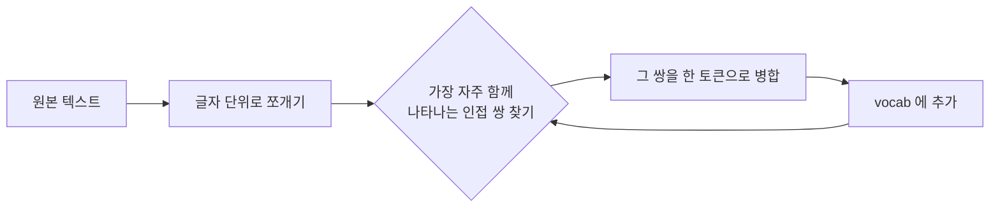

*[Photo by Nancy Hughes on Unsplash](https://unsplash.com/@mostlymarvelling?utm_source=blogmaker&utm_medium=referral)*

LLM 한테 "strawberry 에 r 이 몇 개 들었어?" 라고 물으면 가끔 2개라고 답한다. 사실은 3개인데. 이게 그냥 모델이 멍청해서가 아니라, **모델이 글자 단위로 세상을 보지 않기 때문**이라는 걸 알고 나면 좀 납득이 간다.

이게 토큰화(tokenization) 얘기다.

언어 모델은 한국어든 영어든 코드든, 텍스트를 그대로 먹지 않는다. 일단 잘게 자른 다음 각 조각에 고유 번호를 매겨서 모델 안으로 넣는다. 그 잘게 잘린 한 조각이 **토큰**. "hello" 가 한 통째로 토큰 한 개일 수도 있고, "han" + "gman" 두 조각으로 쪼개질 수도 있다. 자르는 방법을 정의하는 게 토크나이저.

근데 어떻게 자를 거냐. 단어 단위로 자르면 "running" 과 "runs" 가 서로 모르는 사이가 되고, 글자 단위로 자르면 단어 한 개에 토큰이 7~8 개씩 붙어서 시퀀스가 폭발한다. 그 중간 어디쯤을 찾는 게 **서브워드(subword) 토큰화**고, 그 대표가 BPE — Byte Pair Encoding.

이름이 좀 거창한데 원리는 단순하다. 원래 Gage 가 1994 년에 데이터 압축용으로 만든 알고리즘이고, NLP 에 본격적으로 들여온 건 Sennrich et al., 2016. 흐름은 이렇다.

1. 일단 모든 텍스트를 한 글자씩 쪼갠다. 어휘집(vocab)은 글자들로만 시작.
2. 코퍼스 전체를 훑어서 **가장 자주 같이 등장하는 인접 글자 쌍**을 찾는다. 영어라면 "t" 와 "h" 같은 거.
3. 그 쌍을 하나의 새 토큰("th") 으로 합쳐 어휘집에 추가.
4. 2~3 을 미리 정한 횟수만큼 반복. 보통 수만 번.

이렇게 돌리면 "the", "ing", "tion" 같이 자주 나오는 뭉치는 자연스럽게 한 토큰으로 묶이고, 잘 안 나오는 단어는 그대로 글자 쪼가리로 남는다. 결과적으로 어휘집 크기를 5~10 만 개 안쪽으로 유지하면서, 어떤 입력이 와도 어떻게든 토큰화할 수 있다. OOV(out-of-vocabulary, 모델이 모르는 단어) 문제가 사실상 사라지는 거다.

실제로 이걸 파이썬으로 30 줄이면 흉내낼 수 있다. 노트북에서 짧게 돌려봤는데, 셰익스피어 텍스트 몇 메가에 1000 번만 merge 시켜도 빈도순으로 합쳐지는 모양새가 눈에 보인다.

*[Photo by Rob Wingate on Unsplash](https://unsplash.com/@robwingate?utm_source=blogmaker&utm_medium=referral)*

내가 실제로 만져본 한에선, 영어는 BPE 가 정말 깔끔하게 떨어지는데 한국어는 좀 어색하다. "안녕하세요" 가 모델마다 토큰 2~4 개 사이를 왔다 갔다 한다. 이유는 BPE 가 학습 코퍼스의 빈도에만 의존하는 탓에, 한국어 데이터가 적었던 모델은 형태소 경계를 잘 못 잡는다. GPT-4 의 cl100k_base 와 Claude 의 토크나이저가 한국어에서 토큰 효율이 꽤 다르더라 (정확한 수치는 잊었는데 같은 문장이 1.5 배 정도 차이 났던 기억).

*[Photo by Jimmy Wu on Unsplash](https://unsplash.com/@javiwoo?utm_source=blogmaker&utm_medium=referral)*

이게 비용에 곧장 닿는다. API 는 토큰 단위로 과금되니까 한국어로 같은 내용을 쓰면 영어로 쓸 때보다 청구서가 더 두꺼워진다. 토크나이저를 모르고 한국어 챗봇을 운영하면 "왜 자꾸 컨텍스트가 모자라지?" 하다가 한참 헤맨다.

다시 strawberry 얘기로 돌아오면, 모델은 그 단어를 보통 "straw" + "berry" 두 토큰으로 본다. "r 이 몇 개?" 라고 물어보면 모델 입장에선 글자가 아니라 두 덩어리를 세고 있는 거다. 사람이 한자 단어를 글자 하나하나가 아니라 통뭉치로 인식하는 거랑 비슷한 느낌. 추론 능력이 좋아지면 어느 정도 우회는 되는데, 근본적으론 토크나이저의 한계라는 게 내 생각이다.

요즘은 BPE 의 변종들 — SentencePiece, tiktoken, Unigram LM — 이 같이 쓰이고, 멀티모달 모델은 이미지·오디오까지 토큰화 대상이 됐다. 토큰화는 모델 바깥의 전처리처럼 보여 가볍게 지나치기 쉬운데, 사실 모델이 세상을 어떻게 잘라서 보는지를 결정하는 꽤 중요한 한 층이다. byte-level 로 토크나이저를 아예 없애려는 흐름도 있고 (ByT5 같은), 학습 가능한 토크나이저 얘기도 슬슬 나오는데, 이게 어디로 갈지는 좀 더 봐야 할 것 같다.