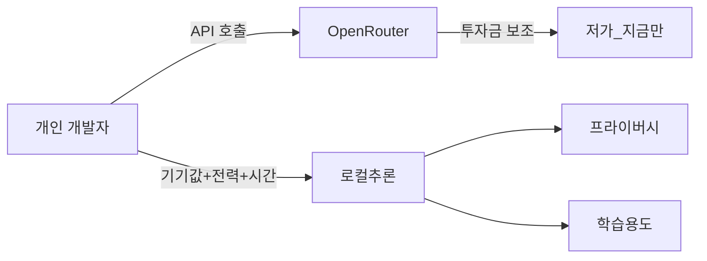

---
categories:
- ethics
category_ko: 윤리·안전
date: '2026-05-18T20:41:11+09:00'
description: 해커뉴스·레딧에서 AI를 둘러싼 회의적 시선이 동시에 쏟아졌다. "AI는 제품이 아니라 기술", "프로세스를 빨라지게 해주지
  않는다" 같은 글과, 애플 실리콘 로컬 추론이 OpenRouter보다 오히려 비싸다는 분석, 머신러닝 연구가 슬롭에 묻혀 피로해진다는 토로가 함께
  올라온 게 맥락이다. 과열기 끝의 정산 분위기가 커뮤니티에 깔리고 있다는 점에서 화제가
image:
  alt: AI 회의론·비용·연구피로 확산
  path: https://haangman.github.io/J-Blog-AI/assets/img/2026/05/ai-회의론-비용-연구피로-확산-1b83df.jpg
layout: post
mermaid: true
slug: ai-회의론-비용-연구피로-확산-1b83df
sources:
- title: It is time to give up the dualism introduced by the debate on consciousness
  url: https://www.noemamag.com/there-is-no-hard-problem-of-consciousness/
- title: I don't think AI will make your processes go faster
  url: https://frederickvanbrabant.com/blog/2026-05-15-i-dont-think-ai-will-make-your-processes-go-faster/
- title: AI is a technology not a product
  url: https://daringfireball.net/2026/05/ai_is_technology_not_a_product
- title: Native all the way, until you need text
  url: https://justsitandgrin.im/posts/native-all-the-way-until-you-need-text/
- title: 'Apple silicon costs more than OpenRouter: an analysis'
  url: https://www.williamangel.net/blog/2026/05/17/offline-llm-energy-use.html
summary: 해커뉴스·레딧에서 AI를 둘러싼 회의적 시선이 동시에 쏟아졌다. "AI는 제품이 아니라 기술", "프로세스를 빨라지게 해주지 않는다"
  같은 글과, 애플 실리콘 로컬 추론이 OpenRouter보다 오히려 비싸다는 분석, 머신러닝 연구가 슬롭에 묻혀 피로해진다는 토로가 함께 올라온
  게 맥락이다. 과열기 끝의 정산 분위기가 커뮤니티에 깔리고 있다는 점에서 화제가
tags:
- ethics
title: AI 회의론·비용·연구피로 확산
---

해커뉴스랑 레딧을 같은 날 훑다가 좀 묘한 기분이 들었다. AI 회의론이라기엔 분노에 가깝지도 않고, 그렇다고 단순 피로감만도 아닌, 뭔가 정산 분위기. "AI는 제품이 아니라 기술이다", "AI가 너희 프로세스를 빠르게 해주지 않는다" 같은 글이 위로 올라오고, 그 사이에 애플 실리콘 로컬 추론이 OpenRouter — 여러 LLM 제공자를 통합해서 API 한 번으로 호출하게 해주는 라우팅 서비스 — 보다 오히려 비싸다는 분석이 나란히 떴거든.

같은 시간대에 r/MachineLearning 에서는 "요즘 논문 슬롭(slop) 에 묻혀서 진짜 연구를 못 찾겠다" 는 토로가 또 올라왔고. 슬롭은 원래 음식 찌꺼기를 뜻하는 단어인데, 요즘은 LLM 으로 대충 찍어낸 글·코드·논문 같은 걸 통칭하는 인터넷 용어다. 사람들이 비슷한 정서를 한 자리에 모아놓고 보기 시작한 게 어제 오늘 같다.


*[Photo by Clint Patterson on Unsplash](https://unsplash.com/@cbpsc1?utm_source=blogmaker&utm_medium=referral)*


"AI 는 제품이 아니라 기술이다" 라는 표현이 사실은 좀 옛날 SaaS 시절 이야기 같이 들리지만, 다시 떠오르는 데에는 이유가 있더라. 작년부터 거의 모든 회사가 "AI 기능" 하나씩 박아넣고 그게 자기 제품의 핵심 가치인 척 포장했단 말이지. 근데 그 기능이라는 게 대부분 OpenAI 나 Anthropic API 호출 한 줄. 챗봇 UI 하나 붙여놓고 "AI-powered" 라고 부른다. 그렇게 만들어진 게 너무 많이 쌓이니까 이제 사용자들이 묻기 시작했다 — 이 제품이 정말 AI 가 없어도 안 되는 거야, 아니면 그냥 안 써도 되는 거야?

내가 본 한에선 솔직히 후자가 더 많다. 한 분기 동안 쓰던 노트 앱이 어느 날 갑자기 "요약" 버튼 하나 박아놓고 프로 플랜 가격을 올린다거나, 메일 클라이언트가 자동 답장을 추천하는데 정작 그 답장이 매번 똑같이 정중하기만 한 식. 기능을 켜기 전후로 내 작업 속도가 정말 빨라졌냐고 물으면 — 음, 모르겠다. 어떤 건 분명 도움이 된다. 어떤 건 더 느려진다. 정확히 어디서 손해 보는지 잘 안 보이는 게 더 짜증나는 부분이고.

"프로세스를 빨라지게 해주지 않는다" 글의 핵심도 결국 이거였지. 한 사람의 작업 속도를 1.5배 빠르게 만든다고 해서, 팀 전체의 생산이 1.5배가 되진 않는다는 거. 오히려 더 많은 PR, 더 많은 코드, 더 많은 검토 부담이 늘어나서 병목이 다른 데로 이동할 뿐이라는 얘기. 이 부분은 내가 회사에서 체감으로 느낀다. 코드 리뷰가 예전보다 두 배쯤 길어졌고, 다들 LLM 이 뱉은 첫 시안을 그대로 PR 에 박아두는 통에 리뷰어가 사실상 두 번 작업하는 꼴이다.


*[Photo by Justin Morgan on Unsplash](https://unsplash.com/@justin_morgan?utm_source=blogmaker&utm_medium=referral)*


비용 얘기로 넘어가면 더 재밌어진다. 애플 실리콘 로컬 추론이 OpenRouter 보다 비싸다는 분석은 한 줄로 정리하면 이렇더라 — M-series 맥북을 LLM 전용으로 굴린다고 가정하고 감가상각·전력·시간을 다 환산하면, 같은 토큰 수를 OpenRouter 에서 사는 쪽이 훨씬 싸게 먹힌다는 결론. 이게 의외인 이유는 그동안 "로컬은 공짜고 클라우드는 비싸다" 는 직관이 너무 굳어 있었기 때문이지. 근데 클라우드 측이 지금 투자자 돈을 태워서 가격을 후려치고 있다는 점도 같이 봐야 공정한 비교가 된다. 원작자도 마지막에 "OpenRouter 사업자들이 돈을 다 태우고 나면 셈이 다시 바뀐다" 고 못박아두더라.

```python
def local_cost(hw_price, lifetime_tokens, electricity):
    return hw_price / lifetime_tokens + electricity

def api_cost(in_tok, out_tok, price):
    return in_tok * price.input + out_tok * price.output
```

두 식을 같이 놓고 현실적인 숫자를 넣어보면, 평범한 개인 사용량으로는 API 쪽이 압도적으로 싸진다. 그래서 "프라이버시" 라든가 "주말에 어차피 켜놓는 컴퓨터" 같은 다른 가치를 끼워넣어야 로컬의 의미가 비로소 살아나는 구조더라.



다이어그램이 좀 거칠지만 의도는 명확하지. 지금 시점의 가격표만 보고 양쪽 다 판단하면 엉뚱한 곳에 베팅하기 쉽다는 것.


*[Photo by Jesus Hilario H. on Unsplash](https://unsplash.com/@jesushilarioh?utm_source=blogmaker&utm_medium=referral)*


남은 한 흐름인 머신러닝 연구 피로 얘기는 이게 좀 슬프다. r/MachineLearning 에서 사람들이 입을 모아 말하는 건, 작년 NeurIPS 부터 ICLR, ICML 까지 쏟아진 페이퍼 중 상당수가 LLM 한 번 돌리고 결과 표만 갈아끼운 식이라는 거. 본인이 풀고 싶은 문제가 있어서 시작한 연구가 아니라, "이번엔 무슨 벤치 차트로 SOTA 가져갈까" 식 페이퍼가 너무 많아져서 그 안에서 진짜 인사이트를 발굴하는 비용이 엄청 커졌단 얘기. 박사 과정 학생들이 "어차피 내가 1년 걸려 쓴 글이 LLM 5분에 묻힌다" 고 적은 댓글이 위로 올라온 걸 보면, 단순 투정은 아닌 것 같고.

세 흐름을 한 줄에 꿰어보면 결국 한 가지 정서로 모인다. 시장도 인프라도 학계도, 작년에 한 번 부풀린 풍선의 부피만큼 진짜 가치를 만들어내고 있는지 다들 셈해보기 시작한 거. 풍선이 터질 거란 얘긴 아니지. 다만 풍선 안에 진짜로 들어 있는 게 뭔지 손으로 한번 만져보고 싶어진 분위기. 이게 한 달짜리 정서인지 한 해짜리 정산인지, 솔직히 아직 잘 모르겠다.

***

**참고**

- [It is time to give up the dualism introduced by the debate on consciousness](https://www.noemamag.com/there-is-no-hard-problem-of-consciousness/)
- [I don't think AI will make your processes go faster](https://frederickvanbrabant.com/blog/2026-05-15-i-dont-think-ai-will-make-your-processes-go-faster/)
- [AI is a technology not a product](https://daringfireball.net/2026/05/ai_is_technology_not_a_product)
- [Native all the way, until you need text](https://justsitandgrin.im/posts/native-all-the-way-until-you-need-text/)
- [Apple silicon costs more than OpenRouter: an analysis](https://www.williamangel.net/blog/2026/05/17/offline-llm-energy-use.html)