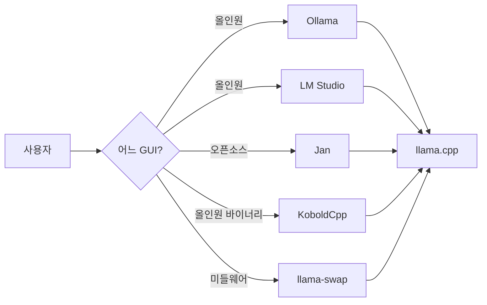

---
categories:
- inference
category_ko: 추론·최적화
date: '2026-05-18T10:38:36+09:00'
description: r/LocalLLaMA에서 Ollama·LM Studio를 벗어나려는 사용자들이 오픈소스 대체 도구를 찾는 글이 연달아 올라오고
  있다. llama.cpp 최신 추적과 모델 탐색·다운로드 편의성이 핵심 요구이며, 비전 모델을 지원하는 커서 인식 AI 앱처럼 Ollama 백엔드를
  끌어다 쓰는 신규 프로젝트도 동시에 베타테스터를 모집 중이다.
image:
  alt: LM Studio 대안 탐색 활발
  path: https://haangman.github.io/J-Blog-AI/assets/img/2026/05/lm-studio-대안-탐색-활발-0805d5.jpg
layout: post
slug: lm-studio-대안-탐색-활발-0805d5
sources:
- title: Looking to migrate off of Ollama and LMStudio
  url: https://www.reddit.com/r/LocalLLaMA/comments/1tff36t/looking_to_migrate_off_of_ollama_and_lmstudio/
- title: lm studio alternative
  url: https://www.reddit.com/r/LocalLLaMA/comments/1tfmoy4/lm_studio_alternative/
- title: 'Follow-up: adding Ollama support to my open-source cursor-aware AI app -
    looking for beta testers with vision-capable local models'
  url: https://v.redd.it/v8ywwmch2s1h1
summary: r/LocalLLaMA에서 Ollama·LM Studio를 벗어나려는 사용자들이 오픈소스 대체 도구를 찾는 글이 연달아 올라오고 있다.
  llama.cpp 최신 추적과 모델 탐색·다운로드 편의성이 핵심 요구이며, 비전 모델을 지원하는 커서 인식 AI 앱처럼 Ollama 백엔드를 끌어다
  쓰는 신규 프로젝트도 동시에 베타테스터를 모집 중이다.
tags:
- inference
title: LM Studio 대안 탐색 활발
---


*[Photo by Roberto Nickson on Unsplash](https://unsplash.com/@rpnickson?utm_source=blogmaker&utm_medium=referral)*

요즘 r/LocalLLaMA 들어가 보면 **Ollama** 랑 **LM Studio** — 로컬에서 LLM 돌릴 때 거의 디폴트로 깔리는 두 도구 — 에서 벗어나려는 글이 일주일에 두세 번씩 올라오더라. 작년만 해도 "초보인데 뭐부터 쓰면 되나요" 질문에 두 이름이 거의 자동완성이었는데, 지금 흐름은 좀 달라진 분위기.

이유가 한두 가지로 깔끔하게 떨어지진 않는 것 같다. 어떤 사람은 속도가 답답해서, 어떤 사람은 llama.cpp 최신 기능 — 양자화 포맷이 바뀌거나 새 sampler 가 들어오거나 — 가 Ollama 빌드에 반영되는 데 시간이 걸려서. 또 누군가는 LM Studio 가 오픈소스가 아니라는 이유 하나로 마음이 떠난 것처럼 보이고. 사실 셋 다 같은 사람 안에 동시에 있는 불만이기도 하지.

이게 좀 웃긴 게, Ollama 와 LM Studio 둘 다 결국 내부에서 llama.cpp — Meta 의 LLaMA 부터 시작해서 지금은 거의 모든 오픈 LLM 을 CPU/GPU 에서 돌리는 사실상 표준 추론 엔진 — 를 쓴다. 그러니까 "그냥 llama.cpp 직접 쓰면 되잖아" 가 가장 깔끔한 답인데, 막상 그러려면 모델마다 `-ngl`, `-c`, `-b`, `--rope-freq-base` 같은 플래그를 기억하고 있어야 한다. 그게 싫어서 두 도구를 골랐던 사람들이, 다시 같은 이유로 떠나면서 "그래도 좀 가볍고 오픈소스인 뭔가" 를 찾는 셈.

```bash
./llama-server -m models/qwen2.5-7b.Q5_K_M.gguf \
  -ngl 99 -c 8192 -b 2048 \
  --host 0.0.0.0 --port 8080
```


*[Photo by Faraaz Zuberi on Unsplash](https://unsplash.com/@ffz_20?utm_source=blogmaker&utm_medium=referral)*


체감상 그 사이를 비집고 들어가려는 후보가 몇 갈래 있다. Jan 처럼 처음부터 Apache 2.0 으로 시작한 데스크탑 앱이 한 축, llama-swap 처럼 백엔드를 hot-swap 해주는 미들웨어가 또 한 축, KoboldCpp 처럼 한 바이너리 안에 다 박아넣은 올인원이 또 한 축. 셋 다 성격이 다르고 정확하게 같은 자리를 노리지도 않는다. 내 생각엔 "Ollama 대안" 이라기보다 **"Ollama 가 한 번에 가렸던 서로 다른 니즈가 다시 갈라지는 중"** 에 가까운 듯.



재밌는 건, 똑같은 서브레딧 안에서 정반대 방향 글도 같이 올라온다는 거. 어제 본 한 게시물은 "**커서 인식 AI 앱**" — 화면에서 마우스 커서가 가리키는 게 뭔지 알아채는 데스크탑 어시스턴트 — 에 Ollama 지원을 막 붙였다며 비전 모델 가진 베타테스터를 모집하더라. 떠나려는 사람과 새로 붙이려는 사람이 한 서브레딧 안에 공존하는 거지. 그러니까 Ollama 가 죽고 있다기보다, **백엔드 인프라**로 한 단계 내려가는 중인 셈이고, 그 위 GUI 자리에서 분화가 일어나는 것처럼 보이는 풍경.


*[Photo by ARTO SURAJ on Unsplash](https://unsplash.com/@artosuraj?utm_source=blogmaker&utm_medium=referral)*


솔직히 내 데스크탑(4080) 에선 아직 Ollama 그대로 쓰고 있다. 회사 데모 만들 때 OpenAI 호환 API 가 그냥 도는 게 너무 편하고, 모델 한 줄로 받아지는 게 가벼우니까. 다만 새 양자화 포맷이 나왔는데 Ollama 가 며칠씩 안 따라잡으면 그 며칠 동안만 llama.cpp 를 직접 빌드해서 쓰는 식. 두 개를 같이 쓰는 게 결국 가장 정직한 답인 것 같기도 하고.

문제는 이게 신규 진입자한테 친절한 풍경은 아니라는 거. "처음 시작하는데 뭐부터?" 질문에 1년 전엔 한 줄로 끝났는데, 지금 정성스럽게 답하려면 "뭐 하려는 건데?" 부터 되물어야 하는 분위기지. 도구가 분화한다는 건 생태계가 살아있다는 신호이긴 한데, 표준이 한 번 굳었다가 다시 흐물흐물해지는 중간 어딘가에 와 있는 느낌. 이게 다시 한쪽으로 수렴할지, 아니면 OpenAI 호환 API 만 공통 규약으로 남기고 그 위 GUI 들이 영구히 갈라질지 — 좀 더 두고 보면 윤곽이 잡힐 듯.

***

**참고**

- [Looking to migrate off of Ollama and LMStudio](https://www.reddit.com/r/LocalLLaMA/comments/1tff36t/looking_to_migrate_off_of_ollama_and_lmstudio/)
- [lm studio alternative](https://www.reddit.com/r/LocalLLaMA/comments/1tfmoy4/lm_studio_alternative/)
- [Follow-up: adding Ollama support to my open-source cursor-aware AI app - looking for beta testers with vision-capable local models](https://v.redd.it/v8ywwmch2s1h1)