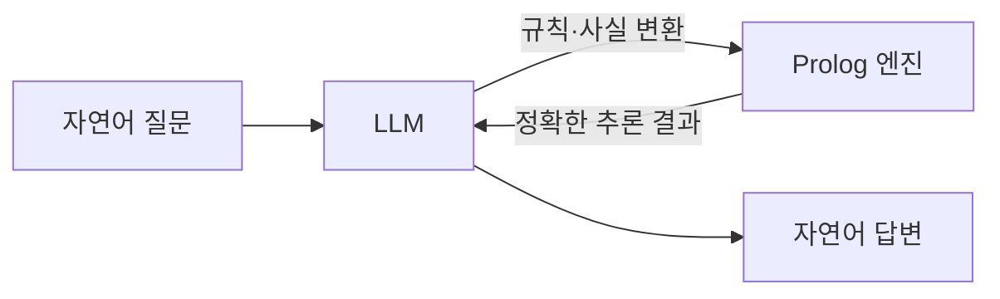

---
categories:
- other
category_ko: 기타
date: '2026-05-18T20:49:07+09:00'
description: Hacker News에서 Prolog 관련 글 두 편이 동시에 주목받고 있다. 하나는 Prolog 코딩의 난점을 다룬 "Coding
  Horror" 사례이고, 다른 하나는 포켓몬을 예시로 Prolog 기초를 설명하는 글이다. 논리형 언어에 대한 재조명 흐름 속에서 학습 자료와
  실전 경험담이 함께 공유되며 토론이 이어지고 있다.
image:
  alt: Prolog 입문 화제
  path: https://haangman.github.io/J-Blog-AI/assets/img/2026/05/prolog-입문-화제-8b2d1b.jpg
layout: post
mermaid: true
slug: prolog-입문-화제-8b2d1b
sources:
- title: Prolog Coding Horror
  url: https://www.metalevel.at/prolog/horror
- title: Prolog Basics Explained with Pokémon
  url: https://unplannedobsolescence.com/blog/prolog-basics-pokemon/
summary: Hacker News에서 Prolog 관련 글 두 편이 동시에 주목받고 있다. 하나는 Prolog 코딩의 난점을 다룬 "Coding
  Horror" 사례이고, 다른 하나는 포켓몬을 예시로 Prolog 기초를 설명하는 글이다. 논리형 언어에 대한 재조명 흐름 속에서 학습 자료와
  실전 경험담이 함께 공유되며 토론이 이어지고 있다.
tags:
- other
title: Prolog 입문 화제
---

Prolog 이야기가 며칠 사이에 Hacker News 첫 페이지에 두 개나 떠 있었다. 하나는 "Prolog Coding Horror" — 실전에서 Prolog 로 뭔가 만들려다 머리가 깨졌다는 회고. 다른 하나는 정반대 방향으로, 포켓몬을 예시 데이터로 Prolog 의 기초를 풀어 설명하는 친절한 튜토리얼이었다. 같은 언어를 두고 한쪽은 "이게 왜 이래" 라고 비명을 지르고, 다른 한쪽은 "어, 의외로 깔끔하지?" 하고 손을 내미는 구도.

Prolog 가 뭐냐 — 한 줄로 줄이면, **"답을 구하는 방법" 대신 "답이 만족해야 하는 조건들" 만 적어두고 컴퓨터한테 알아서 풀어보라고 던지는** 언어다. 보통 쓰는 Python 이나 C 는 "이렇게 저렇게 해서 X 를 구해라" 식이고, Prolog 는 "X 는 이런 조건을 만족하는 어떤 값" 이라고 선언한 다음 처리기가 알아서 매칭한다. 데이터베이스 쿼리와 비슷한 느낌이 있는데, 거기에 재귀와 패턴 매칭을 얹은 거라고 보면 대충 맞다.

근데 솔직히 나는 Prolog 를 제품에 직접 써본 적은 없다. 학부 때 "프로그래밍 언어론" 수업에서 가족 관계 예제 — `parent(tom, bob).` 같은 — 를 만져본 게 전부. 그래서 이번 두 글이 동시에 뜬 게 좀 재밌었다. 한 발 떨어져서 보니까 둘 다 같은 진실을 다른 각도에서 말하고 있더라.


*[Photo by Varun Yadav on Unsplash](https://unsplash.com/@vay2250?utm_source=blogmaker&utm_medium=referral)*


포켓몬 튜토리얼 쪽이 좋았던 건, 추상적인 "관계와 술어" 가 아니라 "피카츄는 전기 타입이다", "전기 타입은 물 타입에게 강하다" 같은 익숙한 데이터로 시작하기 때문이다. 그 위에서 "그러면 피카츄가 강한 상대를 모두 찾아라" 같은 질의를 던지면, Prolog 가 알아서 규칙을 따라가서 답을 길어 올린다. 이게 처음 보면 약간 마법 같다. 명시적으로 for 문을 쓴 적도 없고, 정렬 알고리즘을 깐 적도 없는데 답이 그냥 나온다.

문제는, 그 마법이 깨지는 순간 정말 깨진다는 거다. Coding Horror 쪽 글이 정확히 그 지점을 짚는다. 규칙 한두 개로 끝나는 장난감 예제 너머로 가면, **검색 공간이 폭발한다.** 컴퓨터가 가능한 모든 조합을 시도하다가 어느 순간 영원히 안 끝나거나, 메모리를 다 잡아먹는다. 그래서 실전에선 `cut`(`!`) 같은 연산자로 탐색을 강제로 잘라야 하는데, 이 순간부터 "선언적 언어로 깔끔하게 적는다" 는 처음의 우아함이 사라진다. 명령형 트릭을 자꾸 끼워 넣어야 동작이 되니까.

```prolog
% 깔끔해 보이는 가족 관계
parent(tom, bob).
parent(bob, ann).
grandparent(X, Z) :- parent(X, Y), parent(Y, Z).

?- grandparent(tom, Who).
% Who = ann.
```

위 코드는 정말 예쁜데, 똑같은 모양으로 100만 노드짜리 그래프를 적으면 그때부턴 완전히 다른 이야기가 된다.

내가 요즘 Prolog 가 다시 회자된다고 느끼는 이유는, LLM 때문이다. 챗봇에게 "내 보험 약관 조건이 다 만족되는지 추론해 줘" 라고 시키면, 단순한 경우엔 잘 하지만 조건이 5~6 단계 얽히면 그럴듯한 거짓말을 하기 시작한다. LLM 은 본질적으로 확률 기반 토큰 예측이라, 엄밀한 논리 추론은 약점이다. 그래서 "LLM 으로 자연어를 파싱해서 Prolog 규칙으로 변환하고, 실제 추론은 Prolog 엔진에 맡기자" 같은 하이브리드 시도가 작은 커뮤니티에서 다시 떠오르는 분위기. neuro-symbolic 이라는 큰 우산 아래 비슷한 방향이 여럿 있다.



말은 쉬운데, 실제로 굴려보면 LLM 이 만들어내는 Prolog 규칙이 미묘하게 틀리거나 — 변수명 한 글자가 어긋나거나, 술어 인자 개수가 안 맞거나 — 해서 막힌다더라. 결국 사람이 한 번 더 검토해야 한다면, 그게 정말 자동화의 승리인지 모호해진다.


*[Photo by Abu Saeid on Unsplash](https://unsplash.com/@abusaeid01?utm_source=blogmaker&utm_medium=referral)*


그래도 두 글이 동시에 뜬 게 우연은 아니라고 본다. 50년 가까이 된 언어가 매번 어딘가에서 "재발견" 되는 이유는, **표현 자체가 사람 머리에 자연스럽기** 때문이다. "X 가 Y 의 조상이다" 같은 관계 서술은, 절차적 코드보다 일상 언어에 훨씬 가깝다. 단지 그걸 컴퓨터가 효율적으로 푸는 게 어려울 뿐. 이 미스매치가 해결되는 날이 올지, 아니면 Prolog 는 영원히 학교 수업과 특정 도메인 도구로만 남을지는 좀 더 봐야 할 것 같다.

다음 주말에 시간 나면 포켓몬 튜토리얼을 따라 처음부터 한 번 돌려볼까 싶다. 학부 이후로 안 만진 거니까 거의 새로 배우는 셈인데, 두 글을 같이 본 김에 손에 한 번 묻혀보는 것도 나쁘지 않을 것 같아서.

***

**참고**

- [Prolog Coding Horror](https://www.metalevel.at/prolog/horror)
- [Prolog Basics Explained with Pokémon](https://unplannedobsolescence.com/blog/prolog-basics-pokemon/)