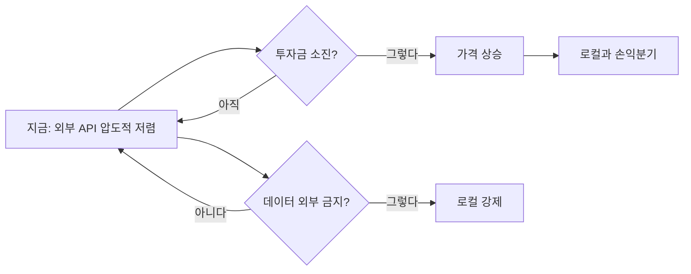

---
categories:
- hardware
category_ko: 하드웨어·반도체
date: '2026-05-18T10:32:48+09:00'
description: 한 분석가가 로컬 AI를 애플실리콘으로 돌리는 비용이 OpenRouter API 사용보다 비싸다는 계산을 내놓아 Reddit
  LocalLLaMA와 HackerNews에서 동시에 화제다. 다만 OpenRouter 제공업체들이 투자금으로 가격을 떠받치고 있어 향후 요금이
  오르면 셈법이 달라질 수 있다는 반론도 함께 제기되고 있다.
image:
  alt: 애플실리콘 비용 논쟁
  path: https://haangman.github.io/J-Blog-AI/assets/img/2026/05/애플실리콘-비용-논쟁-94d749.jpg
layout: post
mermaid: true
slug: 애플실리콘-비용-논쟁-94d749
sources:
- title: 'Apple silicon costs more than OpenRouter: an analysis'
  url: https://www.williamangel.net/blog/2026/05/17/offline-llm-energy-use.html
- title: Apple Silicon costs more than OpenRouter
  url: https://www.williamangel.net/blog/2026/05/17/offline-llm-energy-use.html
summary: 한 분석가가 로컬 AI를 애플실리콘으로 돌리는 비용이 OpenRouter API 사용보다 비싸다는 계산을 내놓아 Reddit LocalLLaMA와
  HackerNews에서 동시에 화제다. 다만 OpenRouter 제공업체들이 투자금으로 가격을 떠받치고 있어 향후 요금이 오르면 셈법이 달라질
  수 있다는 반론도 함께 제기되고 있다.
tags:
- hardware
title: 애플실리콘 비용 논쟁
---

애플 실리콘으로 로컬 LLM 돌리는 게 OpenRouter API 쓰는 것보다 비싸다는 분석이 어제부터 Reddit r/LocalLLaMA 랑 HN 양쪽에서 동시에 도는 중. 처음 봤을 때 솔직히 "또 시작이네" 싶었거든. 비슷한 계산 글이 분기에 한 번씩은 나오는데, 이번 건 댓글이 의외로 길게 붙어서 한 번 들여다봤다.

요지는 단순해. M2 Ultra 든 M3 Max 든 풀스펙으로 사서 70B 급 모델 — 파라미터 700억 개짜리, 요즘 오픈소스 LLM 중 큰 축 — 돌리는 비용을 토큰당으로 환산하면, OpenRouter (여러 inference 제공업체들의 API 가격을 한 곳에서 비교·라우팅해주는 서비스) 의 같은 모델 호출 단가보다 비싸게 나온다는 거. 감가상각, 전기료, 그리고 그 기계가 24시간 뭔가 뱉어내는 게 아니라 대부분 idle 인 시간까지 다 깔면 — 단가는 더 벌어진다고.

근데 이게 좀 묘한 게, 비교 자체가 공정하지가 않아. 댓글에서 가장 많이 나온 반론도 그 지점이었고.


*[Photo by Anthony Choren on Unsplash](https://unsplash.com/@tony_cm__?utm_source=blogmaker&utm_medium=referral)*


첫 번째는 **OpenRouter 의 가격이 진짜 비용을 반영하는 가격이냐**는 의문. 거기 올라와 있는 제공업체들 — Together, Fireworks, DeepInfra, 그 외 한 다스 — 상당수가 투자금으로 inference 가격을 받쳐주는 단계로 보임. 작년 한 해만 봐도 같은 모델의 토큰 단가가 절반 이하로 떨어졌고, 그게 GPU 가 갑자기 절반값이 됐기 때문은 아니거든. 시장 점유 싸움 중인 거지. 이게 언제까지 갈지 아무도 모름. 한 사용자가 댓글에 정확히 적어놨더라 — "지금의 OpenRouter 가격은 Uber 가 첫 5년 동안 받던 운임이랑 같은 구조."

두 번째는 **하드웨어가 LLM 만 돌리느냐**의 문제. 내 책상 위 Mac 도 그렇고, 이 글 쓰는 사람들 대부분 Mac 을 어차피 본업 (개발, 영상, 음악) 으로 쓰고 있을 거. 거기에 ollama 한 줄 깔아서 가끔 LLM 돌리는 한계비용은 사실상 전기료뿐이지. "AI 전용 머신을 새로 산 비용"으로 계산하면 당연히 안 맞는 셈.

세 번째는 가장 본질적인 부분 — **프라이버시·오프라인·레이턴시 같이 가격표에 안 찍히는 가치들**. 회사 코드를 OpenRouter 에 통째로 던지긴 좀 그렇잖아. 비행기 안에서도 돌고, 인터넷 끊겨도 돌고. 이걸 "한 토큰당 얼마"로 환산해서 비교하는 건 애초에 다른 축의 비교를 한 축에 욱여넣는 거고.


*[Photo by Bosh Ar on Unsplash](https://unsplash.com/@notsurewhyinamedmyselfthiss?utm_source=blogmaker&utm_medium=referral)*


분석가 본인 글을 다시 읽어보면, 이 사람도 "로컬이 무조건 손해" 라고 주장하는 게 아니야. **현재 시점, 순수 토큰 단가만 보면**, 이라는 단서가 분명히 붙어 있어. 댓글 싸움 중에 그 단서가 휘발돼버린 거지. 트위터·HN 첫 페이지로 올라가면서 제목만 남고 본문은 흘렀다.

체감상 동의하는 부분은 하나 있어. **소비자가 자기 돈으로 풀스펙 Mac Studio 를 LLM 만 돌리려고 사면 보통은 손해.** 이건 분석가 말이 맞아. 70B 모델을 4비트 양자화 — 모델 가중치를 4비트 정수로 압축해 메모리를 1/4 로 줄이는 기법 — 로 돌려도 토큰 속도가 OpenRouter 의 1/5 수준이고, 같은 시간에 같은 작업을 하려면 더 오래 기다리거나 더 작은 모델로 타협해야 하니까. 시간을 돈으로 환산하면 격차는 더 벌어지지.

다만 셈법이 뒤집히는 시나리오가 두 가지 보여:

```
1) OpenRouter 단가가 2~3 배 오른다 (투자금 소진 / 통합)
2) 데이터를 외부로 못 보내는 워크로드가 늘어난다 (법무·의료·보안 컨설팅)
```

1번은 시기 문제 — 안 일어날 수가 없는 구조고. 2번은 이미 진행 중. EU AI Act 시행 첫 단계가 작년 발효됐고, 한국도 개인정보위 가이드가 LLM 입력 데이터를 점점 빡빡하게 보는 쪽으로 가는 듯.


*[Photo by Scott Rodgerson on Unsplash](https://unsplash.com/@scottrodgerson?utm_source=blogmaker&utm_medium=referral)*




이 논쟁을 보면서 내 잠정 결론은 — **지금 Mac Studio 를 LLM 용으로 새로 사진 마. 근데 어차피 갖고 있다면 로컬은 무조건 켜둬라.** 두 번째 문장은 분석가도 아마 동의할 거. 본인이 댓글에 비슷한 얘기를 짧게 달아놨더라고.

가격 비교 표 한 장으로 끝낼 수 있는 주제가 아니라는 게 내 느낌. 1~2년 뒤에 같은 글이 또 올라올 텐데, 그땐 숫자가 어느 쪽으로 가있을지 솔직히 나도 잘 모르겠어.

***

**참고**

- [Apple silicon costs more than OpenRouter: an analysis](https://www.williamangel.net/blog/2026/05/17/offline-llm-energy-use.html)
- [Apple Silicon costs more than OpenRouter](https://www.williamangel.net/blog/2026/05/17/offline-llm-energy-use.html)