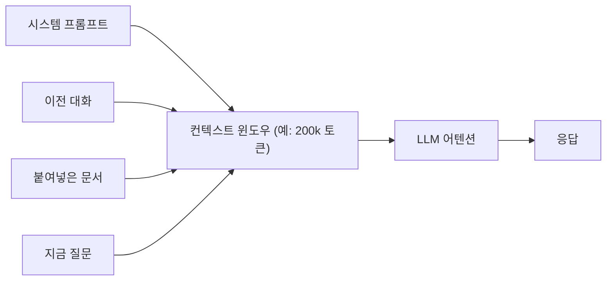

---
categories:
- llm
category_ko: 대규모 언어 모델
date: '2026-05-18T10:39:46+09:00'
description: AI 카테고리 'llm' 의 intro 수준 핵심 토픽 정리. 독자가 처음 접해도 따라올 수 있게 비유·예시·필요 시 다이어그램·코드
  스니펫 포함.
image:
  alt: 컨텍스트 윈도우가 의미하는 것
  path: https://haangman.github.io/J-Blog-AI/assets/img/2026/05/컨텍스트-윈도우가-의미하는-것-abe226.jpg
layout: post
slug: 컨텍스트-윈도우가-의미하는-것-abe226
summary: AI 카테고리 'llm' 의 intro 수준 핵심 토픽 정리. 독자가 처음 접해도 따라올 수 있게 비유·예시·필요 시 다이어그램·코드
  스니펫 포함.
tags:
- llm
title: 컨텍스트 윈도우가 의미하는 것
---

*[Photo by James Bold on Unsplash](https://unsplash.com/@jamesbold?utm_source=blogmaker&utm_medium=referral)*

컨텍스트 윈도우 — LLM 을 쓰다 보면 한 번쯤은 듣게 되는 말이다. "이 모델 컨텍스트가 200k 라더라", "1M 까지 늘렸다" 같은 식으로. 근데 이게 정확히 뭘 의미하는지는 다들 좀 흐릿하게 알고 넘어간다.

쉽게 말하면, 모델이 **한 번에 기억할 수 있는 글자(정확히는 토큰) 의 양** 이다. 사람이 책을 읽을 때 펼쳐 놓은 페이지 안의 문장들끼리는 연결해 이해하지만, 50 페이지 전 문장을 그대로 떠올리진 못하는 것과 비슷하다. LLM 도 똑같이 "지금 이 창 안에 들어 있는 것" 만 본다. 그 창의 크기가 컨텍스트 윈도우.

토큰 단위로 잰다. 영어는 대충 1 토큰 ≈ 4 글자, 한국어는 더 짧다 (한 음절이 토큰 하나로 잡힐 때도 많음). GPT-4 가 처음 나왔을 때 8k 였다가 128k 로 늘었고, 요즘은 Claude 200k, Gemini 1M 같은 숫자가 나온다. 1M 이면 책 한 권을 통째로 던질 수 있는 수준.

근데 여기서 사람들이 잘 모르는 게 있다. 컨텍스트가 크다고 그 안의 정보를 다 "잘 기억하는" 건 아니다. 내가 직접 큰 윈도우에 긴 문서를 넣고 중간 어딘가에 있던 사실을 물어보면, 종종 못 찾는다. 보통 **앞 부분과 끝 부분은 잘 떠올리는데 중간이 흐릿** 한 식. 이걸 "lost in the middle" 이라고 부른다 (Liu et al., 2023). 사람도 좀 그렇긴 한 것 같지만.

내부적으로는 어텐션이 모든 토큰끼리 짝지어서 계산을 하니까, 컨텍스트가 두 배 되면 계산량이 네 배로 뛴다. 그래서 1M 같은 큰 윈도우는 거의 다 일반 어텐션이 아니라 sliding window, sparse attention, 기타 트릭들이 섞여 있다. 정확한 구조는 회사마다 다르고 공개 안 된 게 많아 단정하긴 어렵다.

*[Photo by Chris Ried on Unsplash](https://unsplash.com/@cdr6934?utm_source=blogmaker&utm_medium=referral)*

체감상 가장 큰 변화는, 코드베이스를 통째로 넣고 질문하는 게 가능해졌다는 점이다. 예전엔 함수 하나만 떼서 보여주며 "이거 왜 안 돼?" 물었다면, 지금은 폴더 째로 던지고 "전체 흐름 보고 말해줘" 가 된다. 다만 위에 적었듯 정말 중요한 정보는 프롬프트 끝 쪽에 한 번 더 정리해 넣어주는 게 안전하더라 — 그게 내 손버릇이 됐다.

이게 어디까지 늘어날지, 늘어나는 게 정말 답인지는 좀 더 봐야 할 것 같다. 무한히 큰 윈도우보다 RAG 처럼 필요한 부분만 그때그때 가져와 쓰는 게 비용·정확도 면에서 더 나을 수도 있고.