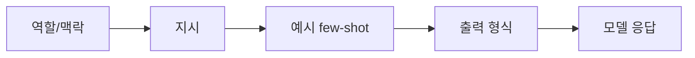

---
categories:
- llm
category_ko: 대규모 언어 모델
date: '2026-05-18T20:51:38+09:00'
description: AI 카테고리 'llm' 의 intro 수준 핵심 토픽 정리. 독자가 처음 접해도 따라올 수 있게 비유·예시·필요 시 다이어그램·코드
  스니펫 포함.
image:
  alt: 프롬프트 엔지니어링 기본기
  path: https://haangman.github.io/J-Blog-AI/assets/img/2026/05/프롬프트-엔지니어링-기본기-b741ed.jpg
layout: post
mermaid: true
slug: 프롬프트-엔지니어링-기본기-b741ed
summary: AI 카테고리 'llm' 의 intro 수준 핵심 토픽 정리. 독자가 처음 접해도 따라올 수 있게 비유·예시·필요 시 다이어그램·코드
  스니펫 포함.
tags:
- llm
title: 프롬프트 엔지니어링 기본기
---

프롬프트 엔지니어링이라는 단어가 처음 회사 슬랙에 등장한 게 2023년쯤이었나. 그때만 해도 "이게 무슨 직업이냐, 그냥 검색창에 잘 물어보는 거 아니냐" 하는 농담이 많았는데, 막상 LLM — Large Language Model, GPT나 Claude처럼 통째로 글을 받아 통째로 글을 뱉는 그 큰 언어 모델 — 을 제품에 박아 넣어보면 이게 농담이 아니라는 걸 금방 안다.

같은 모델, 같은 질문인데 어떻게 묻느냐에 따라 답의 품질이 두세 배씩 갈리거든.

내가 이걸 처음 체감한 건 사내 고객 문의 분류기를 만들 때였지. 처음엔 그냥 "이 문의를 환불/배송/기타 중 하나로 분류해줘" 라고만 던졌더니 정확도가 70% 언저리. 근데 거기다 예시 세 개를 붙이고, "답은 한 단어만, 다른 말 붙이지 마" 같은 제약을 명시하니까 80% 후반으로 뛰더라. 모델은 그대론데.


기본 골격은 사실 단순해. 좋은 프롬프트는 보통 네 가지를 갖고 있더라.



**역할/맥락** 은 "너는 의료 상담을 해주는 챗봇이 아니라 단순 분류기야" 같은 줄. 모델한테 어떤 모자를 씌울지 정해주는 거지. **지시** 는 진짜 시킬 일. **예시(few-shot)** 는 입력-출력 짝 두세 개를 보여주는 부분인데, 솔직히 체감상 이게 제일 효과가 크다. 사람도 백 마디 설명보단 "이렇게 하라는 거구나" 싶은 예시 하나가 빠르잖아. 모델도 똑같더라.

**출력 형식** 은 후공정 때문에 중요하다. JSON 으로 받을 거면 "JSON만, 백틱 없이, 다음 스키마로" 라고 못 박아야지. 안 그러면 "물론입니다! 다음은 요청하신 JSON입니다:" 같은 친절한 머리말이 따라붙어서 파서가 죽어버린다.

간단한 예시 하나만 보면:

```python
prompt = """너는 한국어 고객 문의를 분류한다.
카테고리: refund, delivery, other

예시:
입력: "어제 주문한 거 아직 안 왔어요"
출력: delivery

입력: "환불 받고 싶은데요"
출력: refund

이제 분류:
입력: "{user_text}"
출력:"""
```

이게 다야. 화려할 거 없지.


*[Photo by Patrick Perkins on Unsplash](https://unsplash.com/@patrickperkins?utm_source=blogmaker&utm_medium=referral)*


그 다음 단계는 **Chain-of-Thought**, 줄여서 CoT 라 부르는 기법. 어려운 문제는 "정답만 말해" 보다 "단계별로 생각하고 마지막에 정답" 이라고 시키면 정확도가 올라간다. Wei et al. (2022) 의 그 유명한 논문에서 처음 정리됐고, 그 뒤로 거의 모든 reasoning 벤치마크의 디폴트가 됐지. 정확한 수치는 잊었는데 GSM8K 수학 문제에서 두 자릿수 퍼센트 차이가 났던 걸로 기억한다.

근데 요즘 Claude 4 나 GPT-5 급 모델은 "think step by step" 같은 주문을 안 붙여도 알아서 추론을 길게 하는 편이라, 옛날만큼 극적인 차이는 아니더라. 그래도 모델이 헷갈리는 자리에서는 여전히 유효한 카드.

체감상 더 자주 쓰게 되는 건 **제약 명시**. "모르겠으면 모른다고 답해라", "원문에 없는 사실은 만들어내지 마라", "답은 두 문장 이내" 같은 가드레일. 환각(hallucination) — 모델이 그럴듯한 거짓말을 지어내는 그 현상 — 을 완전히 막진 못해도 빈도는 확실히 줄어든다. 내 환경에선 RAG (외부 문서를 모델한테 같이 넘겨서 답하게 하는 방식) 와 같이 쓸 때 특히 유효.

재밌는 건, 프롬프트를 너무 길게 쓰면 오히려 망가질 때가 있다는 점. 모델이 앞부분 지시를 슬슬 잊거나(=중간에 있는 지시는 잘 묻힘. "lost in the middle" 이라고 불리는 현상), 너무 많은 예시가 오히려 노이즈가 되거든. 그래서 production 에서는 길게 쓰는 것보다 **짧고 또렷한 지시 + 좋은 예시 2~4개** 가 안정적이더라. 예시 100개 박는 건 fine-tuning 영역으로 넘기는 게 맞고.


*[Photo by Pankaj Patel on Unsplash](https://unsplash.com/@pankajpatel?utm_source=blogmaker&utm_medium=referral)*


그래서 결국 프롬프트 엔지니어링이 따로 직업으로 살아남느냐, 아니면 모델이 더 똑똑해지면서 사라지느냐 — 이 질문을 자주 받는다. 솔직히 내 생각은 반반. 단순한 "잘 묻는 법" 은 모델이 알아서 흡수하고 있어서 점점 의미가 줄겠지. 근데 "내가 만드는 제품 안에서 이 모델을 어떻게 가둘 것인가" 의 영역, 그러니까 출력 스키마·평가 기준·실패 케이스 대응 같은 시스템 디자인 쪽은 오히려 더 중요해질 것 같음.

이건 결국 모델을 "잘 다루는 사람" 의 일이지 단어를 잘 고르는 사람의 일은 아니거든. 그래서 이름이 바뀌든 말든, 이 감각은 한동안 더 필요할 듯.