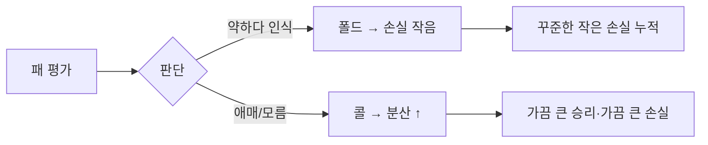

1.2B 짜리 작은 LLM 이 텍사스 홀덤 토너먼트에서 1조 파라미터급 클라우드 모델까지 깔린 테이블을 두 번이나 우승했다는 글이 r/LocalLLaMA 에 올라왔다. 16GB 맥북 한 대에서 로컬로 돌린 모델인데, 다섯 판 중에 두 판을 챙겼다는 거다.

원문에 박혀 있는 표가 좀 웃긴데, 1위 명단이 Qwen 1.7B, MiniMax 230B, Liquid 1.2B, Kimi ~1T, 그리고 다시 Liquid 1.2B. 클라우드 거대 모델이 한 번씩 이긴 사이사이로 가장 작은 로컬 모델이 두 번 정상에 올랐다. Liquid 는 Liquid AI 에서 낸 LFM (Liquid Foundation Model) 의 1.2B 사이즈 — 작년부터 엣지·온디바이스 쪽으로 미는 그 모델이다.

글쓴이가 단 헤드라인이 더 인상적이다. "The Smallest Model Beat a ~1T Model by Being Too Dumb to Fold." 폴드를 못 해서 이겼다는 거다. 텍사스 홀덤을 모르면 정말 단순히 보면 — 자기 카드 두 장 + 테이블에 깔리는 공용 카드 다섯 장으로 다섯 장짜리 패를 만들고, 매 라운드마다 죽을지(fold) 따라갈지(call/raise) 정한다. 큰 모델이 똑똑하게 "내 핸드가 약하니까 죽자" 하고 빠지면, 폴드를 잘 안 하는 작은 모델은 그냥 가만히 끝까지 따라가다가 우연히 잘 맞은 패 한 번으로 판돈을 다 가져가는 식이다.

이게 좀 웃긴 게, 실제로 포커는 단기 운의 분산이 어마어마하게 큰 게임이다. 5판은 통계적으로 거의 의미가 없는 표본이고, 프로 포커 토너먼트에서도 보통 100판 단위는 돌려봐야 실력이 드러난다. 그러니까 "1.2B 가 1T 를 이겼다" 보다는 "5판이라는 작은 표본에서 폴드 안 하는 단순 전략이 우연히 EV 가 잘 맞았다" 가 솔직히 더 정확한 표현 같다. 다만 흥미로운 건 — 큰 모델일수록 학습 데이터 안의 "내 패가 별로네" 같은 self-doubt 을 더 잘 따라 한다는 거. 영리한 보수성이 이 게임 룰 안에서는 손해로 돌아온다.

같은 시기에 r/LocalLLaMA 에 MoE (Mixture of Experts) 아키텍처의 실효성을 묻는 글도 같이 올라왔다. 요지는 이거다. xB MoE 가 yB 만큼만 활성화돼서 빨리 돌아간다 해도, 어차피 가중치 전체를 RAM 에 올려야 한다면 같은 RAM 으로 dense x/2B 를 돌리는 거랑 비교했을 때 도대체 뭐가 더 나은 거냐. 체감상 이건 모델·태스크별로 답이 너무 다르다. 학습 효율(같은 FLOPs 로 더 멀리)이나 라우팅이 자연스러운 도메인(코드 vs 자연어처럼 갈리는 경우)에서는 MoE 가 분명 유리한데, 글쓴이가 지적한 RAM 관점에서는 정말 마진이 좁아진다.

*[AI generated (Pollinations · Flux)](https://pollinations.ai/)*

내가 본 한에선, 이번 포커 에피소드와 MoE 논의가 같은 흐름의 다른 단면 같다. **모델 크기가 더 이상 단일 축의 우열을 결정하지 않는다**는 거. 코딩 벤치마크 1위, MMLU 점수, 포커 토너먼트 우승이 죄다 다른 모델에게 돌아갈 수 있는 시대고, "큰 게 무조건 낫다" 는 명제가 점점 좁은 조건에서만 성립한다. 작은 모델이 잘 하는 자리는 따로 있고, 그 자리는 점점 더 일상에 가까운 쪽으로 내려오는 중이다.

물론 5판짜리 토너먼트 결과를 갖고 "작은 게 더 낫다" 까지 가면 그건 그것대로 과장이다. 다만 1조 파라미터짜리 클라우드 모델이 16GB 맥북 위의 1.2B 한테 두 번 진 표가 그대로 화면에 박혀 있는 광경은 — 솔직히 한 번 더 보게 만든다. 우리가 "잘 한다" 라고 부르는 게 정확히 어떤 평가축 위에서의 잘함인지, 그 축이 토픽마다 얼마나 다른지부터 다시 생각하게 되는 자리다. 이게 어떻게 굴러갈진 좀 더 봐야 할 것 같다.

***

**참고**

- [What is the point of MoE models, beyond being faster?](https://www.reddit.com/r/LocalLLaMA/comments/1thfd53/what_is_the_point_of_moe_models_beyond_being/)
- [My 1.2B model won 2 out of 5 poker tournaments against models up to 1T params.](https://www.reddit.com/r/LocalLLaMA/comments/1thetg7/my_12b_model_won_2_out_of_5_poker_tournaments/)
- [I Made LLMs Play Texas Hold’em. The Smallest Model Beat a ~1T Model by Being Too Dumb to Fold](https://www.reddit.com/r/singularity/comments/1thhrfm/i_made_llms_play_texas_holdem_the_smallest_model/)