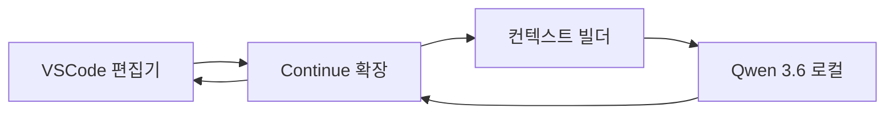

요즘 r/MachineLearning 둘러보다가 좀 재밌는 글을 봤다. 16세 개발자가 본인 첫 패키지로 model-agnostic sensitivity approximator — 그러니까 모델이 뭘 쓰든 입력을 살짝 흔들었을 때 출력이 얼마나 흔들리는지 근사해주는 XAI 도구 — 를 올리고 피드백을 받고 싶다고 했다. XAI 는 eXplainable AI 의 줄임말인데, 모델이 왜 그렇게 답했는지 사람이 이해할 수 있게 해주는 분야다.

사실은 이게 좀 재밌었다. 업계 표준이라 부르는 SHAP, LIME — 모델의 어떤 feature 가 예측에 얼마나 기여했는지 점수를 매겨주는 도구들 — 은 죄다 "기여도(attribution)" 쪽이다. 근데 이 친구가 만든 건 "민감도(sensitivity)" 쪽. 비슷해 보이지만 결이 다르다. attribution 은 "이 입력값이 결과에 얼마나 영향을 줬나" 를 점수화하는 거고, sensitivity 는 "이 입력을 살짝 흔들면 결과가 얼마나 흔들리나" 를 본다. 후자는 모델이 어떤 입력에 취약한지, robustness 검증 쪽에 더 가깝다.

코드는 안 봤지만 컨셉만 보면 finite difference 비슷한 방식일 것 같다. 입력 x 에 작은 perturbation 더해서 출력 차이를 모으는 식. model-agnostic 이라 모델 내부 gradient 접근 안 해도 되니까 black-box API 에도 붙일 수 있다. 다만 정확도와 비용 사이 trade-off 가 가팔라서, 입력 차원이 커지면 샘플링 전략이 핵심이 될 거다. 16살이 이 정도 발상을 첫 패키지로 던진다는 게 솔직히 부럽다. 내가 16살 때는 그냥 학교 다녔는데.

같은 날 r/LocalLLaMA 에는 Continue.dev — VSCode 안에서 LLM 으로 코드 자동완성·리팩토링 시켜주는 확장 — 와 Qwen 3.6 (알리바바가 공개한 오픈소스 LLM 시리즈) 조합 써본 사람 있냐는 질문이 올라왔다. 원래 Roo / Zoo 를 쓰고 있었는데 컨텍스트 관리가 너무 빡빡해서 대안을 찾는다는 맥락.

이게 좀 웃긴 게, 로컬 LLM + 코딩 확장 조합은 다들 비슷한 벽에 부딪힌다. 컨텍스트 윈도우는 한정돼 있고 코드베이스는 큰데, 어떤 파일을 LLM 에 같이 넣어줄지 결정하는 게 사실상 시스템 품질을 결정한다. Roo 계열은 자동으로 많이 긁어와서 정확도는 좋은데 토큰을 빨리 먹는다. Continue 는 그 결정을 좀 더 사용자에게 넘기는 쪽이라더라 — 내가 직접 둘을 비교해본 건 아니라서 정확한 평가는 못 한다.

*[Photo by Mohammad Rahmani on Unsplash](https://unsplash.com/@afgprogrammer?utm_source=blogmaker&utm_medium=referral)*

체감상 이 두 글이 같은 날 올라온 게 묘하게 같은 신호로 읽혔다. 한쪽은 16살이 만든 XAI 도구, 다른 쪽은 본인 환경에 맞춰 코딩 보조 도구를 갈아끼우려는 사람. 둘 다 "남이 만든 추상 위에 얹혀 사는 거 말고 내가 직접 들여다보고 싶다" 는 충동을 공유한다. 그동안 LLM API 만 갖다 쓰던 사람들이 한 단계 안쪽으로 들어가고 있다는 신호인지, 아니면 그냥 주말에 손 놀리고 싶었던 두 명의 우연인지는 좀 더 봐야 알 것 같다.

***

**참고**

- [model-agnostic sensitivity approximator [P]](https://www.reddit.com/r/MachineLearning/comments/1tgemq5/modelagnostic_sensitivity_approximator_p/)
- [If you use continue.dev and Qwen 3.6 (dense / MoE) - I could use your help](https://www.reddit.com/r/LocalLLaMA/comments/1tgkyud/if_you_use_continuedev_and_qwen_36_dense_moe_i/)