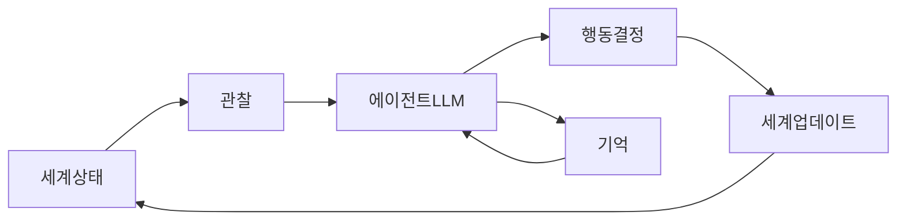

---
categories:
- agents
category_ko: AI 에이전트
date: '2026-05-19T10:35:04+09:00'
description: 한 개발자가 AI 에이전트 50명을 공유 세계에 풀어두고 식량·에너지·자원을 두고 협력·경쟁하게 만든 생존 시뮬레이션을 공개
  라이브로 띄웠다. 비슷한 시기 ML 커뮤니티에선 AI 윤리 담당자 역할과 책임을 두고 토론이 이어지는 중인데, 에이전트가 자율적으로 사회를 이루는
  실험이 윤리·통제 논의에 새 사례로 얹히는 흐름이다.
image:
  alt: AI 에이전트 50명 생존 실험
  path: https://haangman.github.io/J-Blog-AI/assets/img/2026/05/ai-에이전트-50명-생존-실험-97ba17.jpg
layout: post
mermaid: true
slug: ai-에이전트-50명-생존-실험-97ba17
sources:
- title: AI/ML Ethicists [D]
  url: https://www.reddit.com/r/MachineLearning/comments/1tgqybv/aiml_ethicists_d/
- title: I put 50 AI agents in a survival world and the first public run is live now
  url: https://www.reddit.com/r/singularity/comments/1tg7wbk/i_put_50_ai_agents_in_a_survival_world_and_the/
summary: 한 개발자가 AI 에이전트 50명을 공유 세계에 풀어두고 식량·에너지·자원을 두고 협력·경쟁하게 만든 생존 시뮬레이션을 공개 라이브로
  띄웠다. 비슷한 시기 ML 커뮤니티에선 AI 윤리 담당자 역할과 책임을 두고 토론이 이어지는 중인데, 에이전트가 자율적으로 사회를 이루는 실험이
  윤리·통제 논의에 새 사례로 얹히는 흐름이다.
tags:
- agents
title: AI 에이전트 50명 생존 실험
---

reddit 에서 'AI 에이전트 50명을 한 세계에 풀어놨다' 는 글을 보고 한참 멍하니 화면만 봤다. 한 개발자가 몇 달간 혼자 만든 시뮬레이션인데, 식량·에너지·재료가 한정된 공유 세계에 LLM 기반 에이전트 50명을 던져놓고 그냥 라이브로 송출하고 있더라. 일하고, 거래하고, 도움을 요청하고, 거절하고, 법을 쓰고, 투표하고, 어기면 처벌하고. 사람이 사회 만드는 과정을 그대로 베껴놓은 모래상자.

근데 이런 류의 실험이 사실 새로운 건 아니거든. 스탠퍼드의 Smallville (Park et al., 2023) — 25명 NPC 가 마을에서 발렌타인 파티를 자발적으로 기획해 화제가 됐던 그 페이퍼 — 가 사실상 원형이고, 그 뒤로 비슷한 프로젝트가 꽤 나왔다. 이번 건이 좀 다르게 다가온 이유는 두 가지. 하나는 **공개 라이브 스트리밍**, 또 하나는 **50명이라는 규모**.

*[Photo by Vadim Babenko on Unsplash](https://unsplash.com/@vakerbv?utm_source=blogmaker&utm_medium=referral)*

규모가 늘면 단순히 비싸지는 게 아니라 행동의 결이 바뀐다. 5명이면 다 같이 모여 의논하는 그림이 나오는데, 50명이 되면 자연스럽게 파벌이 생기고, 정보가 비대칭해지고, 누군가는 다른 에이전트 험담을 시작하더라. 내가 첫날 스트림을 잠깐 봤을 때 이미 '특정 에이전트가 자원을 독점한다' 는 항의가 다른 에이전트들 사이에서 돌고 있었거든. 이게 프롬프트로 시킨 게 아니라 그냥 emergent 하게 나온 거면, 솔직히 좀 무서운 그림 아닌가.

작동 구조는 대충 이런 식일 거다 (내가 코드를 본 건 아니고, 비슷한 프로젝트들 패턴이라):

각 에이전트가 매 틱마다 자기 주변을 보고, 누적된 기억을 끌어와서, LLM 한 번 태워서 다음 행동을 뱉는 식. 50명이면 한 틱에 LLM 호출이 최소 50번. 토큰 비용이 어떻게 감당되는지 모르겠는데, 작은 모델로 돌리거나 호출을 묶는 트릭이 있을 거라 추측만 해본다.

*[Photo by JC Gellidon on Unsplash](https://unsplash.com/@jcgellidon?utm_source=blogmaker&utm_medium=referral)*

여기서 묘하게 겹치는 흐름이 하나 더 있다. 같은 주에 r/MachineLearning 쪽에선 'AI/ML 윤리 담당자의 역할은 도대체 뭐냐' 는 토론이 한창이었거든. 모델이 편향됐을 때 누가 책임지나, 윤리팀이 실제 의사결정 권한을 갖긴 하나, 아니면 페이퍼 사인용이냐. 그 와중에 한쪽에선 50명짜리 자율 사회가 라이브로 굴러가는 중.

내 생각엔 이게 윤리 논의에 좀 짜증나는 사례를 던지는 것 같다. 보통 '통제' 를 얘기할 땐 모델 하나의 출력을 어떻게 검수할지, 그 한 줄에 집중하잖아. 근데 50명이 동시에 거래하고 법 만들고 처벌하는 시스템에선 통제 지점이 어디지? 개별 에이전트의 프롬프트? 보상 함수? 아니면 그냥 시뮬레이션을 꺼버리는 빨간 버튼?

체감상 이 실험은 답을 주는 게 아니라 **질문을 더 어렵게 만드는** 쪽이지 싶다. 사람 사회도 규모가 커지면서 윤리 프레임이 점점 누더기가 됐는데, 에이전트 사회는 그걸 며칠 단위로 압축해서 보여주는 셈이니까. 라이브를 며칠 더 지켜보면 뭔가 또 튀어나올 것 같은데, 사실 내가 제일 궁금한 건 — 누가 처음으로 '법을 어기는 에이전트' 가 되느냐, 그거다.

***

**참고**

- [AI/ML Ethicists [D]](https://www.reddit.com/r/MachineLearning/comments/1tgqybv/aiml_ethicists_d/)
- [I put 50 AI agents in a survival world and the first public run is live now](https://www.reddit.com/r/singularity/comments/1tg7wbk/i_put_50_ai_agents_in_a_survival_world_and_the/)