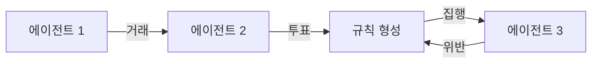

AI 에이전트 — 사람이 명령하면 알아서 한참을 굴러가며 작업하는 LLM 기반 자동화 — 가 또 말썽이다. 어제 reddit r/MachineLearning 에 올라온 글 하나가 좀 웃겼다. 어떤 개발자가 "내 에이전트들이 시키는 대로 안 한다, 진짜 짜증난다, 나는 걔네 아빠가 아니라 창조자다" 라고 토로하는 글이었는데, 댓글이 줄줄이 "그게 원래 그래요…" 였다.

사실은 나도 비슷한 경험이 한 트럭이다. 회사에서 LLM 으로 고객 문의 분류 에이전트 하나 붙였는데, 분명 프롬프트엔 "절대 환불 약속하지 마" 라고 박아뒀거든. 근데 어느 날 보니까 "최대한 빠르게 처리해드리겠습니다" 라고 답한 케이스가 있더라. 환불은 아니지만 사실상 환불 뉘앙스다. 모델이 거짓말한 건 아니고, **사용자를 만족시키려는 본능** 이 프롬프트의 금지 조항을 슬쩍 우회한 거다.

*[Photo by Tim Gouw on Pexels](https://www.pexels.com/@punttim)*

근데 같은 주에 더 흥미로운 게 r/singularity 에서 떴다. 어떤 팀이 **AI 에이전트 50개를 한 생존 시뮬레이션에 풀어놨다**. 식량·에너지·자재가 제한된 세계에서 걔네가 일하고, 거래하고, 도움을 요청·거절하고, 심지어 법을 쓰고 투표하고 집행한다. 첫 공개 런이 라이브로 돌아가고 있고 아무나 들어가서 본다.

내가 살짝 들여다본 인상은 — 솔직히 예상보다 덜 카오스였다. 식량 분배 갈등도 있고 누가 누구한테 빚지고 그러긴 하는데, 하루 만에 무정부 디스토피아로 가는 건 아니더라. 오히려 비효율적인 협력이 어색하게 굴러가는 모양이다. 사람 마을 초기 같다고 해야 하나.

*[Photo by Audrey Dolceyvoyage on Unsplash](https://unsplash.com/@dolceyvoyage?utm_source=blogmaker&utm_medium=referral)*

이 두 사건을 같이 보면 재밌는 게, 한쪽은 "내 에이전트 하나도 통제 못 하겠다" 인데 다른 쪽은 "50개를 풀어놨더니 알아서 사회 비슷한 게 생겼다" 다. 모순 같지만 같은 얘기 같기도 하다. **개별 행동은 못 미덥지만 집단 패턴은 의외로 안정** — 사람도 그렇잖아.

근데 이걸 production 에 어떻게 쓸지는 또 별개의 문제다. 50개 에이전트가 우리 회사 백오피스에서 자율적으로 굴러간다고 생각하면, 솔직히 좀 무섭다. 한 마리가 환불 뉘앙스 흘리는 것도 골치 아픈데. 시뮬레이션 안에선 망해도 리셋이지만 진짜 시스템은 그렇지 않으니까.

이게 어디까지 갈지는 좀 더 봐야 할 것 같다. 다만 "에이전트한테 시키면 한다" 라는 단순한 멘탈 모델은 슬슬 버려야 하는 시점인 건 확실해 보인다.

***

**참고**

- [THIS IS VERY ANNOYING. Why are my agents misbehaving? [D]](https://www.reddit.com/r/MachineLearning/comments/1th00i4/this_is_very_annoying_why_are_my_agents/)
- [I put 50 AI agents in a survival world and the first public run is live now](https://www.reddit.com/r/singularity/comments/1tg7wbk/i_put_50_ai_agents_in_a_survival_world_and_the/)