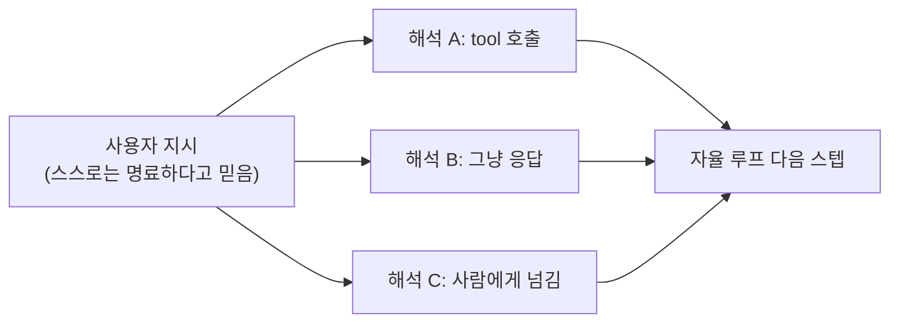

요즘 AI 에이전트가 말을 안 듣는다고 답답해하는 글이 ML 서브레딧 상단에 올라와 있더라. 글쓴이는 "내가 얘들 아빠도 아니고, 만든 사람인데 시키면 그대로 해야지 왜 자꾸 딴짓이냐" 식으로 토로했다. 비슷한 시기에 다른 쪽에서는 다른 개발자가 자기가 만든 에이전트 50개를 한 가상 생존 세계에 풀어놓고, 자기들끼리 협력하고 싸우고 법을 만드는 걸 라이브로 중계하기 시작했고. 둘이 톤은 정반대인데, 사실 같은 얘기를 다른 각도에서 하는 거더라.

근데 솔직히 그 첫 글, 댓글창이 더 흥미로웠다. 다들 "그게 LLM 이다", "system prompt 더 빡세게 짜라" 같은 정석 답변을 다는데, 중간에 한 명이 "에이전트가 말 안 듣는 게 아니라, 네가 시킨 그 지시가 너 자신도 명확하게 정의 못 한 거 아니냐" 라고 박아놨거든. 이게 좀 정곡이다 싶더라.

내 환경에서도 비슷한 일이 종종 있다. 사내 챗봇에 tool calling — 모델이 답하는 대신 외부 함수나 API 를 호출하게 만드는 — 을 붙여놓고, "이거 안 되면 저거 써, 그래도 안 되면 사람 호출해" 정도로 정책을 줘 봤는데, 정작 "어떤 게 안 된 거냐" 의 판단 기준을 모호하게 두면 에이전트는 거의 매번 멋대로 굴러간다.

*[Photo by Sebastian Herrmann on Unsplash](https://unsplash.com/@officestock?utm_source=blogmaker&utm_medium=referral)*

문제는 이게 hallucination 이 아니라는 점. 모델이 헛소리하는 게 아니라, 우리가 '명확하다'고 믿었던 지시가 사실 명확하지 않았던 거지. 머릿속에서는 분기 트리 하나로 보였는데, 모델 입장에서 그 트리는 가지가 다섯 갈래쯤 갈라져 있는 거다.

이건 처음 LLM 만질 때부터 다들 한 번씩 겪는데, '에이전트' 라는 추상이 한 겹 더 얹히면 더 두드러지더라. 그냥 chat 일 땐 "응답이 좀 이상하네" 로 끝나는데, 자율 루프 안에서는 잘못된 한 번의 해석이 다음 단계까지 그대로 끌고 가버리거든.

그래서 두 번째 사건 — 50 에이전트 생존 시뮬 — 이 묘하게 연결돼 보였다. 거기선 만든 사람이 일부러 통제를 놓더라. 한정된 식량·자재·에너지를 주고, 도울지 거절할지, 법을 만들지 말지, 위반자를 처벌할지를 다 에이전트끼리 결정하라고 떠넘기는 구조.

운영자가 공개한 초반 로그를 보면, 어떤 에이전트는 첫날부터 자원을 독점하려 들고, 어떤 에이전트는 다른 애한테 음식 빌려주고 그 빚으로 정치적 동맹을 만들려는 식으로 움직이고. 이게 진짜로 그렇게 사고하는 건지, 아니면 prompt 에 슬쩍 넣어둔 "너는 생존을 우선시한다" 같은 한 줄이 그 행동을 끌어낸 건지는 바깥에서 봐선 구분이 잘 안 된다.

*[Photo by Kristijan Arsov on Unsplash](https://unsplash.com/@aarsoph?utm_source=blogmaker&utm_medium=referral)*

재밌는 건 둘 다 결국 "내가 만든 애가 내가 의도한 대로 안 움직인다" 인데, 한쪽은 그걸 버그로 보고, 다른 쪽은 그걸 콘텐츠로 본다는 거. 같은 현상을 어디까지 허용하느냐가 다를 뿐.

체감상 production 에서 LLM 에이전트 다루는 입장에선, 솔직히 첫 글 쪽 감정에 훨씬 더 가깝다. "왜 또 멋대로 도구를 호출했냐, 왜 멈춰야 할 때 한 번 더 retry 했냐" — 매주 하는 회고가 거의 이거지. 모델이 더 똑똑해질수록 줄어드는 게 아니라, 자율성 폭이 커져서 어디로 튈지 예측 범위가 같이 넓어지는 느낌이 있더라.

근데 시뮬레이션 쪽 영상 한참 보면서 든 생각은, 어쩌면 우리가 다루는 단일 에이전트도 이미 50개짜리 군집에 더 가까운 게 아닐까 하는 거. 도구 호출, 다단계 reasoning, sub-agent 분기, memory — 하나의 에이전트라고 부르지만 안에선 여러 가닥이 서로 거래하고 있고, 우리는 system prompt 한 줄로 그 가닥들이 깔끔하게 한 방향으로 정렬되리라고 기대하는 거잖아.

이게 어디까지 통할지는 좀 더 봐야 할 것 같다. 50 에이전트가 한 달 뒤 어떤 사회를 만들고 있을지도 궁금한데, 그것보단 솔직히 내 회사 챗봇이 다음 주에 또 어디서 사고를 칠지가 훨씬 더 신경 쓰이는데.

***

**참고**

- [THIS IS VERY ANNOYING. Why are my agents misbehaving? [D]](https://www.reddit.com/r/MachineLearning/comments/1th00i4/this_is_very_annoying_why_are_my_agents/)
- [I put 50 AI agents in a survival world and the first public run is live now](https://www.reddit.com/r/singularity/comments/1tg7wbk/i_put_50_ai_agents_in_a_survival_world_and_the/)