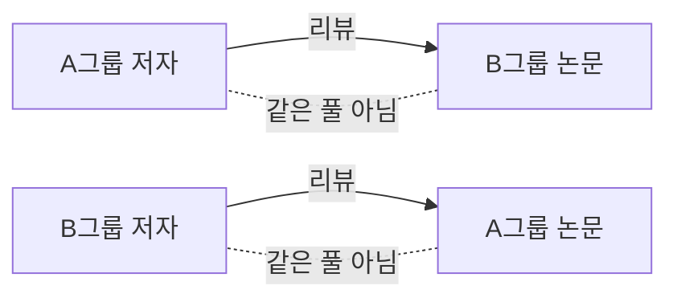

---
categories:
- industry
category_ko: 산업·회사 동향
date: '2026-05-19T19:24:05+09:00'
description: HuggingFace가 방치된 PapersWithCode를 부활시키는 작업에 착수했고, AI 학회 피어리뷰의 상호 거절 문제에
  대한 해법도 제시되고 있다. 종이에 코딩하는 방식 논의까지 더해지며 연구 생태계의 인프라와 평가 시스템을 다시 짜려는 흐름이 동시에 일고 있다.
image:
  alt: AI 연구 커뮤니티 동향
  path: https://haangman.github.io/J-Blog-AI/assets/img/2026/05/ai-연구-커뮤니티-동향-97d855.jpg
layout: post
mermaid: true
slug: ai-연구-커뮤니티-동향-97d855
sources:
- title: Coding on Paper
  url: https://wickstrom.tech/2026-05-16-coding-on-paper.html
- title: Reviving PapersWithCode (by Hugging Face) [P]
  url: https://www.reddit.com/r/MachineLearning/comments/1tgmwqr/reviving_paperswithcode_by_hugging_face_p/
- title: A Simple Solution to Improve Broken Peer Review System at AI Conferences
    [R]
  url: https://www.reddit.com/r/MachineLearning/comments/1the441/a_simple_solution_to_improve_broken_peer_review/
summary: HuggingFace가 방치된 PapersWithCode를 부활시키는 작업에 착수했고, AI 학회 피어리뷰의 상호 거절 문제에 대한
  해법도 제시되고 있다. 종이에 코딩하는 방식 논의까지 더해지며 연구 생태계의 인프라와 평가 시스템을 다시 짜려는 흐름이 동시에 일고 있다.
tags:
- industry
title: AI 연구 커뮤니티 동향
---

PapersWithCode 가 다시 살아난다는 소식이 며칠 새 좀 시끄러웠다. HuggingFace 의 Niels 라는 사람이 — HuggingFace 는 오픈소스 모델이랑 데이터셋을 한 곳에 모아두는 허브, ML 하는 사람이면 안 거치기 어려운 그 회사 — r/MachineLearning 에 직접 글을 올렸다. PapersWithCode 는 논문이랑 거기 딸린 코드·벤치마크 점수를 한 화면에 모아 보여주던 사이트였는데, Meta 가 인수한 뒤로 사실상 방치돼 죽어 있었다.

나도 모델 비교할 때마다 그 사이트 들렀던 기억이 있어서 사라졌을 때 좀 허전했다. abstract 읽고 GitHub 따로 검색하는 게 은근 귀찮거든. 벤치마크 표 하나 뜨면 "아 이 모델이 이 데이터셋에서 몇 점이구나" 가 5초 만에 정리되던 곳이었다.

재밌는 건 Niels 가 이걸 어떻게 다시 짓는지다. AI 에이전트로 논문을 대량 파싱해서 코드 링크·벤치마크·태스크를 자동으로 뽑아낸다고 한다. 사람이 손으로 채워 넣던 자리에 LLM 이 들어가는 구조. 시대상 맞다 싶으면서도 좀 무섭다. LLM 이 잘못 읽은 숫자가 그대로 "공식" 벤치마크 표로 굳어버리면 — 그 뒤 논문들이 그걸 기준으로 비교를 시작할 텐데 — 꽤 흔들릴 수 있다. 인간 검수가 어디까지 들어가는지가 결국 관건일 것 같다.

*[AI generated (Pollinations · Flux)](https://pollinations.ai/)*

비슷한 시기에 r/MachineLearning 에 또 다른 글이 올라왔다. AI 학회 피어리뷰가 망가졌다는 얘기, 그리고 그 해법 제안. 핵심 문제는 reciprocal reviewing 이라는 건데, 풀어 말하면 이렇다. 내가 리뷰어로 배정받은 논문을 부당하게 거절할수록 내 논문이 붙을 확률이 올라가는 구조. 게임 이론으로 보면 거의 죄수의 딜레마다. 다 같이 협력하면 좋은데 한 명이 배신하면 그 사람만 이득이라, 결국 모두 약하게 배신한다.

제안된 해법은 단순한데 좀 영리하다. 학회 제출 논문·저자를 A 그룹과 B 그룹으로 가른 뒤, A 그룹 저자는 B 그룹 논문만 리뷰한다. 내가 리뷰한 논문이 나랑 같은 풀에서 경쟁하지 않으니, 굳이 죽일 동기가 사라진다.

완벽한 그림은 아닐 거다. 같은 세부 분야 사람들이 양쪽에 흩어지면 도메인 expertise 부족한 리뷰가 나올 수 있고, 그룹 간 난이도 편차도 생기겠지. 근데 적어도 가장 큰 인센티브 왜곡 하나는 잡힌다.

*[Photo by Kvalifik on Unsplash](https://unsplash.com/@kvalifik?utm_source=blogmaker&utm_medium=referral)*

세 번째로 본 게 좀 의외였다. HackerNews 에 "Coding on Paper" 라는 글이 떴다. 종이에 손으로 코드를 쓰는 게 사고력에 좋다는 옛날 얘기. 처음엔 그냥 노스탤지어인가 했는데, 댓글 흐름 보니까 의외로 진지했다. IDE 자동완성이랑 Copilot 에 익숙해진 사람들이 빈 종이 앞에서 한 줄도 못 적는 현상에 대한 자각 같은 거. 손이 멈춘다는 댓글이 꽤 있더라.

이 세 가지가 왜 같은 주에 화제가 됐을까 곰곰이 보면 한 줄로 묶이는 것 같다. AI 가 연구의 모든 단계에 끼어들면서, 사람이 어디서 어떻게 개입할지를 다시 정해야 하는 시점이 온 것. PapersWithCode 부활은 "데이터 수집을 AI 에 맡기는 실험" 이고, 피어리뷰 개혁은 "사람 인센티브를 다시 설계하는 시도" 고, 종이 코딩은 "AI 없이도 머리가 굴러가는지 확인하는 운동" 이다. 도메인은 다 다른데 질문은 같다 — *어디까지 자동화하고, 어디부터 사람이 잡아야 하나.*

내 입장에선 PapersWithCode 가 다시 굴러가는 게 가장 실용적으로 반갑다. 모델 후보 좁힐 때 들이는 시간이 절반은 깎이니까. 다만 LLM 자동 파싱 결과를 얼마나 믿을지는 좀 더 봐야 할 것 같다. 초창기엔 중요한 숫자는 손으로 한 번 더 확인하는 습관, 그게 안전판이 될 듯하다.

***

**참고**

- [Coding on Paper](https://wickstrom.tech/2026-05-16-coding-on-paper.html)
- [Reviving PapersWithCode (by Hugging Face) [P]](https://www.reddit.com/r/MachineLearning/comments/1tgmwqr/reviving_paperswithcode_by_hugging_face_p/)
- [A Simple Solution to Improve Broken Peer Review System at AI Conferences [R]](https://www.reddit.com/r/MachineLearning/comments/1the441/a_simple_solution_to_improve_broken_peer_review/)