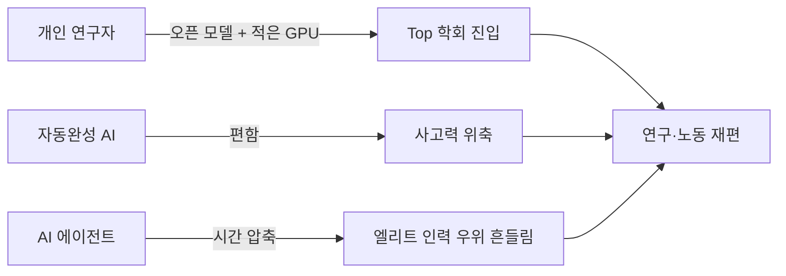

---
categories:
- industry
category_ko: 산업·회사 동향
date: '2026-05-19T10:22:10+09:00'
description: 종이에 코딩하는 실험부터 Hugging Face의 PapersWithCode 부활, Qwen 기반 ACL 2026 논문, Citadel의
  AI 에이전트 활용까지 AI가 연구·개발·금융 노동을 빠르게 재편하고 있다. 개인 연구자도 톱 학회에 진입하고, 엘리트 기업의 인력 우위가 흔들린다는
  신호가 동시에 나오는 흐름이다.
image:
  alt: AI가 바꾸는 연구·노동 현장
  path: https://haangman.github.io/J-Blog-AI/assets/img/2026/05/ai가-바꾸는-연구-노동-현장-7474ec.jpg
layout: post
mermaid: true
slug: ai가-바꾸는-연구-노동-현장-7474ec
sources:
- title: Coding on Paper
  url: https://wickstrom.tech/2026-05-16-coding-on-paper.html
- title: Reviving PapersWithCode (by Hugging Face) [P]
  url: https://www.reddit.com/r/MachineLearning/comments/1tgmwqr/reviving_paperswithcode_by_hugging_face_p/
- title: 'I trained TIME: short context-triggered thinking on Qwen model instead of
    overthinking'
  url: https://www.reddit.com/r/LocalLLaMA/comments/1tg90pu/i_trained_time_short_contexttriggered_thinking_on/
- title: If AI removes the labor constraint on high-skill work, what happens to the
    advantage of elite firms?
  url: https://www.reddit.com/r/singularity/comments/1th6lrs/if_ai_removes_the_labor_constraint_on_highskill/
summary: 종이에 코딩하는 실험부터 Hugging Face의 PapersWithCode 부활, Qwen 기반 ACL 2026 논문, Citadel의
  AI 에이전트 활용까지 AI가 연구·개발·금융 노동을 빠르게 재편하고 있다. 개인 연구자도 톱 학회에 진입하고, 엘리트 기업의 인력 우위가 흔들린다는
  신호가 동시에 나오는 흐름이다.
tags:
- industry
title: AI가 바꾸는 연구·노동 현장
---

AI 가 연구·노동 현장을 정말 빠르게 갈아엎는다는 신호가 이번 주에만 네 군데에서 동시에 튀어나왔다. 종이에 손으로 코딩하는 실험, Hugging Face 의 PapersWithCode — 논문이랑 코드, SOTA 벤치마크를 한 페이지에 묶어주던 그 사이트 — 부활, 개인이 Qwen 으로 학습시켜 만든 ACL 2026 논문, 그리고 Citadel 의 AI 에이전트 이야기. 표면적으론 다 다른 사건인데 묶어보면 같은 그림이 그려진다.

먼저 "Coding on Paper". HN 에 올라온 글인데, 코파일럿·커서 다 끄고 종이에 알고리즘을 쓰면서 푼다는 실험이다. 좀 코믹해 보일 수 있는데, 사실 이게 요즘 엔지니어들 사이에서 은근히 화두다. 코드 자동완성에 너무 익숙해진 머리가 직접 사고를 안 한다는 자각. 나도 체감한다. Claude 한테 함수 하나 시키고 받은 결과를 토씨도 안 바꾸고 커밋하는 날이 늘었는데, 그게 편한 건 맞지만 6개월쯤 지나면 손 떼고는 못 짤 것 같다.

*[Photo by Mike Tinnion on Unsplash](https://unsplash.com/@m15ky?utm_source=blogmaker&utm_medium=referral)*

근데 그 반대편에서는 Hugging Face 의 Niels 가 PapersWithCode 를 되살리고 있다. 메타가 인수한 뒤 방치돼 있던 그 사이트를 직접 다시 만드는 중인데, **수만 편의 논문을 AI 에이전트로 자동 파싱한다**고 적어놨다. 한 사람의 사이드 프로젝트가 메타 한 조직이 못 유지하던 인프라를 대체하는 그림. 이게 좀 묘하다.

훨씬 더 인상적인 건 r/LocalLLaMA 에 올라온 **TIME** 논문이다. 어떤 개인이 자기 Open-WebUI 에서 쓰려고 Qwen3 를 "짧은 thinking burst" 로 학습시켰는데 — 그게 **ACL 2026** 에 통과됐다. ACL 은 NLP 학회 중 톱티어. 보통 랩 단위 연구가 들어가는 자리에 솔로 개인 연구자가 비집고 들어간 거다. 학습은 RTX 4090 한 장 + 오픈 베이스 모델이면 이론적으로 못 할 이유가 없는 시대니까, 안 될 게 없었는데 실제로 누가 해서 붙었다는 점이 신호다.

*[Photo by Toni G on Unsplash](https://unsplash.com/@ton1_g?utm_source=blogmaker&utm_medium=referral)*

흐름을 한 장으로 그려보면 이렇다.

마지막이 Ken Griffin 의 발언. Citadel — 미국 최상위 헤지펀드 중 하나 — 의 CEO 인데, 어느 금요일 집에 가면서 "꽤 우울했다" 고 말했다더라. **AI 에이전트가 며칠 만에 한 일이, 원래 금융 PhD 팀이 몇 달 걸리던 일**이었다고. 본인이 강조한 게 "저숙련 업무 자동화가 아니라 극상위 숙련 노동" 이라는 점인데, 이게 진짜라면 엘리트 기업의 핵심 자산이었던 "최상위 인력의 시간" 이 더 이상 희소하지 않다는 뜻이 된다.

*[Photo by Jakub Żerdzicki on Unsplash](https://unsplash.com/@jakubzerdzicki?utm_source=blogmaker&utm_medium=referral)*

내가 일하는 쪽에서 체감하는 것도 비슷하다. 작년만 해도 시니어 한 명이 일주일 붙들고 있던 RAG 파이프라인 PoC 가, 지금은 신입이 Claude Code 켜고 이틀이면 돌아간다. 시니어가 필요 없어졌다는 얘기는 아니다 — 오히려 시니어는 더 큰 그림 보는 쪽으로 옮겨갔다. 다만 "그걸 할 줄 안다" 자체가 더 이상 차별점이 아니게 됐다.

솔직히 이게 어디로 흘러갈지 잘 모르겠다. 개인이 ACL 에 붙는 시대라는 건 좋은 일 같은데, 동시에 "내가 회사에서 가지고 있던 우위" 가 다 같이 평평해진다는 뜻이기도 하니까. 종이에 알고리즘을 다시 써보는 사람들이 늘어나는 게, 어쩌면 그 평평해진 세계에서 마지막으로 손에 쥘 수 있는 게 뭔지 더듬어보는 행동일 수도 있겠다는 생각이 든다.

***

**참고**

- [Coding on Paper](https://wickstrom.tech/2026-05-16-coding-on-paper.html)
- [Reviving PapersWithCode (by Hugging Face) [P]](https://www.reddit.com/r/MachineLearning/comments/1tgmwqr/reviving_paperswithcode_by_hugging_face_p/)
- [I trained TIME: short context-triggered thinking on Qwen model instead of overthinking](https://www.reddit.com/r/LocalLLaMA/comments/1tg90pu/i_trained_time_short_contexttriggered_thinking_on/)
- [If AI removes the labor constraint on high-skill work, what happens to the advantage of elite firms?](https://www.reddit.com/r/singularity/comments/1th6lrs/if_ai_removes_the_labor_constraint_on_highskill/)