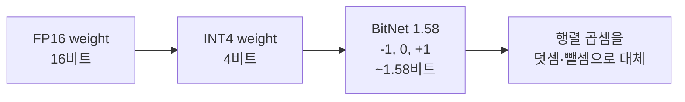

HuggingFace 에 같은 주에 두 가지가 풀렸다 — 인도어 11종을 묶은 980만 문서짜리 다국어 코퍼스, 그리고 openbmb 가 올린 BitCPM4-CANN 시리즈. 둘 다 오픈소스 LLM 판에서 따로 봐도 흥미로운데, 같은 시기에 같이 풀린 게 좀 묘하다. 한쪽은 학습 데이터의 폭을, 한쪽은 추론 비용의 바닥을 동시에 끌어내리는 움직임이다.

먼저 코퍼스 쪽. AM0908 이라는 계정이 올린 데이터셋인데, 힌디·벵골어·타밀·텔루구·마라티·구자라티·칸나다·말라얄람·펀자비·우르두에 영어까지 11개 언어로 약 980만 문서, 토큰 기준 8.4B. CC0 라이선스 — 그러니까 사실상 퍼블릭 도메인이다. 상업용 학습에 그대로 써도 된다. 영어·중국어로 도배된 LLM 판에서 인도어 데이터는 늘 부족했고, 있는 것도 라이선스가 애매한 경우가 많았다. 8B 토큰은 frontier 모델을 단독으로 학습시키기엔 작지만, 기존 다국어 모델에 인도어 비중을 끌어올리는 mid-training / continued pretraining 용으로는 꽤 의미가 있는 크기다.

*[Photo by Akshat Vats on Unsplash](https://unsplash.com/@akuvats?utm_source=blogmaker&utm_medium=referral)*

근데 사실은 이게 그냥 "데이터 또 풀렸네" 로 끝날 얘기는 아니다. 인도는 모바일 인터넷 사용자가 8억 명을 넘는데, 그중 대부분은 영어가 아니라 자기 모어로 검색하고 채팅한다. 이 코퍼스가 정말 깨끗하다면 — 웹 크롤링 데이터는 늘 노이즈가 문제다 — 인도어 SLM (small language model) 한 판이 새로 열릴 수 있는 토대다. 데이터셋 카드를 빠르게 봤는데 dedup 과 quality filter 가 어느 정도 들어간 것 같더라. 다만 내가 직접 샘플을 뜯어서 본 건 아니라, 단정은 못 하겠다.

이제 BitNet 쪽이 더 재밌다. openbmb 가 BitCPM4-CANN 1B / 3B / 8B 를 같은 주에 올렸다. CANN 은 화웨이 Ascend NPU 용 런타임인데, 모델 이름에 박혀 있는 걸 보면 처음부터 화웨이 칩 추론을 노린 빌드다. 핵심은 **BitNet** — 가중치를 -1, 0, +1 세 값(약 1.58 비트) 으로만 표현하는 양자화 방식이다. 2024년에 Microsoft Research 가 BitNet b1.58 (Ma et al., 2024) 로 띄운 그 아이디어.

왜 이게 의미가 있냐면, 1.58 비트면 행렬 곱셈을 사실상 덧셈·뺄셈으로 바꿔버릴 수 있다. 곱셈 회로가 거의 필요 없어진다는 얘기다. GPU 보다는 NPU·전용 ASIC 에서 이점이 폭발적인 구조라, openbmb 가 CANN 용으로 먼저 푼 것도 자연스럽다. 체감상 8B 모델을 휴대폰에서 돌리는 게 농담이 아니게 될 수 있는 시점이 점점 다가오는 중이다.

*[Photo by Umberto on Unsplash](https://unsplash.com/@umby?utm_source=blogmaker&utm_medium=referral)*

다만 BitNet 이 만능은 아니다. 내가 본 한에선 7B 이하 규모에서는 BF16 대비 손실이 거의 없다는 결과가 종종 나오는데, 정작 그 손실을 어떻게 측정했는지는 벤치마크마다 다르다. 정확한 수치는 잊었다 — 다만 perplexity 만 보고 안심하기엔 다국어·long-context 쪽 손실이 따로 있을 가능성이 있다. 그리고 BitNet 모델은 처음부터 1.58 비트로 학습해야 효과가 있지, 기존 FP16 모델을 사후 양자화한 게 아니다. 그래서 BitCPM4-CANN 같은 신규 빌드가 계속 나와야 생태계가 굴러간다. 사후 양자화로 우회할 수 없는 구조라는 점이 양날의 검이다.

내가 막상 손에 잡고 돌려본 건 아니라 단정은 못 하는데, 두 릴리스가 한 주에 같이 떨어진 건 우연으로만 보이지는 않는다. 학습 데이터는 영어 바깥으로 넓어지고, 추론 비용은 1.58 비트까지 깎이는 중. 가운데 어디선가 "내 모어로, 내 휴대폰에서, 인터넷 없이도 돌아가는 LLM" 이라는 그림이 진짜로 만들어지고 있는 거다. Jan (로컬 LLM 데스크톱 앱) 이 llama.cpp 의 BitNet 지원 버전으로 올라가면 BitCPM4-CANN 3B 부터 한 번 돌려봐야겠다. 그때 가서 체감이 어떨지는 좀 더 봐야 알 것 같다.

***

**참고**

- [Released a free 9.8M doc Indic multilingual corpus — Hindi, Bengali, Tamil, Telugu + 7 more (CC0, HuggingFace) [P]](https://www.reddit.com/r/MachineLearning/comments/1th4po3/released_a_free_98m_doc_indic_multilingual_corpus/)
- [NEW BITNET MODELS!](https://www.reddit.com/r/LocalLLaMA/comments/1tgjwdf/new_bitnet_models/)