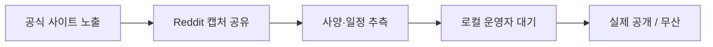

Qwen 3.7 프리뷰가 공식 사이트에 잠깐 노출됐다는 얘기가 새벽에 r/LocalLLaMA 타임라인을 휩쓸었다. 정확히 말하면 누군가 Qwen 페이지에서 "3.7" 라벨이 붙은 항목을 캡처해 올렸고, 그 캡처가 r/singularity로 넘어가면서 "GPT-5 잡는다" 류 댓글이 깔리는 흐름. 알리바바가 만드는 오픈 웨이트 모델 시리즈, 그러니까 코드와 가중치를 통째로 풀어서 누구나 받아서 돌려볼 수 있는 그 Qwen 얘기다.

솔직히 나는 새 모델 루머에 흔들리지 않는 편이다. 작년부터 분기마다 한 번씩 "다음 Qwen 공개 임박"이 돌았고, 실제로 나온 3.0이나 3.5는 좋긴 한데 커뮤니티가 예고편에 만들어낸 기대치만큼 폭발적이진 않았다. 근데 이번엔 좀 다른 게, **버전 번호가 0.2 단위로 뛰는 것** 자체가 신호일 수 있다. 보통 0.5 단위로 점프했는데 3.5 → 3.7처럼 작은 점프는 아키텍처 큰 변경 없이 학습 데이터·포스트트레이닝만 갈아낀 마이너 업데이트일 때 쓰는 패턴이다.

내 환경에서 Qwen 시리즈는 꽤 실용적인 자리에 있다. 회사 제품 일부는 비용 때문에 클라우드 API를 못 쓰고 사내 GPU 한 장에 자체 호스팅으로 깔아야 하는데, 그 자리에 들어갈 후보가 사실상 Qwen, Llama, Mistral 셋이다. Qwen의 강점은 한국어·중국어 토크나이저가 짜증을 덜 낸다는 것 — 같은 한국어 문장도 Llama보다 토큰을 적게 먹어서 처리량이 체감으로 1.3~1.5배 나오더라. 그래서 3.7이 진짜 나오면 첫 주말은 vLLM에 올려서 한국어 RAG 파이프라인에 갈아끼워 보고, 평소 쓰던 평가셋 돌려볼 생각이다.

재밌는 건 r/singularity 쪽 반응. 거긴 거의 무조건 "AGI 한 발 더 가까이" 톤이라 신뢰도가 좀 떨어지지만, r/LocalLLaMA는 실제로 로컬에서 모델 굴리는 사람들이 모여서 톤이 완전 다르다. 거기 댓글은 "32B랑 72B만 다시 내주면 좋겠다", "이번엔 Qwen-Coder도 같이 가나" 같이 철저히 실용 위주. 사람들이 무엇을 기다리는지 들여다보면 그 도구가 실제로 어떤 자리에 쓰이고 있는지가 보인다.

다만 한 가지 짚어둘 건, 공식 사이트에 "Preview" 라벨이 잠깐 떴다고 해서 며칠 안에 가중치가 풀린다는 보장은 없다. Qwen 팀은 과거에도 페이지 먼저 띄우고 실제 공개까지 2~3주 걸린 적이 있다. 그래서 지금 시점에서 vLLM 빌드를 미리 새 버전으로 올려두는 정도까진 해도, "다음 주 월요일 사내 데모" 같은 약속을 끌어다 쓰는 건 좀 위험.

*[Photo by Taylor Vick on Unsplash](https://unsplash.com/@tvick?utm_source=blogmaker&utm_medium=referral)*

가장 궁금한 건 컨텍스트 윈도우다. 3.5가 이미 128k 토큰까지 받았는데, 최근 흐름이 1M 토큰을 넘기는 쪽이라 3.7이 그 라인을 따라간다면 사내 위키 통째로 프롬프트에 넣는 시나리오도 슬슬 현실로 들어온다. 물론 "긴 컨텍스트를 받는다"와 "긴 컨텍스트에서 실제로 잘 추론한다"는 별개의 문제고, 그 부분은 needle-in-a-haystack 류 벤치마크보다 실제 도메인 문서로 테스트 안 해보면 모른다. 내가 잘못 알고 있을 수도 있는데, 3.5 시점에서도 64k 넘어가면 중간 부분 회상이 흐려지는 인상이긴 했다.

이게 어떻게 굴러갈진 며칠 더 봐야 알 것 같다. 가중치가 풀리면 그날 밤 한 번 돌려보고 후기를 따로 적어둘 생각.

***

**참고**

- [Qwen 3.7 Preview](https://twitter.com/Alibaba_Qwen/status/2056403591464984753)
- [Qwen cant wait to release 3.7 models](https://i.redd.it/os2dyrbn9x1h1.jpeg)
- [Qwen 3.7 Has been Spotted on the Qwen website](https://i.redd.it/zd7k60llyw1h1.jpeg)