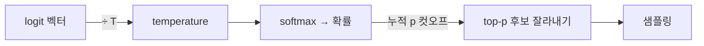

---
categories:
- llm
category_ko: 대규모 언어 모델
date: '2026-05-19T19:41:54+09:00'
description: AI 카테고리 'llm' 의 intermediate 수준 핵심 토픽 정리. 독자가 처음 접해도 따라올 수 있게 비유·예시·필요
  시 다이어그램·코드 스니펫 포함.
image:
  alt: Temperature와 Top-p 샘플링 차이
  path: https://haangman.github.io/J-Blog-AI/assets/img/2026/05/temperature와-top-p-샘플링-차이-4c7a51.jpg
layout: post
mermaid: true
slug: temperature와-top-p-샘플링-차이-4c7a51
summary: AI 카테고리 'llm' 의 intermediate 수준 핵심 토픽 정리. 독자가 처음 접해도 따라올 수 있게 비유·예시·필요 시
  다이어그램·코드 스니펫 포함.
tags:
- llm
title: Temperature와 Top-p 샘플링 차이
---

LLM API 만지다 보면 `temperature` 랑 `top_p` 슬라이더가 늘 같이 붙어 있다. 둘 다 "출력의 다양성" 을 만지는 손잡이라고 설명되는데, 사실은 작동하는 지점이 서로 다르다. 처음엔 사실상 같은 거 아닌가 싶었는데, 직접 찍어 보니까 꽤 다르더라.

먼저 큰 그림. 모델은 다음에 올 토큰을 고를 때 후보 단어 수만 개 각각에 점수(logit) 를 매긴다. 그 점수를 softmax 로 확률 분포로 바꾸고, 거기서 한 개를 뽑는다. **temperature 와 top-p 는 이 분포를 손대는 서로 다른 두 손잡이.**



Temperature 는 분포 자체의 모양을 조절한다. logit 을 T 로 나눠서 softmax 에 넣는 식. T 가 1 이면 원본 분포, T 가 0 에 가까우면 가장 확률 높은 토큰이 거의 1 로 쏠리고 나머지는 0 으로 짜부라지지(=결정적). T 가 1.5 처럼 크면 평평해져서 평소엔 잘 안 뽑힐 단어도 한 번씩 튀어나옴. 콘트라스트 다이얼이라고 생각하면 감이 잡힌다.

Top-p (=nucleus sampling) 는 좀 다른 결. 분포 모양은 안 건드리고 후보 명단을 잘라낸다. 확률 높은 순으로 누적해서 합이 p 를 넘는 지점까지만 살리고, 나머진 통째로 버린 뒤 거기서 샘플링. p=0.9 면 상위 누적 90% 까지가 후보. 재미있는 건, 모델이 다음 토큰을 거의 확신할 땐 후보가 1~2 개로 줄고, 애매할 땐 수십 개가 살아남는다는 것. **컷오프가 동적이다.**


*[Photo by Chris Ried on Unsplash](https://unsplash.com/@cdr6934?utm_source=blogmaker&utm_medium=referral)*


```python
def sample(logits, temperature=1.0, top_p=1.0):
    logits = logits / temperature
    probs = softmax(logits)
    idx = np.argsort(-probs)
    cum = np.cumsum(probs[idx])
    cutoff = (cum < top_p).sum() + 1
    keep = idx[:cutoff]
    p = probs[keep] / probs[keep].sum()
    return np.random.choice(keep, p=p)
```

코드로 보면 적용 줄 자체가 다르다는 게 한눈에 들어옴. temperature 는 logit 단계, top-p 는 확률 단계. 그래서 둘은 같이 써도 충돌하지 않는다 — 주요 API 기본 파라미터 자리에 둘 다 들어가 있는 이유.

체감으로는 코드 생성처럼 정답이 좁은 작업엔 temperature 를 낮추는 쪽이 직관적이고(0.2 근처), 글쓰기처럼 다양성이 필요한 자리는 temperature 0.7 + top_p 0.9 정도가 무난하더라. top_p 를 0.5 아래로 너무 죄어 놓으면 글이 "안전한 단어만 도는" 평이한 느낌으로 빠지는 경향이 있는 듯. 다만 이건 내 환경(GPT-4 / Claude) 한정 인상이고, 작은 모델은 또 양상이 다를 수 있겠지.

한 가지 흔한 오해: temperature 0 이면 완전히 결정적이라는 말. 이론상 argmax 라 같은 입력 → 같은 출력이어야 하는데, 실제 운영에선 floating point 비결정성, 배치 분할, GPU 커널 차이 같은 게 끼어들어서 완전히 같은 결과를 보장하진 못한다는 얘기가 종종 돈다. 내가 끈질기게 재현 실험을 돌려본 건 아니라 정확한 원인까진 잘 모르겠지만, "T=0 = 항상 결정적" 으로 가정하면 가끔 깨진다는 정도는 기억해 두는 게 좋더라.

이게 응용 단에서 얼마나 중요해지는지는 결국 케이스 바이 케이스. 정형 응답 파싱이 핵심인 시스템이면 T 만 낮추기보다 structured output 쪽이 안정적이고, 창의성이 필요한 자리에선 두 손잡이를 같이 굴리며 감을 잡는 게 답인 것 같다.