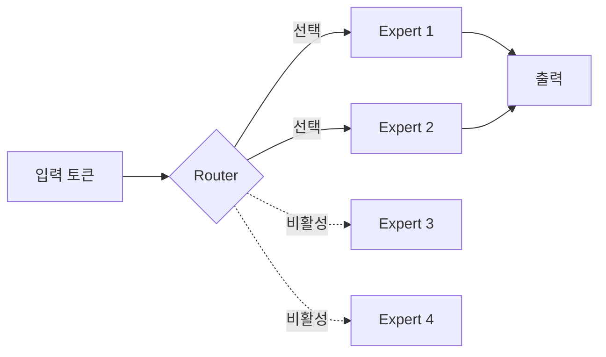

요즘 로컬 LLM 판이 좀 시끄럽다. 2026년 5월 기준으로 r/LocalLLaMA — 직접 PC 에서 모델 돌리는 사람들이 모이는 서브레딧 — 한 주만 훑어봐도 글 톤이 두 갈래로 갈린다. 한쪽은 "오픈 가중치가 끊기면 어쩌지" 하는 불안, 다른 한쪽은 "그래도 새 모델 또 떨어졌네" 하는 환호. 솔직히 둘 다 이해된다.

먼저 환호 쪽. ByteDance 가 며칠 전 **Lance** 라는 3B 짜리 네이티브 멀티모달 모델을 풀었다. 이미지·영상 이해 + 생성 + 편집을 한 프레임워크 안에서 다 한다고 한다. 3B 면 노트북 GPU 에도 무리 없이 올라가는 사이즈인데 그 안에 멀티모달을 다 욱여넣었다는 게 포인트. 내가 직접 돌려본 건 아니라 체감 성능은 더 봐야겠는데, 작은 모델로 여러 모달리티를 묶는 흐름은 분명히 가속되고 있다.

근데 이 환호 뒷면에 그 불안이 같이 깔린다. 메인 글 중 하나가 "만약 Qwen, Gemma 같은 시리즈가 어느 날 갑자기 안 풀린다면 5년 뒤 우리는 뭘 돌리고 있을까" 였는데, 댓글 분위기가 묘했다. 누구도 "그럴 리 없다"고 강하게 말하지 못한다. 사실은 회사들이 오픈 가중치를 푸는 게 자선이 아니라 채용·생태계 장악이라는 사업 셈인 걸 다들 아니까, 셈이 바뀌면 언제든 잠긴다. 체감상 이 불안이 작년보다 분명히 늘었다.

그래서 "2026년 너의 로컬 셋업은 뭐냐" 류 글이 다시 인기다. 4090/5090 한 장에 64GB RAM 으로 70B 양자화 굴리는 사람부터 맥미니 M4 Pro 로 30B 굴리는 사람까지. 내 환경은 4080 + 32GB 인데 요즘은 Qwen3 14B 양자화를 가장 자주 켠다. 코드 자동완성 백엔드 + 야밤에 끄적이는 글 초안용.

*[AI generated (Pollinations · Flux)](https://pollinations.ai/)*

재밌는 건 같은 주에 작은 모델의 효율 얘기도 같이 떴다. **1.2B 모델이 1T 급 모델을 텍사스 홀덤에서 이긴** 실험. 셋업이 다 검증된 건 아니라 살짝 의심하면서 봤는데, "크기만이 답이 아니다" 라는 분위기를 부추기는 데는 충분했다. 같이 올라온 MoE 무용론(?) 글도 결국 같은 결의 질문이었다 — MoE 가 단순히 속도만 빠른 거라면 dense x/2 와 뭐가 다르냐.

*[Photo by engin akyurt on Unsplash](https://unsplash.com/@enginakyurt?utm_source=blogmaker&utm_medium=referral)*

내가 본 한에선 MoE 의 이득이 속도 외에 두 가지 더 있다. 학습 시 같은 compute 로 더 많은 파라미터를 노출시킬 수 있다는 점, 그리고 전문가별 분업이 생겨 특정 도메인에서 dense 보다 덜 깎이는 경우가 있다는 점. 단점도 분명하다 — RAM 은 풀 사이즈 그대로 필요하고, 라우팅이 불안정하면 출력 품질이 들쭉날쭉.

조금 변두리 얘기지만 오디오 복원 모델 — 리버브 제거, 음성 회복, auto-EQ — 가 로컬에서 거의 안 다뤄지는 게 이상하다는 글도 있었다. 듣고 보니 그렇다. LLM 쪽으로 관심이 너무 쏠려서 다른 모달의 좋은 오픈 모델들이 묻히고 있는 느낌. Auphonic 대체할 만한 로컬 옵션이 안 보인다는 댓글에 공감이 많이 달렸다.

종합하면, 지금 로컬 LLM 판의 정서는 "공급 끊기기 전에 좋은 거 다 끌어모아 두자" + "어차피 크기보다 구성이다" 의 묘한 콤보다. 둘이 모순처럼 보이는데 사실은 같은 방향이다 — 큰 모델 하나에 매달리지 말고 좋은 작은 모델 여러 개를 손에 쥐자는 쪽. 이게 어떻게 굴러갈진 좀 더 봐야 할 것 같다.

***

**참고**

- [What happens to local LLM if/when LLMs are no longer released for free?](https://www.reddit.com/r/LocalLLaMA/comments/1tgmjq0/what_happens_to_local_llm_ifwhen_llms_are_no/)
- [bytedance released an open source model that attempts to do just about anything with only 3b parameters](https://huggingface.co/bytedance-research/Lance#text-to-video)
- [What’s your current local LLM setup in 2026?](https://www.reddit.com/r/LocalLLaMA/comments/1th7f24/whats_your_current_local_llm_setup_in_2026/)
- [Audio upscaling, cleanup, or improvement models?](https://www.reddit.com/r/LocalLLaMA/comments/1thg3n6/audio_upscaling_cleanup_or_improvement_models/)
- [What is the point of MoE models, beyond being faster?](https://www.reddit.com/r/LocalLLaMA/comments/1thfd53/what_is_the_point_of_moe_models_beyond_being/)