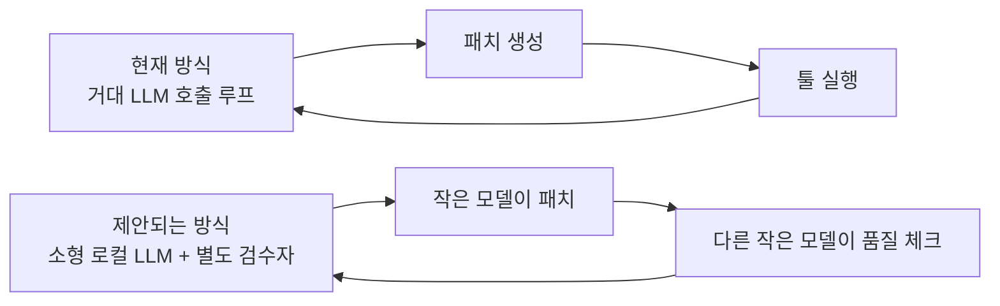

요즘 r/LocalLLaMA 를 들여다보면 "소형 모델 코딩 에이전트" 얘기가 거의 매일 올라온다. Cursor, Claude Code, OpenCode 같은 도구가 GPT-5.4 나 Claude Opus 를 전제로 깔고 만들어졌다는 건 다들 안다. 근데 그걸 로컬 모델 — Gemma 든 Qwen 이든 — 에 그대로 꽂으면 와장창 깨진다는 것도 다들 체감한 모양이더라.

이번 주에 올라온 글 네댓 개가 묘하게 결이 비슷했음. 4B 파라미터로 벤치 87% 찍었다는 자랑, Qwen3 35B a3b 가 의외로 잘 도더라는 후기, JEPA 같은 다른 패러다임을 코딩 에이전트에 도입하면 어떻겠냐는 토론, 그리고 코드 품질 검수는 작은 로컬 모델한테 따로 맡기자는 워크플로 제안까지. 따로따로 보면 그냥 흩어진 글이지만, 한 발 떨어져 보면 사람들이 같은 벽에 부딪치고 있구나 싶다.

벽은 두 가지. 비용과 프라이버시.

API 호출 단가 자체야 작년보다 많이 떨어졌지만, 에이전트라는 게 결국 LLM 을 수십 번 부르는 루프잖아. 회사 코드 만지면서 5시간짜리 작업 한 번 돌리면 청구서가 이상한 모양으로 찍히기 시작함. 그리고 회사 보안팀은 "그 코드가 외부 API 로 흘러나간다" 라는 한 문장만으로도 굳어버린다. 그러니 "내 4090 한 장으로 돌릴 수 있는 코딩 에이전트" 라는 키워드가 클릭을 부르는 건 자연스러운 일.

*[Photo by Christian Wiediger on Unsplash](https://unsplash.com/@christianw?utm_source=blogmaker&utm_medium=referral)*

근데 진짜 가능한가? 가 핵심.

87% 벤치마크라는 숫자는 일단 의심부터 하는 게 맞다고 본다. 어떤 벤치마크였는지, 셋업이 어땠는지가 안 보이면 그 숫자는 그냥 마케팅 글자. SWE-bench Verified 처럼 빡센 데이터셋에서 그 점수가 나왔다면 진짜 사건인데, 글쓴이가 자기 깃허브 issue 100 개 모아서 자체 벤치 만든 거면 얘기가 다르지. 글에서는 거기까지 구체적으로 안 나왔어서 나는 일단 보류.

대신 Qwen3 35B a3b 후기 쪽은 좀 더 믿음이 갔다. MoE (Mixture of Experts — 입력마다 일부 전문가만 깨우는 구조라 추론 비용이 35B 보단 작은 모델 쪽에 더 가깝게 떨어지는) 라서 4090 + 5060 Ti 같은 어중간한 듀얼 셋업에서도 q8 quant 로 돌아갔다는 거. llama.cpp 백엔드를 Claude Code 의 endpoint 로 바꿔 끼웠다는 부분이 흥미로웠다. 즉, 에이전트 프레임워크는 그대로 두고 모델만 갈아끼우는 방식. 이건 내가 회사에서도 한 번 실험해봐야겠다 싶었음.

JEPA 얘기는 솔직히 좀 결이 다르다. LeCun 이 밀고 있는 Joint Embedding Predictive Architecture — 픽셀이나 토큰을 직접 예측하지 말고 추상화된 임베딩 공간에서 다음 상태를 예측하자는 — 를 코딩 에이전트에 가져다 쓰자는 제안인데, 아직 코딩 도메인 구현체가 변변치 않다. 토론이라기보단 "이런 방향도 있지 않을까" 정도의 스케치였고, 댓글창도 그쪽 톤이더라.

오히려 내가 제일 와닿았던 건 네 번째 글 — "QUALITY.md 한 장 두고 작은 로컬 모델한테 코드 검수만 시키자" 라는 제안. 코딩 에이전트가 빠르긴 한데 코드 베이스가 시간이 갈수록 너저분해지는 건 사실 다들 겪고 있는 일이거든. 큰 모델이 코드를 쏟아내고, 작은 모델이 옆에서 "이 함수 지난주에 비슷한 거 만들지 않았어?" 하고 잔소리하는 그림. 비용도 안 들고, 큰 모델이 놓치는 일관성 문제 정도 잡아주기엔 충분히 똑똑하지.

"에이전트가 에이전트를 만든다" 는 글도 한 묶음으로 보면 같은 맥락. Qwen3 35B 한 모델이 사용자 인터뷰 → 프롬프트 검증 → 실제 subprocess 실행 → 최종 산출까지 도는 폐쇄 루프인데, 이게 진짜로 안정적인지는 모르겠음. 데모 영상 한두 개로는 판단이 안 서. 다만 "내 노트북 안에서 다 끝난다" 라는 정서적 매력은 분명히 있더라.

*[Photo by Kaitlyn Baker on Unsplash](https://unsplash.com/@kaitlynbaker?utm_source=blogmaker&utm_medium=referral)*

내 입장은 좀 미적지근한 편. 소형 모델 코딩 에이전트가 "프론티어 모델을 대체한다" 는 단계는 아니라고 본다. 87% 같은 숫자는 신중하게 봐야 할 영역이고, 내 환경에서 같은 셋업을 재현해보기 전엔 못 믿겠음. 그렇지만 "옆에 두고 같이 일하는 보조 에이전트" 로서의 자리는 이미 잡혔다고 본다. 비용·프라이버시 양쪽 다 답을 주니까.

그래서 다음 주말에는 4090 한 장에 Qwen3 35B a3b q8 올려서, 평소 회사 일에서 자주 나오는 리팩토링 작업 — 함수 이름 일관성 고치기, 안 쓰는 import 정리, 테스트 케이스 누락 잡기 — 같은 잔손 일만 거기로 돌려보려 함. 큰 작업은 여전히 Claude Code 가 맡고, 잔손은 로컬이. 이 분업이 의미가 있을지는 좀 더 굴려봐야 알 듯.

***

**참고**

- [Is the future of coding agents JEPA? [D]](https://www.reddit.com/r/MachineLearning/comments/1tgq9v2/is_the_future_of_coding_agents_jepa_d/)
- [I built a coding agent that gets 87% on benchmarks with a 4B parameter model, here's how](https://i.redd.it/ibtta0vvcu1h1.png)
- [Qwen 35b a3b surprises me](https://www.reddit.com/r/LocalLLaMA/comments/1tgqpa8/qwen_35b_a3b_surprises_me/)
- [Is anyone prioritizing code quality checks via a small local model?](https://www.reddit.com/r/LocalLLaMA/comments/1tgex9o/is_anyone_prioritizing_code_quality_checks_via_a/)
- [Built an agent that builds agents — pure Python, Qwen3.6 35b a3b Q8_0 MTP](https://github.com/0c33/Agentic-Ai)