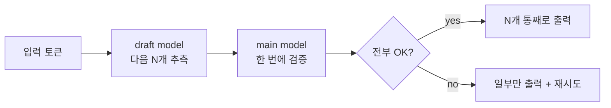

애플 실리콘에서 LLM 돌리는 비용 이야기가 또 HN 에 떴더라. 이번엔 누가 "OpenRouter API 보다 직접 굴리는 게 싸다" 식으로 정리해 올렸고, 거의 같은 주에 Reddit r/LocalLLaMA 에는 정반대 톤의 글 — M2 Max 96GB 로 27B 짜리 모델을 MTP 켜고 돌렸더니 9~10 t/s 밖에 안 나오더라는 — 이 올라옴. 같은 하드웨어 묶음 안에서 한쪽은 "가성비 미쳤다", 다른 한쪽은 "기대만큼 안 빠른데?" 인 셈.

근데 두 글을 같이 놓고 보면 이게 좀 재밌어지더라고. 둘 다 맞는 말이거든.

비용 쪽 분석부터 보자. OpenRouter — 여러 LLM API 를 한 번에 묶어 쓰게 해주는 라우터 — 의 토큰 가격을, 본인이 가진 맥 한 대의 전기 요금 + 감가상각 + 동시 처리 가능 토큰 수로 나누면 정말 "이 정도면 직접 돌리는 게 낫지" 라는 숫자가 나옴. 단, 거기엔 전제가 깔려 있는 게, **꾸준히, 많이, 본인이 직접** 돌리는 경우. 가끔 한 번씩 부르는 거면 API 쪽이 압도적으로 싸. 슬립 상태인 맥은 돈을 안 먹지만, 켜놓고 idle 인 맥은 그냥 깡통 발열판이라.

*[AI generated (Pollinations · Flux)](https://pollinations.ai/)*

문제는 처리량 쪽인 듯. MTP 가 뭐냐면 Multi-Token Prediction — 한 번 forward 할 때 다음 토큰 하나만 뽑는 게 아니라 여러 개를 한꺼번에 예측해놓고 검증 단계만 통과시키는 식의 가속. NVIDIA 쪽 H100 + vLLM 환경에선 이게 꽤 잘 먹힌다고들 하더라. 근데 Reddit 글쓴이가 부딪힌 건 그 가속이 애플 실리콘에선 그림이 다르다는 점.

내가 이해한 한에선 이런 식이지:

이 그림 자체는 GPU 든 Apple Silicon 이든 똑같음. 차이는 **메모리 대역폭 vs 연산 패턴** 쪽에서 나오는 모양. 애플 실리콘의 통합 메모리는 용량 큰 모델을 띄우는 데는 천하무적인데, 그 안에 draft 모델까지 추가로 올리고 둘 사이 컨트롤 플로우가 왔다갔다 하면 오히려 단순 디코딩보다 오버헤드가 커지는 케이스가 생긴다는 거. 그래서 12 t/s → 9~10 t/s. 뭔가 더 빨리 가려고 켰는데 더 느려진 거.

이게 좀 짠한 게, 96GB 맥이라고 누가 자랑하면 다들 "와 27B 가뿐하겠네" 하지만, 정작 가뿐하긴 한데 "가뿐+빠름" 은 또 다른 문제더라고. 메모리 여유랑 throughput 은 별개 축이라서.

*[AI generated (Pollinations · Flux)](https://pollinations.ai/)*

체감상 정리하고 싶은 건 이쯤이야. 애플 실리콘은 **모델을 띄울 수 있는가** 의 문턱은 가성비 좋게 낮춰주지만, **얼마나 빨리 토큰을 뱉느냐** 는 여전히 NVIDIA 쪽 스택의 영역인 것 같음. 그 사이 어디쯤에서 본인 워크로드가 어디 더 가까운지로 갈리는 거.

가끔 부르는 어시스턴트 한 마리면 그냥 API. 매일 수천 개씩 토큰 쥐어짜야 하는 사이드 프로젝트면 맥. 둘 사이에 끼는 케이스는… 음. 좀 더 봐야 할 것 같네.

***

**참고**

- [Apple Silicon costs less than OpenRouter](https://twitter.com/rohan_sood15/status/2056585919805714777)
- [MTP and Apple Silicon, any benefits ?](https://www.reddit.com/r/LocalLLaMA/comments/1theqjm/mtp_and_apple_silicon_any_benefits/)