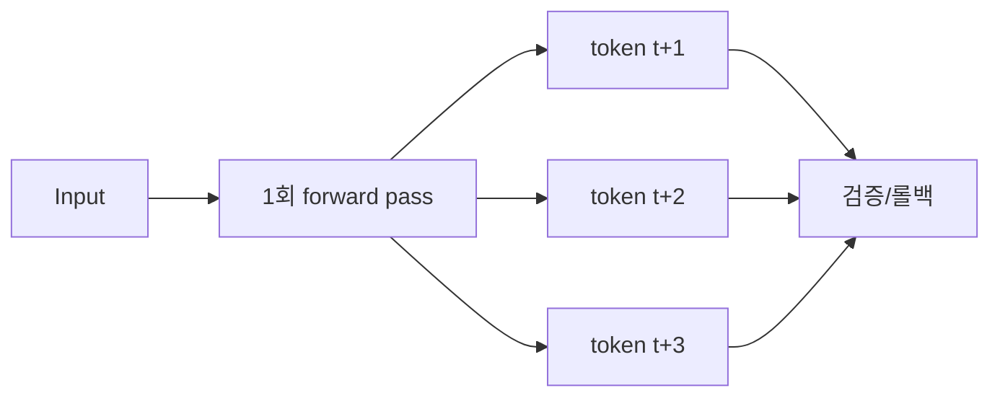

오픈소스 LLM 스택이 이번 주에 두 군데서 동시에 진척이 있었다. 하나는 Dropbox 엔지니어가 회사 안에서 만들어 풀어 둔 시맨틱 검색 엔진 Witchcraft, 다른 하나는 동네북처럼 잘 알려진 로컬 LLM 런타임 llama.cpp — 노트북 한 대에서 GGUF 모델 띄울 때 거의 다 쓰는 그 라이브러리 — 의 MTP 관련 PR. 출처는 다르고 다루는 레이어도 다른데, "로컬에서 굴러가는 AI 스택을 더 가볍고 빠르게" 라는 같은 방향을 가리키고 있어서 같이 묶어 보고 싶었다.

Witchcraft 부터. 이게 좀 재밌는 건, 처음부터 새 알고리즘을 발표한 게 아니라 Stanford 에서 나온 XTR-Warp 라는 시맨틱 검색 엔진을 — XTR 자체가 multi-vector retrieval, 그러니까 한 문서를 여러 벡터로 쪼개서 매칭 정밀도를 끌어올리는 계열의 방법이다 — 처음부터 safe Rust 로 다시 짠 프로젝트라는 점이다. 알고리즘 논문이 아니라 엔지니어링 작품에 가까운 결.

근데 더 흥미로운 건 인덱스 저장소가 **SQLite** 라는 점. FAISS·Qdrant·Pinecone 같이 별도 벡터 DB 를 띄우는 게 일반적인 동네에서, 그냥 노트북에 파일 하나 떨어뜨려 두고 검색을 돌리는 그림이다. 내 환경에서 보면 — 사실 노트북 한 대에서 RAG 데모를 띄울 때 의존성 하나하나가 다 짐인데, SQLite 한 파일로 multi-vector 검색이 굴러간다면 PoC 단계의 마찰이 확 줄어든다.

*[AI generated (Pollinations · Flux)](https://pollinations.ai/)*

물론 한계도 있다. SQLite 기반이라는 건 단일 머신·중간 규모 코퍼스에 잘 맞는다는 뜻이지, 수천만 문서 스케일에서 분산 인덱스를 대체하는 카드는 아니다. 그리고 XTR 계열은 단일 dense vector 검색보다 메모리·디스크 풋프린트가 큰 편이라, "SQLite 한 파일" 의 매력 뒤에 실제 인덱스 사이즈가 얼마나 나오는지는 직접 돌려봐야 안다. 나도 아직 안 돌려봤다.

자리를 바꿔서 llama.cpp 의 MTP 얘기. MTP — Multi-Token Prediction 은 한 번의 forward 패스에서 다음 토큰 하나만 뽑는 게 아니라 여러 토큰을 동시에 예측해 디코딩 속도를 올려보겠다는 아이디어다. DeepSeek-V3 가 학습 단계에서 MTP head 를 쓴 게 잘 알려진 사례인데, 추론 시점에 그 정보를 활용해서 speculative decoding 처럼 토큰을 한꺼번에 흘려보내는 식.

llama.cpp PR #23269 은 그 MTP 경로에 대한 보강·정리 성격으로 보이는데, 머지 단계라 그런지 LocalLLaMA 쪽에서 "이제 업데이트할 때 됐다" 식의 반응이 돌고 있다. 체감상 llama.cpp 의 MTP 는 그동안 모델·하드웨어 조합에 따라 효과가 들쭉날쭉했어서, 이번 PR 이 정착되면 같은 GGUF 모델로도 디코딩 throughput 이 더 안정적으로 올라갈 여지가 있어 보인다. 정확한 수치는 머지 후 직접 벤치를 떠봐야 안다.

*[AI generated (Pollinations · Flux)](https://pollinations.ai/)*

두 사건을 같이 놓고 보면 흐름이 좀 보인다. 한쪽은 **검색 인덱스의 무게를 SQLite 한 파일로 압축** 하는 방향, 다른 쪽은 **추론 단계의 토큰당 비용을 깎는** 방향. 결이 다른데, "내 머신 한 대에서 RAG + LLM 풀스택을 띄우는 그림" 을 더 현실적으로 만든다는 점에서는 닮았다. 작년만 해도 로컬에서 RAG 데모 하나 돌리려면 벡터 DB 컨테이너 띄우고, llama.cpp 로 quantize 모델 로드하고, 그 사이 latency 도 무거웠다. 그게 점점 평평해지는 중이다.

솔직히 내가 잘못 짚고 있을 수도 있는데, 이 흐름이 향하는 자리는 "AI 가 들어간 데스크톱 앱이 외부 의존성 없이 그냥 깔리는 세계" 인 것 같다. 클라우드 한 켜 위에 또 한 켜 쌓는 지금의 그림과는 다른 결. Witchcraft 가 SQLite 위에서 굴러간다는 점, llama.cpp 가 GGUF 한 파일을 들고 다닌다는 점, 둘 다 같은 미감이다.

이번 주말에 시간 나면 Witchcraft 부터 한 번 깔아보고 인덱스 사이즈가 얼마나 나오는지 메모해두려고 한다. MTP PR 은 머지된 다음에 다시 봐야 할 것 같고.

***

**참고**

- [Witchcraft, fast local semantic search on top of SQLite [P]](https://www.reddit.com/r/MachineLearning/comments/1tgqyo8/witchcraft_fast_local_semantic_search_on_top_of/)
- [Time to update llama.cpp to get som MTP improvements!](https://www.reddit.com/r/LocalLLaMA/comments/1thlmsx/time_to_update_llamacpp_to_get_som_mtp/)