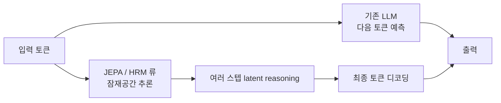

요즘 AI 쪽 타임라인에 JEPA 기반 코딩 에이전트 얘기랑 HRM-Text 라는 1B 모델이 거의 같은 주에 올라왔는데, 둘이 묘하게 같은 방향을 가리키고 있어서 메모를 좀 남겨두려 한다. 토큰 단위로 다음 글자 예측하는 LLM 의 한계가 슬슬 보이기 시작했고, 이걸 어떻게든 비껴가려는 시도들이 코드든 텍스트든 가리지 않고 튀어나오는 중이다.

먼저 JEPA — Joint Embedding Predictive Architecture, Meta 의 Yann LeCun 이 몇 년째 밀고 있는 구조다. 핵심만 거칠게 풀면, "다음 토큰을 생성하지 말고, 다음 상태의 *표현(embedding)* 만 예측해라" 가 전부다. 글자 한 자 한 자 뱉어내는 게 아니라, 머릿속에서 한 발 앞을 추상적으로 시뮬레이션한다는 얘기. 사람으로 치면 문장을 다 떠올리지 않고도 "이쯤 가면 답이 나오겠네" 하고 감을 잡는 그 느낌에 가깝다.

근데 reddit r/MachineLearning 에 올라온 "Is the future of coding agents JEPA?" 글이 흥미로웠던 건, 이걸 *코딩 에이전트* 에 붙이자는 제안이었다. 지금 코딩 에이전트들 — Claude Code, Cursor, Cline 같은 것들 — 은 결국 frontier LLM 한테 통째로 컨텍스트 던지고 패치 토큰을 한 자씩 받아낸다. 비용도 비싸고 느리다. 만약 코드 변경을 토큰이 아니라 *AST 임베딩 공간* 에서 예측한다면? 한 번에 "이 함수 시그니처가 이런 식으로 바뀔 거다" 를 추상 표현으로 먼저 던지고, 실제 토큰화는 마지막에 한 번만. 듣고 보면 그럴싸한데, 솔직히 학습 데이터가 어떻게 구성될지부터 막힌다. 양질의 AST 변경 페어가 얼마나 있겠나.

*[AI generated (Pollinations · Flux)](https://pollinations.ai/)*

비슷한 타이밍에 r/singularity 에 HRM-Text 가 올라왔다. HRM 자체는 Hierarchical Reasoning Model — 뇌의 빠른 사고/느린 사고를 흉내냈다는 그 구조다. HRM-Text 는 그걸 1B 파라미터 텍스트 생성 모델로 옮긴 거고, 잠재공간(latent space) 추론을 강화한 task completion 프레임워크가 같이 묶여 있다. 토큰 디코딩 전에 잠재 차원에서 여러 스텝 reasoning 을 돌린 뒤 마지막에 글자로 떨어뜨린다는 컨셉.

여기서 진짜 눈이 가는 건 학습 비용이다. 단돈 1천 달러, 400억 토큰. 보통 1B 급 foundation model 하나 pretrain 하려면 데이터·컴퓨트 모두 두 자릿수에서 세 자릿수 배 더 든다. 130~600배 적은 컴퓨트, 150~900배 적은 데이터로 가능했다는 게 그쪽 주장. 수치 자체는 검증이 더 필요하지만, 1천 달러라는 단위가 사실이라면 박사과정생 한 명이 GPU 한두 장으로 토이 foundation 을 굴려보는 시대가 정말 코앞이다.

두 흐름의 공통점은 결국 *토큰 자체를 출력에서 멀리 떨어뜨려놓겠다* 는 거다. 추론은 표현 공간에서, 토큰은 마지막 한 번만. 이게 맞으면 두 가지가 따라온다. 학습 효율 — 얇은 토큰 단위 supervision 대신 더 풍부한 latent 신호 — 그리고 추론 속도, 한 번에 더 큰 의미 단위로 점프하니까. 코딩 에이전트가 그중 가장 큰 수혜자일 거라는 건 그래서 자연스러운 추론이다. 한 줄 한 줄 토큰을 받는 게 아니라, "이 PR 전체 형태" 를 한 번에 머릿속에서 그리고 마지막에 코드로 떨어뜨리는 그림.

*[AI generated (Pollinations · Flux)](https://pollinations.ai/)*

체감상 두 논의 모두 아직 *아이디어 + 토이 검증* 수준이다. JEPA 는 비전 쪽에서 V-JEPA 로 어느 정도 결과가 나왔지만 코드·언어로 옮긴 SOTA 는 내가 본 한엔 아직 없다. HRM-Text 의 1B 도 frontier 모델과 직접 비교 가능한 벤치마크는 부족하다. 내가 잘못 알고 있을 수도 있는데, 둘 다 "되긴 되는 것 같은데 어디까지 스케일이 갈지 모름" 의 영역이다.

그래도 두 가지가 같은 주에 올라온 게 좀 마음에 걸린다. 보통 패러다임이 바뀌기 직전엔 비슷한 아이디어가 여기저기서 동시다발로 튀어나오더라. transformer 도 그랬고, RLHF 도 그랬다. 토큰 단위 next-token-prediction 외주를 그만 줄 때가 됐다는 신호일 수도 있고, 그냥 LeCun 트윗 한 번에 잠깐 사람들이 들썩이는 것일 수도 있다.

당분간 내 production 스택을 갈아엎을 일은 없을 것 같다. 근데 다음 분기쯤에 누가 JEPA-coder 라는 이름으로 0.5B 짜리 PoC 를 던지면 한 번 돌려볼 생각은 있다. 그때 이 글에 비교 한 줄 추가하러 다시 오면 재밌겠지.

***

**참고**

- [Is the future of coding agents JEPA? [D]](https://www.reddit.com/r/MachineLearning/comments/1tgq9v2/is_the_future_of_coding_agents_jepa_d/)
- [HRM-Text: Trained on only 1k$ and 40b tokens with brain inspired hierarchical latent architecture](https://github.com/sapientinc/HRM-Text)