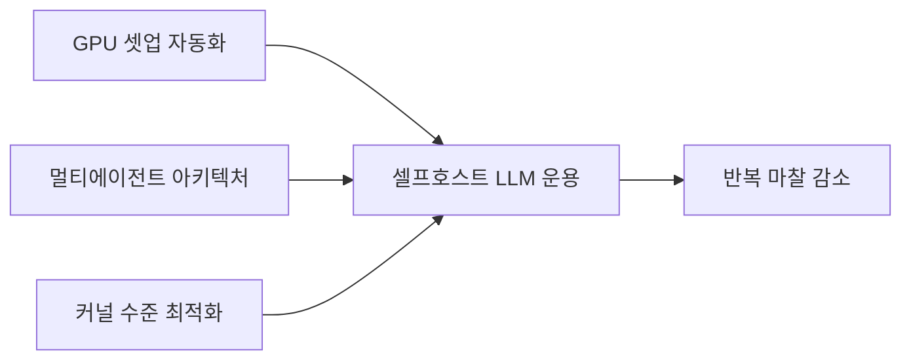

셀프호스트 LLM 운용하는 사람이라면 한 번쯤 다 겪는 고민이 비슷한 시기에 세 갈래로 풀려 올라왔다. 어제 reddit 의 r/MachineLearning 과 r/LocalLLaMA 를 훑다가 같은 날 셋이 동시에 떠 있길래 좀 신기했다.

첫 번째는 클라우드 GPU 위에 ComfyUI — 이미지 생성용 노드 기반 워크플로 툴 — 나 Ollama 같은 걸 한 줄 명령어로 설치하고, 세션 끊겨도 커스텀 노드·모델·config 가 다 보존되게 해 주는 도구다. 솔직히 이건 내가 가장 공감한 부분. 시간당 과금되는 GPU 빌려놓고 45분을 셋업에 날리는 그 짜증을 안 겪어 본 사람은 모른다. 도커 이미지로 해결되겠지 싶지만, provider 마다 base image 가 미묘하게 달라서 매번 어딘가는 깨진다.

두 번째가 좀 더 큰 그림. 어떤 팀이 조직 전체에 멀티 에이전트 시스템을 깔고, 거기서 부딪힌 문제들 — credential 을 어떻게 안전하게 넘길지, 각 에이전트의 state 를 누가 들고 있을지, 실행 추적(execution trace)을 어디에 남길지 — 을 어떻게 풀었는지 공유했다. 글의 디테일은 마케팅 톤이 좀 묻어 있긴 한데, 셋 다 실제로 production 가까이 가본 사람만 신경 쓰는 문제라 읽을 만했다. 내가 일하는 곳도 비슷한 단계라 남 얘기 같지 않더라.

세 번째는 가장 너드한 쪽. RDNA2 — AMD 의 Radeon RX 6000 시리즈에 쓰인 그래픽 아키텍처 — GPU 가 stock 빌드에서는 flash attention 이라는 메모리 효율적 어텐션 커널이 꺼져 있다는 걸 발견하고, 직접 빌드해서 켰더니 추론 속도가 두 배 났다는 글. 본인 환경 한정이라 강조하긴 하지만, 이런 게 GitHub issues 깊은 데서 발견될 때 묘하게 통쾌하다.

*[AI generated (Pollinations · Flux)](https://pollinations.ai/)*

재밌는 건 이 세 글이 다루는 층위가 다 다르다는 거다. 인프라 자동화(첫 번째), 조직 운용 아키텍처(두 번째), 커널 수준 최적화(세 번째). 근데 결국 셋 다 같은 얘기를 하고 있다 — 로컬·셀프호스트 LLM 굴리는 건 모델 골라 띄우는 게 아니라, 그 위아래 모든 마찰을 깎아내는 작업이라는 것.

내 체감으로는 이 흐름이 작년보다 확실히 빨라졌다. API 로 GPT 나 Claude 호출하던 팀들이 비용·데이터 통제·지연 때문에 자체 운용을 진지하게 검토하는 분위기. 그 과정에서 이런 식의 마이크로 토픽 — "GPU 빌리고 첫 45분 안 날리는 법" 같은 — 이 의외로 중요해진다. 어차피 일은 디테일에서 막히니까.

이게 어느 방향으로 굳어질지는 더 봐야 할 것 같다. 다만 한 가지는 확실해 보인다. 모델 자랑보다 운용 자랑이 더 멋있어 보이는 시기가 왔다는 거.

***

**참고**

- [We built a tool that installs frameworks like ComfyUI, Ollama, OpenWebUI etc on any cloud GPU in one command and saves your whole setup between sessions [R]](https://www.reddit.com/r/MachineLearning/comments/1th863j/we_built_a_tool_that_installs_frameworks_like/)
- [Simple Multi-Agent Architecture Running Across Our Entire Org. Keeping everything in Loop.](https://www.reddit.com/r/LocalLLaMA/comments/1thm9ek/simple_multiagent_architecture_running_across_our/)
- [RDNA2 flash attention isn’t enabled stock, I enabled it with this build and doubled my speed](https://www.reddit.com/r/LocalLLaMA/comments/1thbzvf/rdna2_flash_attention_isnt_enabled_stock_i/)