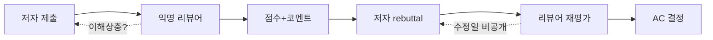

요즘 AI 학회 peer review — 학자들이 서로 논문을 평가해서 채택/탈락을 가르는 그 시스템 — 이 사방에서 새고 있다는 얘기가 한꺼번에 터졌다. ICML, ECCV 같은 큰 학회들에서 동시에. 나는 회사에서 모델을 직접 학습시키는 쪽은 아니고 LLM 을 제품에 붙이는 쪽이라 한 발 떨어져서 보는 입장인데, 그래도 이 동네 돌아가는 꼴이 좀 심각해 보여서 메모.

먼저 r/MachineLearning 에 올라온 글 하나. 누가 reciprocal reviewing — 그러니까 '내가 너 떨어뜨리면 내 자리가 늘어난다' 식의 상호 평가 — 문제를 정리하면서 해법을 던졌다. 저자들을 A 그룹과 B 그룹으로 나눠서, A 가 쓴 논문은 B 쪽 사람들만 리뷰하고 그 반대도 마찬가지로. 자기 논문 통과 확률을 높이려고 남 논문을 부당하게 떨어뜨릴 인센티브가 구조적으로 사라진다는 주장.

근데 솔직히 이게 해법이라기보단 증상의 크기를 보여주는 글 같다. 이런 게 토론거리가 된다는 자체가, 학회 안에서 "리뷰어들이 경쟁자라서 못 믿겠다" 가 농담이 아니라 진심이라는 뜻이니까. 사실은 ML 쪽에서 작년부터 계속 나오는 얘기더라. NeurIPS LLM grader 실험, ICLR 의 익명 노출 사고, OpenReview 의 GPT 흔적 검출 같은 거.

ECCV 쪽도 비슷한 결로 뜨임. OpenReview — 학회 논문 심사가 돌아가는 그 웹 플랫폼 — 에서 리뷰 옆에 '수정 날짜' 가 안 보인다는 글이 올라왔다. 원래는 리뷰어가 저자 rebuttal 을 보고 점수를 다시 매겼는지, 아니면 그냥 처음 점수를 그대로 둔 건지를 수정 일자로 가늠하는데, 그게 사라졌다고. 작은 변화 같지만 이게 빠지면 저자 입장에선 자기 반박을 진짜 읽긴 한 건지 확인할 길이 없어진다. 평가의 투명성이 한 단계 더 줄어든 셈.

이런 와중에 또 다른 결의 글이 하나 더 올라왔는데, 인도 학부생이 ICML 2026 GlobalSouthML 워크숍에 논문 두 편이 채택됐다고. 본인 첫 메이저 학회 게재인데 — 워크숍 자체가 한국에서 열려서 — 여행비, 숙박, 비자가 감당이 안 된다고. Global South 를 위한 워크숍이라면서 정작 발표를 하러 오는 비용을 발표자가 다 짊어진다는 부분이, 학회 시스템이 누구를 위해 굴러가고 있는지 한 번 더 묻게 된다.

*[Photo by Daniel Gomez on Unsplash](https://unsplash.com/@naturelensephotographer?utm_source=blogmaker&utm_medium=referral)*

좀 다른 결이지만 같은 날 HN 에 Show HN 으로 올라온 Haystack 도 같은 맥락에서 흥미롭더라. PR — pull request, 그러니까 코드 변경 제안 — 중에 사람이 직접 봐야 할 것만 골라주는 도구라는데, 결국 "사람의 리뷰 시간은 유한하니 자동으로 분류해 주자" 라는 발상. 학회 peer review 도 결국 똑같은 병목 — 늘어나는 제출, 줄어드는 시간, 흔들리는 인센티브 — 위에서 무너지고 있는 거라, PR 리뷰 자동화 도구가 같은 날 주목받는 게 우연이 아닌 느낌.

내가 한 발 떨어진 입장에서 봤을 때 가장 답답한 부분은, 이 모든 문제가 새로 발견된 게 아니라는 점. reciprocal reviewing 도, 리뷰 수정 추적 문제도, Global South 참가비 부담도 다 몇 년 전부터 나왔던 얘긴데, 학회마다 자기 운영팀이 따로 있고 플랫폼은 OpenReview 하나에 몰려 있고, 정작 누가 책임지고 고치는지가 흐릿하다.

체감상 ML 학회는 지금 두 갈래로 갈라지는 중인 듯. 한쪽은 어떻게든 기존 시스템을 패치해서 굴러가게 하려는 흐름 (rebuttal 강제 reply, 익명 보장 강화, LLM 보조 리뷰 ban 같은 거), 다른 한쪽은 학회 자체를 우회해서 arXiv + 트위터 + 모델 release 만으로 평판을 쌓는 흐름. 후자가 진짜 빨라지면 학회는 '예산 있는 사람만 들어오는 비싼 사교 모임' 으로 굳어질 위험이 있고.

이걸 보면서 한국 입장에서도 좀 생각이 들었다. ICML 2026 이 한국에서 열린다는 건 처음 알았는데, 우리 쪽에서 GlobalSouthML 같은 워크숍을 호스트하면서 참가비 보조나 비자 지원을 학회 차원에서 챙겨주지 않으면, 결국 "한국에서 열린 ICML 에 정작 Global South 사람들은 못 왔다" 는 결말이 될 수도 있겠더라.

해법은 아직 잘 모르겠다. 다만 peer review 가 흔들리는 건 ML 만의 문제가 아니라 — 코드 PR 리뷰도 같은 병목을 다른 모양으로 겪는 중이고 — 이 두 흐름이 같은 주에 나란히 토론거리가 됐다는 게 좀 더 큰 신호로 느껴진다는 거. 이 시스템이 어디로 흘러갈지는 좀 더 봐야 할 듯.

***

**참고**

- [Show HN: Haystack – Review the PRs that need human attention](https://haystackeditor.com/)
- [A Simple Solution to Improve Broken Peer Review System at AI Conferences [R]](https://www.reddit.com/r/MachineLearning/comments/1the441/a_simple_solution_to_improve_broken_peer_review/)
- [First-time ICML workshop acceptance (GlobalSouthML) but can't afford to travel to South Korea. What are my options? [D]](https://www.reddit.com/r/MachineLearning/comments/1thap7a/firsttime_icml_workshop_acceptance_globalsouthml/)
- [[ECCV 2026] No modified date next to reviews [D]](https://www.reddit.com/r/MachineLearning/comments/1thxv15/eccv_2026_no_modified_date_next_to_reviews_d/)