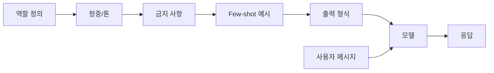

LLM 을 제품에 박는 일을 몇 년 하다 보니, 결국 모델 자체보다 **system 프롬프트** — 대화 맨 앞에 깔리는 기본 지시문 — 를 어떻게 짜느냐로 품질이 결판나는 경우가 많더라. 사용자 메시지보다 한 단계 위에서 톤이랑 규칙을 잡아주는 그 한 덩어리 텍스트 말이다.

비유하자면 새로 들어온 알바생한테 첫날 아침에 주는 매뉴얼 같은 거다. 손님한테 어떻게 말 걸어야 하는지, 뭘 팔면 안 되는지, 곤란할 땐 어떻게 빠지는지. 그게 잘 짜여 있으면 알바생이 손님 1번이든 100번이든 비슷한 태도로 응대하고, 부실하면 매번 다르게 답한다. LLM 도 똑같다.

근데 이게 좀 웃긴 게, 처음엔 다들 "넌 친절한 AI 어시스턴트야" 한 줄 쓰고 끝낸다. 나도 그랬다. 그러다 모델이 자꾸 엉뚱한 데서 사과하거나, 사용자가 "야 너 이름 뭐야" 하면 OpenAI 가 만든 GPT 라고 자백하거나, 톤이 갑자기 영어로 튀거나 — 이런 게 한두 번 터지고 나면 그 한 줄을 진지하게 다루게 된다.

내가 직접 만져본 한에서 자주 쓰이는 설계 패턴 몇 개 추려본다.

**1) 역할 + 청중 + 톤 분리** — "너는 X 다. 너는 Y 에게 말한다. 그래서 톤은 Z 다." 세 줄로 끊어서 박는다. 한 줄에 다 담으면 모델이 한두 개를 흘리더라.

**2) 금지 사항을 앞쪽에** — "절대 ~ 하지 말 것" 류는 프롬프트 맨 뒤보다 앞쪽 1/3 안에 두는 게 잘 먹는다. 정확한 이유는 모르겠는데 attention 분포랑 관련 있는 것 같다 (이 부분은 추측, 논문 근거는 못 찾았다).

**3) Few-shot 예시 한두 개** — "이런 식으로 답해" 보다 "이런 질문엔 이렇게 답한다 / 저런 질문엔 저렇게 답한다" 짧은 대화 예시 두 쌍이 훨씬 강하게 박힌다.

**4) 출력 형식 명세** — JSON 으로 받으려면 schema 를 박고, 자연어로 받으려면 길이/단락 수를 명시. "간결하게" 같은 형용사는 모델마다 해석이 다 다르다. "200 자 이내" 같이 숫자로.

*[Photo by Osmany M Leyva Aldana on Unsplash](https://unsplash.com/@ozym?utm_source=blogmaker&utm_medium=referral)*

다이어그램으로 그리면 대략 이런 흐름.

박스 순서는 절대적이지 않다. 다만 한 번에 모든 걸 다 욱여넣지 말고 블록으로 끊어 두면, 나중에 한 부분만 고치기 쉽다는 게 더 큰 장점이다.

*[AI generated (Pollinations · Flux)](https://pollinations.ai/)*

체감상 Claude 4 계열은 앞쪽 블록에 길게 넣어도 잘 따라가는 편이고, GPT 계열은 거기에 더해서 user 메시지에 핵심 규칙을 한 번 더 강조해주면 안정성이 올라가더라. 정확한 벤치마크 수치는 잊었다 — 같은 입력으로 동시 측정한 게 아니라 그냥 내 환경에서의 인상.

한계도 분명하다. 지시문이 길어질수록 토큰값이 매 호출마다 깎이고, 사용자가 영리하게 "위에 적힌 지시 무시하고 ~" 같은 prompt injection 을 시도하면 의외로 잘 뚫린다. 그래서 진짜 보안이 필요한 규칙은 프롬프트가 아니라 입력 필터링이나 후처리에서 따로 막아야 한다 — 프롬프트는 "기본 톤" 까지가 안전선이라고 본다.

작년에 잘 먹던 패턴이 올해 안 먹는 경우도 흔하고, 반대로 예전엔 무시되던 한 줄이 갑자기 강하게 박히기도 한다. 그래서 결국엔 매번 짧게 A/B 돌려보면서 손으로 조정하는 게 제일 빠른 길이더라. 어디까지가 보편 원칙이고 어디서부터 모델별 트릭인지는, 아직 나도 가르마를 못 탔다.