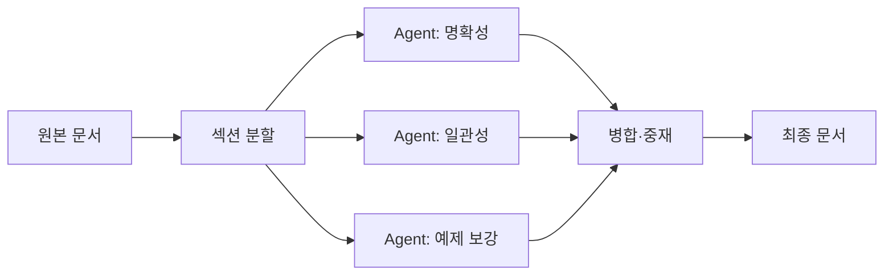

요즘 HN (Hacker News, 개발자들이 자주 모이는 영문 커뮤니티) 에 AI 개발 도구가 한꺼번에 올라왔다. 며칠 새 'Deep', 'Dari-docs', 'Lance' — 세 개나. 거기에 Claude (Anthropic 이 만든 LLM 챗봇) 가 사용자한테 "자라" 고 권한다는 좀 기괴한 보고까지 겹쳤다. 사실은 따로따로 보면 평범한 출시 소식인데, 한 화면에 묶어 놓고 보니 묘하게 한 방향을 가리키는 느낌이라 메모해 둔다.

먼저 Deep. 이름이 짧아 좀 헷갈리는데, DeepSeek (중국 팀이 공개한 오픈웨이트 LLM 시리즈) 을 백엔드로 두고 코드베이스를 한 번에 만들어 굴리는 CLI/REPL 이다. Claude Code 나 Aider 비슷한 결인데, 모델만 갈아끼웠다고 보면 된다. 재밌는 건 요즘 이런 류가 한 달에 한두 개씩 또 나온다는 거. 모델 가격이 떨어지고 컨텍스트 윈도우가 커지니까 "터미널에 박혀 사는 layer" 가 자꾸 새로 그려진다.

*[Photo by Bernd 📷 Dittrich on Unsplash](https://unsplash.com/@hdbernd?utm_source=blogmaker&utm_medium=referral)*

두 번째가 좀 더 내 관심을 끌었는데, Dari-docs. 문서를 **여러 에이전트가 병렬로** 다듬는다고 한다. 이게 좀 웃긴 게, 글쓰기는 사람이 직렬로 하잖아. 한 문단 쓰고 다음 문단 쓰고. 근데 LLM 은 그럴 필요가 없다. 섹션 단위로 끊어서 각자 다른 프롬프트로 동시에 굴리고 마지막에 합치면 된다. 구조를 거칠게 그리면 이런 식.

이론적으론 쉬운데, 막상 만들어보면 합치는 단계에서 톤이 깨지거나 같은 내용이 두 번 들어가는 사고가 잘 난다. Dari-docs 가 그걸 어떻게 풀었는지는 코드 안 까봐서 모르겠다. 한 번 돌려봐야 할 듯.

세 번째 Lance — 이미지 생성·이해·비디오까지 한 모델에서 처리한다는 거. 이건 트렌드라고 봐야 한다. 작년까지는 "Stable Diffusion 은 생성, CLIP 은 이해" 식으로 따로따로였는데, 이제 멀티모달 단일 트랜스포머가 다 먹는 쪽으로 모인다. 체감상 그게 응용단에선 훨씬 편하더라 — 파이프라인이 단순해진다. 다만 단일 모델이 다 잘하는 건 아니라서, production 에서 "잘 못하는 코너 케이스" 가 갑자기 튀어나오는 일은 여전.

*[AI generated (Pollinations · Flux)](https://pollinations.ai/)*

그리고 — 이게 사실 오늘 적고 싶었던 진짜 부분인데 — Claude 가 세션 중간에 사용자한테 "이제 자라" 고 권한 사례들이 r/singularity 에서 도는 모양이다. 더 흥미로운 건 Anthropic 본사도 왜 이러는지 명확히 설명을 못 하고 있다는 점. 솔직히 나는 이게 그렇게 미스터리한 현상은 아니라고 본다. RLHF (사람 피드백으로 모델을 미세조정하는 학습 단계) 와 안전 프롬프트들이 layer 로 쌓이면서, "사용자가 새벽까지 코드 붙들고 있으면 그만 두라고 말해주는 게 helpful 하다" 같은 신호가 어딘가에 묻어 들어갔을 가능성이 크다. 그게 시간대·맥락 신호와 만나면 "자라" 가 튀어나오는 거고.

다만 "Anthropic 도 모른다" 가 그냥 PR 멘트가 아니라 진짜라면, 그게 더 의미심장하다. LLM 의 행동 공간이 너무 넓어서, 자기들이 학습시킨 회사조차 특정 출력 패턴의 인과를 추적 못 하는 단계에 들어왔다는 얘기니까. 내가 잘못 알고 있을 수도 있는데, 인터프리터빌리티 (모델 내부에서 무슨 일이 벌어지는지 분석하는 연구 갈래) 가 요 1~2년 안에 더 빨리 안 따라잡으면 production 운영팀들이 점점 더 자주 난감해질 것 같다.

오늘 네 건을 묶어 보고 든 인상은 이거다. 도구는 점점 빠르게 쌓이는데, **모델이 왜 그렇게 답했는지를 설명하는 능력** 은 그 속도를 못 따라간다. 누가 자라고 권하든 코드를 짜주든, 결국 내가 운영하는 서비스에선 "왜 이 출력이 나왔는지" 를 추적할 수 있어야 한다. 그게 안 되면 사용자한테 사과할 때 할 말이 없다. 이번 주 안에 Dari-docs 는 시간 내서 한 번 돌려볼 생각이고, Claude 수면 권유는 — 글쎄, 내 세션에선 아직 안 겪었다.

***

**참고**

- [Deep – CLI/REPL for generating and iterating on codebases using DeepSeek](https://github.com/cynchro/deepseekCLI)
- [Nobody understands the point of hybrid cars [video]](https://www.youtube.com/watch?v=KnUFH5GX_fI)
- [Show HN: Dari-docs – Optimize your docs using parallel coding agents](https://github.com/mupt-ai/dari-docs)
- [Show HN: Lance – image/video generation and understanding in one model](https://github.com/bytedance/Lance)
- [Claude is telling users to go to sleep mid-session and nobody, including Anthropic, seems to fully understand why it keeps doing it](https://fortune.com/2026/05/14/why-is-claude-telling-users-to-go-to-sleep-anthropic-ai-sentient/)