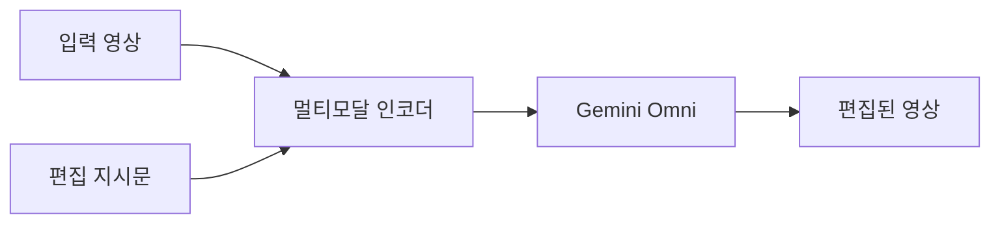

Qwen 이 또 27B 짜리 모델을 곧 풀 것 같다는 트윗이 돌고, 같은 주에 구글이 Gemini Omni — 자기네 차세대 멀티모달 모델 — 의 커뮤니티 데모를 모은 supercut 을 올렸다. 둘이 약속한 것도 아닐 텐데 타이밍이 묘하게 겹친다.

먼저 Qwen 쪽. 알리바바가 만드는 오픈소스 LLM 라인업인데, 작년부터 7B / 14B / 32B / 72B 같은 식으로 사이즈를 부지런히 찍어내고 있다. 이번에 또 27B 가 나온다는 게 좀 의미심장한 건, 27B 라는 숫자가 미묘한 위치라서다. Gemma 3 27B 가 잡고 있던 자리거든. 단일 GPU 24GB (그러니까 4090 / 3090 한 장) 에 quantization 걸어 올리기 딱 좋은 체급. 사람들이 가장 손쉽게 자기 책상에서 돌릴 수 있는 "딱 그만큼" 인 셈인데, 거기에 Qwen 이 또 한 발 얹는다는 얘기다.

근데 솔직히 27B 하나 더 나오는 게 그 자체로 막 놀랍진 않다. 더 재밌는 건 같은 시점에 구글이 보여주려는 그림이다.

Gemini Omni / Omni Flash — 이게 뭔지부터 한 줄로. 구글의 새 멀티모달 모델인데, 텍스트뿐 아니라 이미지 · 영상 · 오디오를 한 모델 안에서 같이 처리한다. Omni Flash 는 그 경량 버전. 그리고 이번 supercut 에서 구글이 밀고 싶었던 포인트는 분명히 "영상 편집" 이다. 트위터 스레드에 올라온 데모들 — flamingos edit 같은 — 을 한 영상으로 엮어 보여주는데, 모델이 영상 안에서 특정 객체를 인식하고 그 부분만 바꾸거나 스타일을 입히는 식이다.

체감상 이게 왜 큰 변화냐면, 그동안 영상 편집은 텍스트 기반 모델 입장에선 거의 외계어였다. 프레임 단위로 일관성 유지하는 게 어렵고, 한 프레임만 잘 고쳐도 다음 프레임에서 깨지면 끝. 근데 멀티모달 모델이 영상을 시간 축까지 같이 이해하기 시작하면 — 정말 잘만 된다면 — 어도비 프리미어를 켤 일이 단순 작업에선 줄어든다.

물론 supercut 이라는 게 항상 그렇듯, 잘 된 컷만 골라 모은 거다. 누가 100번 돌려서 1번 잘 나온 걸 올렸을 가능성도 충분하다. 내가 회사에서 LLM 들 production 에 붙여본 입장에선, 데모 영상과 실제 사용자가 쓸 때의 성공률은 거의 항상 다르더라. 영상은 특히 — 객체 가림 (occlusion), 빠른 카메라 무브, 조명 변화 — 같은 케이스에서 약하다.

*[Photo by Jakob Owens on Unsplash](https://unsplash.com/@jakobowens1?utm_source=blogmaker&utm_medium=referral)*

근데 그렇다고 무시할 흐름은 아니다. 이번 한 주를 보면 결국 두 축이 같이 가고 있다. 오픈소스 쪽은 사람들이 자기 GPU 에 올릴 수 있는 체급에서 계속 촘촘해지고, 빅테크는 단일 모델로 텍스트 → 이미지 → 영상까지 한 번에 끌고 가려고 한다. 둘이 만나는 건 아마 1~2년 뒤. 그쯤이면 27B 짜리 오픈 모델도 영상을 만질 수 있을지도 모르겠다.

당장은 두 흐름 다 좀 더 지켜봐야 할 것 같다. 특히 Gemini Omni 쪽 실제 성공률은 — 데모 말고 내가 직접 영상 하나 넣어보고 한 번 망쳐봐야 감이 잡힌다.

***

**참고**

- [Qwen will release another 27B with high probability](https://i.redd.it/g5uabdvdic2h1.jpeg)
- [I suspect the strength of Omni will be in its ability to edit videos - supercut of examples from twitter](https://v.redd.it/g2oqsogbz62h1)