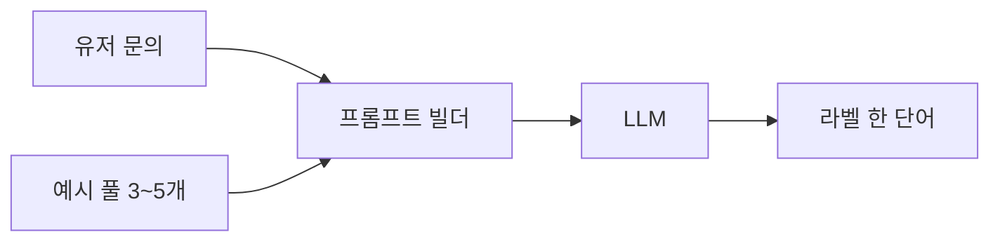

Few-shot 프롬프팅이 뭐 대단한 기술처럼 보이지만, 사실은 "예시 한두 개 던져주고 모델한테 알아서 패턴 따라하라고 시키는 것" 이 거의 다다. 근데 이게 production 에 LLM 박아넣고 운영해보면 체감이 좀 다른 게, 같은 문제도 zero-shot — 예시 없이 그냥 시키는 방식 — 으로 했을 때 결과가 들쭉날쭉하던 게 예시 두세 개만 붙이면 출력 포맷이 갑자기 안정된다.

내가 처음 이걸 제대로 본 건 분류 작업이었다. 고객 문의를 "환불 / 배송 / 기타" 세 가지로 분류시키는 단순한 일인데, 그냥 "다음 문장을 분류해" 하고 던지니까 모델이 자꾸 부연 설명을 붙이더라. "이 문의는 환불 관련 사항으로 보입니다" 식으로. 나는 라벨 한 단어만 받고 싶었는데.

```python
prompt = """다음 문의를 분류해라. 답은 라벨 한 단어만.

문의: 어제 받은 신발이 사이즈가 안 맞아요
라벨: 환불

문의: 택배가 일주일째 안 와요
라벨: 배송

문의: 매장 위치 알려주세요
라벨: 기타

문의: {user_query}
라벨:"""
```

이렇게 예시 세 줄 끼워넣으니까 그 뒤로는 거의 "환불" / "배송" / "기타" 중 하나만 떨어진다. 포맷도 가르치고 클래스도 가르치고, 한 번에 두 가지를 다 시킨 셈.


*[Photo by Jakub Żerdzicki on Unsplash](https://unsplash.com/@jakubzerdzicki?utm_source=blogmaker&utm_medium=referral)*


재밌는 건 예시 개수가 무조건 많을수록 좋은 건 아니라는 점. 내 환경에선 보통 3~5개 사이에서 정점을 찍고, 그 이상 넣으면 오히려 context 가 길어져서 토큰만 늘고 정확도는 비슷하거나 살짝 떨어지더라. 논문에서도 비슷한 보고가 꽤 있다 (Brown et al., 2020 의 GPT-3 원본 페이퍼가 시작점이긴 한데, 그 뒤로 모델 크기·작업 종류에 따라 sweet spot 이 다르다는 추적 연구가 많이 나왔다 — 정확한 수치는 잊었다).

그리고 예시 순서도 결과에 영향을 준다. 어떤 모델은 마지막에 본 예시 쪽으로 답이 기울기도 하고, 라벨 분포가 한쪽으로 쏠려 있으면 그쪽으로 끌려간다. 그래서 나는 예시 셋을 짤 때 각 클래스를 골고루 한 번씩 등장시키고, 들어오는 query 마다 순서를 살짝 섞는 코드를 같이 둔다.



흐름은 이렇게 단순하다. 예시 풀을 따로 들고 있다가, 들어오는 query 마다 거기서 몇 개 뽑아서 prompt 에 박는 식. 진짜 fancy 한 RAG 까지 안 가도, 분류·포맷팅·간단한 추출은 이 정도로 충분히 production 에 굴린다.

한 가지 헷갈렸던 건 in-context learning 이 "학습" 처럼 이름이 붙어 있어서 진짜로 모델이 뭔가 배우는 건가 싶었는데, 그게 아니라 그냥 context 안에서 패턴을 잠시 모방하는 거에 가깝다. 프롬프트 바깥으로 나가면 그 지식은 사라진다. 그래서 같은 시스템을 다음 호출에서 또 쓰려면 예시를 매번 다시 넣어줘야 한다 — 이게 토큰 비용을 늘리는 주범이라, 자주 쓰는 예시는 prompt cache 에 올려두는 게 체감상 효과가 크다.


*[Photo by Brands&People on Unsplash](https://unsplash.com/@brandsandpeople?utm_source=blogmaker&utm_medium=referral)*


한계도 분명히 있다. 추론이 깊게 들어가는 작업, 예를 들어 다단계 계산이나 긴 문서 요약 같은 건 예시 몇 개로 안 풀린다. 그런 데선 chain-of-thought 나 별도 도구 호출 쪽이 훨씬 낫더라. Few-shot 은 "패턴이 명확한 짧은 작업" 에 가장 잘 맞는다 — 분류, 포맷 변환, 간단한 추출, 정해진 스타일로 문장 다듬기. 그 범위를 넘어가면 점점 한계가 보인다.

요즘 모델들이 zero-shot 으로도 꽤 잘하니까 few-shot 이 옛날 기술처럼 느껴질 때도 있는데, 막상 일하다 보면 또 꺼내 쓰게 된다. 특히 출력 포맷을 강제하고 싶을 때 — JSON schema 같은 강한 제약을 쓰기 애매한 자리에서 — 예시 두세 줄이 가장 가성비 좋은 도구로 남아 있다. 이걸 언제까지 쓰게 될진 모르겠지만, 적어도 지금 내 프로젝트들에선 아직 한참은 살아있을 것 같다.