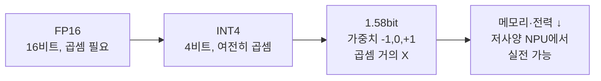

1.58비트 양자화 모델이 화웨이 칩에서 돈다는 소식과, Anthropic 공동창업자가 2028년까지 RSI(재귀적 자기 개선)에 도달할 거라고 말한 트윗 — 같은 주에 이 둘이 거의 동시에 떴길래 잠깐 손을 멈췄다. 방향이 좀 묘하게 갈라져 있어서다.

먼저 첫 번째. OpenBMB — 칭화대 NLP 랩에서 시작해서 MiniCPM 시리즈를 내놓던 그 중국 오픈소스 그룹 — 이 BitCPM-CANN 1.58bit 모델을 공개했다. 그리고 그걸 화웨이 Ascend 910B에서 굴리고 있다고.

1.58bit 가 뭐냐면, Microsoft Research에서 나온 BitNet b1.58 (Ma et al., 2024) 의 그 양자화 방식이다. 모델 가중치를 -1, 0, +1 세 값으로만 표현한다. log₂(3) ≈ 1.58 비트. 보통 FP16 16비트 쓰던 걸 10분의 1로 압축하는데 성능 손실은 의외로 적다는 게 그 논문의 주장이었다. 곱셈이 사실상 없어지니까 (덧셈/뺄셈만) 추론 속도와 전력 효율이 크게 좋아진다.

근데 내가 이번 소식에서 더 흥미로웠던 건 모델보다 **하드웨어** 쪽이다.

Ascend 910B — 화웨이가 미국 제재 이후로 자체적으로 미는 NPU다. NVIDIA H100 안 살 거면 이걸 써라, 이런 포지션. CANN 은 그 위에 올라가는 소프트웨어 스택 (CUDA 의 화웨이 버전이라 보면 된다). 그동안 "스펙은 좋은데 생태계가 빈약해서 실전엔 못 쓴다" 가 정설이었는데, 점점 그 격차를 메우는 흐름이 보인다.

*[AI generated (Pollinations · Flux)](https://pollinations.ai/)*

체감상 이게 의미하는 건 — 중국 AI 스택이 NVIDIA에 의존하지 않고도 어느 정도는 굴러간다는 신호다. 1.58bit 처럼 메모리 압박이 덜한 모델이면 더더욱. 정확한 토큰/초 수치는 공개된 게 없어서 단정 못 하겠고, 트위터 영상만 봐선 그게 진짜 같은 모델이 같은 정확도로 돌아가는 건지도 확인 어렵다. 그래도 방향은 분명해 보인다.

자, 이제 두 번째 — Jack Clark 의 예측.

Jack Clark 는 Anthropic 공동창업자 중 정책/대외 담당 쪽이고, 매주 *Import AI* 라는 뉴스레터를 쓴다. 업계에서 "현장 감각 있는 정책가" 로 통한다. 그가 최근에 던진 세 가지가 이거다.

- **1년 안에**: AI 가 노벨상급 발견을 도와줄 거다
- **2년 안에**: 이족 보행 로봇이 실제 노동에 투입된다
- **2028년 말까지**: RSI 에 도달한다

RSI 는 Recursive Self-Improvement — AI 가 자기 자신을 더 똑똑하게 만드는 과정을 스스로 운영하는 단계. 이게 되면 그 다음부터의 발전 속도는 사람이 예측하기 어렵다는 게 AGI 논의의 오래된 골자다.

*[AI generated (Pollinations · Flux)](https://pollinations.ai/)*

솔직히 첫 번째(노벨상급 발견)는 별로 놀랍지 않다. AlphaFold 가 이미 화학 노벨상 한 자리 챙긴 게 작년 일이고 (Hassabis & Jumper, 2024), 그 외 분야에도 비슷한 사례가 줄을 서고 있다. 1년 안에 또 나와도 이상하지 않다.

두 번째는 글쎄. Figure, 1X, Boston Dynamics, Tesla — 이 쪽 영상은 다들 멋지지만, 영상과 24/7 공장 투입 사이엔 큰 구덩이가 있다. "실제 노동에 투입" 의 기준을 어디다 두느냐에 따라 답이 달라질 거다.

세 번째 — 2028년 RSI — 가 핵심이다. 이게 진심으로 던진 숫자라면, Anthropic 내부가 보는 그림이 외부 분위기보다 훨씬 가파르다는 뜻이다. 그리고 정책 담당이 이런 말을 공개적으로 한다는 것 자체가 의도된 신호일 가능성이 높다. AI Safety 진영이 규제 논의 끌어내려고 의도적으로 페달을 밟는 패턴이 작년부터 반복되고 있더라.

이게 좀 웃긴 게, 같은 사람이 한쪽에선 "위험하니까 규제해야 한다" 라고 말하면서 다른 쪽에선 그 모델을 더 빨리 만들고 있다. 이걸 위선이라 보는 시선도 있고, "그러니까 내부에 있어야 한다" 라는 논리(이른바 *race to the top*)도 있다. 어느 쪽이 맞는지는 내가 단정 못 하겠다.

두 소식을 같은 글에 묶은 이유는, 묘하게 같은 그림을 가리키고 있어서다. 한쪽에선 더 작은 모델을 더 보편적인 하드웨어에서 굴리는 흐름 — AI 가 인프라 측면에서 점점 흩어진다. 다른 쪽에선 프론티어 랩이 RSI 같은 단어를 공개 발언으로 내놓는 흐름 — 첨단은 점점 빨라진다. 갈라지는 것 같지만, 두 흐름 다 결국 "이게 어디까지 갈까" 라는 같은 질문 앞에 와 있다.

내가 잘못 본 걸 수도 있다. 2028년이 지나봐야 알 일이고, 그때 가서 이 글을 다시 읽으면 부끄러울 수도 있다. 그래도 지금 시점에서 두 뉴스를 같이 놓고 보면, 적어도 한 가지는 확실하다 — 작년 이맘때 같은 토픽으로 글을 썼다면 RSI 라는 단어를 본문에 적을 일은 없었을 거다.

***

**참고**

- [OpenBMB presents the model BitCPM-CANN 1.58 bit](https://www.reddit.com/gallery/1tkjpsh)
- [Anthropic Co-founder Jack Clark’s recent predictions: AI will help make a Nobel Prize-winning discovery within the next year, bipedal robots doing useful work in 2 years, RSI by end of 2028](https://www.reddit.com/gallery/1tkstc0)