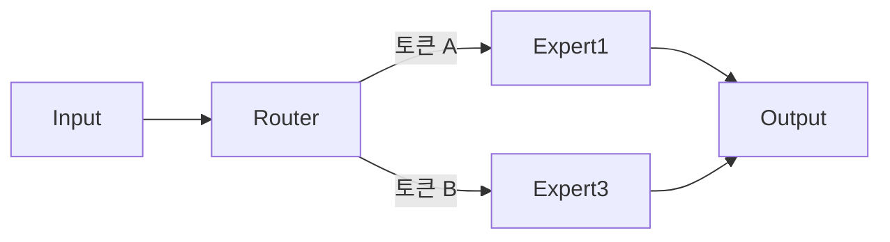

이번 주에 r/LocalLLaMA 를 돌다 보니 묘한 그림이 보였다. 한쪽에선 16GB VRAM 에 Qwen-27B 를 어떻게든 욱여넣겠다고 IQ4_KS 라는 새 양자화 — 큰 모델의 가중치를 더 적은 비트로 압축해서 메모리에 욱여넣는 기술 — 를 들고 나오고, 다른 쪽에선 12GB RTX 2060 으로 MoE 모델을 굴리려고 llama.cpp 를 포크해서 "레이어 단위가 아니라 전문가(expert) 단위로 잘라 올린다" 는 시도가 올라왔다.

근데 같은 주에 r/singularity 에서 누가 이런 글을 올렸다. Opus 4.7, GPT 5.5, Gemini 3.5 flash — 다 예상보다 비싸졌다고. "모델은 점점 싸진다" 에 베팅하던 회사들이 다 머쓱해진 분위기.

이게 좀 우연이 아닌 것 같아서 끄적여본다.

## 양쪽이 동시에 움직이는 중

LLM 추론 비용은 두 갈래로 흐른다. 클라우드 API 호출, 그리고 로컬 GPU 위에서 직접 돌리기. 보통은 트레이드오프다. API 는 비싸지만 편하고, 로컬은 싸지만 VRAM 부족으로 큰 모델은 못 굴린다.

그런데 지금 두 갈래가 동시에 움직인다. 클라우드는 위로, 로컬은 옆으로. "옆으로" 라고 한 건, 사람들이 VRAM 한계를 우회하려고 별 짓을 다 시작했기 때문이다. IQ4_KS, IQ3_XXS 같은 극단적 양자화. 27B 모델을 16GB 에 욱여넣고, MoE 30B+ 를 12GB 에서 굴린다.

## MoE 가 갑자기 화두인 이유

조금만 풀면 — MoE(Mixture of Experts) 는 큰 모델 안에 전문가 여러 명을 두고, 입력마다 일부 전문가만 깨우는 구조다. 한 토큰 처리에 전체 가중치가 아니라 일부만 쓰니까, 메모리에 다 안 올려도 되는 거 아니냐는 발상이 자연스럽게 따라온다.

"Experts first" 포크의 아이디어는 단순하다. GPU 에 레이어를 통째로 올리는 대신, 활성화 빈도 높은 전문가만 골라 올린다. 나머진 CPU/RAM. 이론적으론 우아한데, 실제 토큰/초가 얼마나 나올진 더 봐야 한다.

*[AI generated (Pollinations · Flux)](https://pollinations.ai/)*

## 그리고 클라우드 가격

솔직히 나도 작년까진 "다음 세대는 절반 가격" 시나리오를 머릿속에 갖고 있었다. 그게 깨진다.

이유는 몇 가지 짐작 가능하다. 추론 시 reasoning chain 이 길어지면서 토큰 소비량 자체가 늘었고, GPU 공급은 여전히 빡빡하고, frontier 모델 학습 비용은 회수해야 한다. "최고 모델" 에 붙는 가격 탄력성이 생각보다 낮다는 게 회사 입장에선 검증된 거기도 하고.

체감상, "이 기능 비용이 1년 뒤엔 1/3 될 거니까 일단 출시하자" 라는 베팅이 잘 안 먹히는 시기로 들어선 것 같다.

로컬 진영의 양자화 광기와 클라우드 가격 상승이 한 시기에 겹치는 게 우연이 아닌 것 같다. 추론을 어디서 돌릴지에 대한 계산이 다시 시작되는 거다. 작은 작업은 로컬로 내릴 이유가 점점 늘어난다.

내가 잘못 보고 있을 수도 있다. 1년 뒤 다시 글을 열어봤을 때 양쪽 다 잠잠해져 있을 수도 있고. 일단 지금은 한쪽에선 IQ4 양자화 PR 이 매주 올라오고, 한쪽에선 가격표가 위로 간다.

***

**참고**

- [Qwen-27B-IQ4_KS for ik_llama.cpp, especially for NVIDIA with 16GB VRAM](https://www.reddit.com/r/LocalLLaMA/comments/1tkmgwj/qwen27biq4_ks_for_ik_llamacpp_especially_for/)
- [Experts first llama.cpp](https://www.reddit.com/r/LocalLLaMA/comments/1tknbzh/experts_first_llamacpp/)
- [Why are AI models getting more expensive?](https://www.reddit.com/r/singularity/comments/1tkr1q4/why_are_ai_models_getting_more_expensive/)