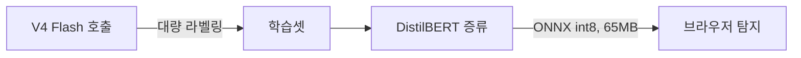

딥시크 V4 프로 가격이 영구 인하됐다. 프로모션으로 75% 깎아주던 할인가가 그대로 정가가 됐다는 발표다. 솔직히 프로모션 끝나면 슬쩍 원복할 줄 알았는데 그냥 박아버린 거라, 이게 좀 의외였다.

가격표 자체보다 더 흥미로운 건 같은 주에 옆에서 굴러나온 소식이다. 누가 V4 Flash — 프로 말고 그 아래 빠르고 싼 라인업 — 를 라벨러로 써서 프롬프트 인젝션 탐지기를 학습시켰는데, DistilBERT 베이스로 F1 99%, ONNX int8 양자화 후 약 65MB. 브라우저에서 Transformers.js v3 로 그냥 돈다. 서버 호출 없이 사용자 탭 안에서.

이게 왜 한 묶음으로 들리느냐 하면, 두 사건이 같은 방향을 가리키고 있어서다. 큰 모델 추론 비용이 계속 떨어지고, 그 떨어진 비용으로 라벨을 잔뜩 받아낸 다음, 작은 모델에 증류해서 엣지에서 돌리는 그림.

작년만 해도 프롬프트 인젝션 막으려면 매 요청마다 가드레일 LLM 을 한 번 더 쳐야 한다는 분위기였는데, 이제는 65MB 분류기가 사용자 브라우저에서 1차로 막아주는 게 현실적이다. 내 환경에서 한 번 띄워봤는데 첫 요청만 살짝 늦고 그 뒤로는 거의 즉답이더라.

물론 F1 99% 라는 숫자는 그 데이터셋 안에서만 99% 다. 실제 트래픽에 들이대면 분포가 어떻게 다른지에 따라 어디서 무너질지는 모른다. 그래도 클라이언트에서 1차 거르고 서버에서 한 번 더 보는 2단 구조가 비용/지연 양쪽에서 너무 매력적이라, 한동안 이런 식의 작은 분류기 증류는 늘어날 것 같다.

*[AI generated (Pollinations · Flux)](https://pollinations.ai/)*

가격 인하 자체는 시장 점유율 싸움이라 그 사실만으로 큰 의미는 없다고 본다. 무서운 쪽은 그 인하가 만들어내는 부수 효과 — 작고 빠른 derivative 모델들이 우후죽순 나오는 흐름 — 인 것 같다. 이게 어떻게 굴러갈진 좀 더 봐야 할 것 같다.

***

**참고**

- [DeepSeek makes the V4 Pro price discount permanent](https://api-docs.deepseek.com/quick_start/pricing)
- [trained a prompt injection detector using ml-intern and DeepSeek v4 Flash, runs in the browser](https://v.redd.it/pa7pur57mp2h1)
- [DeepSeek Announces Permanent Price Cut of 75% after Promotion Period](https://i.redd.it/n2x6yxx8zo2h1.jpeg)