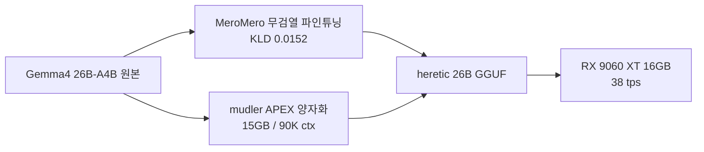

젬마4 26B 무검열 파인튜닝이 또 나왔다. MeroMero 팀이 며칠 전에 31B 버전을 풀더니, 사람들이 26B-A4B 도 해달라고 졸랐는지 결국 그것까지 공개했다. 이름은 `G4-MeroMero-26B-A4B-it-uncensored-heretic`. 길다.

숫자만 먼저 보면, KLD 가 0.0152, 거부율(refusal)이 100건 중 12건. 이게 뭔 소린지 잠깐 풀어두면 — KLD(Kullback-Leibler divergence) 는 두 확률분포가 얼마나 다른지 재는 지표다. 여기서는 **무검열 파인튜닝 모델의 출력 분포가 원본 Gemma4 26B 의 분포에서 얼마나 멀어졌는가** 를 잰 수치라고 보면 된다. 0.0152 면 꽤 가깝다는 뜻 — 즉 검열을 떼면서도 원본의 일반 지식·말투를 거의 안 깨먹었다는 주장. 거부율 12% 도 같은 맥락에서, 곤란한 질문 100개 중 88개는 그냥 답한다는 얘기다.

*[Photo by Growtika on Unsplash](https://unsplash.com/@growtika?utm_source=blogmaker&utm_medium=referral)*

근데 솔직히 무검열 파인튜닝 자체는 한 달에 몇 개씩 쏟아진다. 내가 이번 건을 좀 더 흥미롭게 본 건 옆 동네에서 같이 뜬 **APEX 양자화** 쪽이다. mudler 가 만든 `gemma-4-26B-A4B-it-APEX-GGUF/APEX-I-Compact` — 15GB 짜리. Reddit r/LocalLLaMA 의 한 유저가 RX 9060 XT 16GB 한 장에 llama.cpp Vulkan 으로 돌렸는데, **90,000 토큰 컨텍스트에서 38 tps**, 그리고 본인 체감으론 품질 저하가 거의 없었다고 적었다. 사실이라면 좀 놀라운 수치다. 26B 급 모델을 16GB VRAM 한 장에, 90K 컨텍스트로, 무한루프 없이.

*[Photo by Brecht Corbeel on Unsplash](https://unsplash.com/@brechtcorbeel?utm_source=blogmaker&utm_medium=referral)*

다만 한 사람의 한 장짜리 보고라는 점은 잊지 말아야 한다. APEX 가 어떤 식으로 비트를 떼고 붙였는지 정식 페이퍼는 못 봤고, 38tps 가 어느 prompt 에서 어떤 batch 로 잰 건지도 모른다. 무엇보다 "체감상 품질 저하 없음" 은 벤치마크가 아니다. 내 환경에서 똑같이 나올지는 따로 돌려봐야 하고, 일반 추론은 멀쩡해도 long-context recall 이 무너지는 경우는 자주 봤다.

그래도 흐름이 분명하긴 하다. 작년만 해도 26B 짜리 모델은 24GB GPU 가 거의 마지노선이었는데, 지금은 16GB 컨슈머 카드에서 6만 토큰 넘는 컨텍스트가 정말 돌아가는가 — 이게 진짜라면 로컬 LLM 운영의 비용 곡선이 한 단 더 꺾인다. 한 번 직접 받아서 돌려봐야 할 것 같다.

***

**참고**

- [Models.dev: open-source database of AI model specs, pricing, and capabilities](https://github.com/anomalyco/models.dev)
- [G4-MeroMero-26B-A4B-it-uncensored-heretic Is Out Now, a Finetune of gemma-4-26B-A4B-it, With KLD of 0.0152 and 12/100 Refusals!](https://huggingface.co/llmfan46/G4-MeroMero-26B-A4B-it-uncensored-heretic-GGUF)
- [Gemma4 26b a4b Apex quant is quite good](https://www.reddit.com/r/LocalLLaMA/comments/1tl9woz/gemma4_26b_a4b_apex_quant_is_quite_good/)
- [Best open-source &amp; proprietary options for Indic language ASR](https://www.reddit.com/r/LocalLLaMA/comments/1tlb3cu/best_opensource_proprietary_options_for_indic/)
- [Holding machine upgrade waiting for a model?](https://www.reddit.com/r/LocalLLaMA/comments/1tkiqei/holding_machine_upgrade_waiting_for_a_model/)