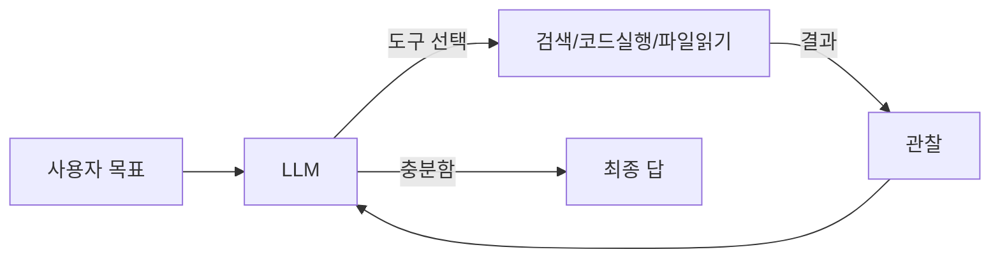

AI 에이전트라는 말이 작년부터 갑자기 여기저기 튀어나오는데, 막상 옆 팀에서 "그거 챗봇이랑 뭐가 다른 거예요?" 물으면 한 줄로 답하기가 의외로 어렵더라. 나도 처음엔 그랬지. 챗봇은 한 번 묻고 한 번 답하는 반면, 에이전트는 답하기 전에 **스스로 뭔가를 한다** — 이 한 문장이 차이의 거의 전부인데, 그 '뭔가' 가 사실 꽤 깊은 얘기.

가장 와닿는 비유는 신입사원. 사수가 "이번 분기 매출 정리해서 보고해 줘" 라고 던졌을 때, 후배가 그 자리에서 답을 외워서 말하면 그건 챗봇이고, 엑셀을 열고 슬랙에 누구한테 묻고 다시 표를 다듬고 결과만 들고 오면 에이전트에 가깝지. 즉 **LLM 이 도구를 쓰고, 결과를 보고, 다시 판단하고, 다시 도구를 쓰는 루프** — 이게 에이전트의 본질이라고 본다.

구조를 그림으로 잡으면 대충 이런 식이지:

핵심은 화살표가 LLM 으로 돌아온다는 점. 한 번 추론하고 끝이 아니라, **본인이 한 일의 결과를 다시 입력으로 받아서** 다음 행동을 정하지. 이걸 학계에선 ReAct (Reason + Act) 패턴이라고 부르더라 (Yao et al., 2022). 요즘 나오는 거의 모든 에이전트가 이 변주라고 보면 된다.

*[Photo by Chris Ried on Unsplash](https://unsplash.com/@cdr6934?utm_source=blogmaker&utm_medium=referral)*

내가 회사에서 굴려본 한에선, 잘 도는 에이전트일수록 **도구가 적고 명확** 했어. 검색·파일읽기·코드실행 셋만 줬을 때가 열 가지 도구를 줬을 때보다 오히려 덜 헤매더라. 솔직히 이 부분은 아직 다들 실험 중인 것 같은데, 도구가 많아질수록 LLM 이 "어느 걸 써야 하지" 에서 흔들리는 인상.

재밌는 건 한계 쪽. 5~6 스텝 넘어가면 자기가 뭐 하고 있었는지 슬슬 잊는 게 체감상 가장 큰 벽이거든. 메모리·요약·플래너를 따로 붙여서 우회하는 시도가 많이 나오는데, 이게 어디까지 일반화될지는 좀 더 봐야 할 것 같다.