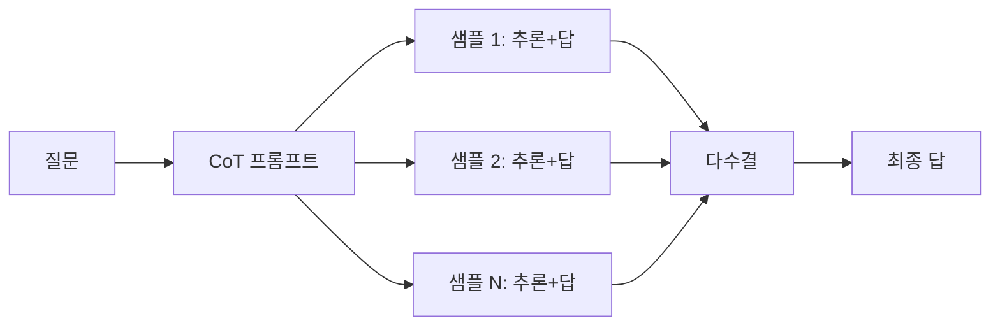

LLM 한테 살짝 까다로운 수학 문제나 논리 퀴즈를 던지면 답이 어이없게 틀리는 경우가 종종 있는데, Chain-of-Thought (CoT, 우리말로 옮기면 "사고 사슬") 프롬프트는 그 상황에서 모델이 최종 답을 뱉기 전에 풀이 과정을 한 줄씩 적게 만드는 트릭이다. 별거 아닌 것 같은데, 체감상 차이가 꽤 크다.

원논문 (Wei et al., 2022) 의 핵심 주장은 의외로 단순하다. 모델이 충분히 크면 — 대충 100B 파라미터 근처부터 — "단계별로 풀어보자" 한 마디를 끼워 넣는 것만으로 산수·상식 추론 벤치마크 정확도가 확 오른다는 것. 재밌는 건 작은 모델에선 효과가 거의 없거나 오히려 어색해진다는 점이다.

비유하자면, 머릿속으로 "음… 이거 계산기 두드려보면…" 중얼거리면서 푸는 사람이랑, 답만 휙 던지는 사람의 차이다. 중얼거리는 쪽은 도중에 자기 실수도 잡고, 어디서 막혔는지도 보인다.


CoT 를 유도하는 방법은 사실 여러 갈래다. 내가 실제로 자주 쓰는 건 크게 세 가지.

첫째, **Zero-shot CoT**. 그냥 프롬프트 끝에 "Let's think step by step." 한 줄 붙이는 것. Kojima et al. (2022) 이 보여준 건데, 어이없을 정도로 단순한데 작동한다. 한국어로는 "한 단계씩 생각해보자" 가 비슷한 효과를 내더라 — 내 환경에서 본 한에선.

둘째, **Few-shot CoT**. 프롬프트 안에 "예시 문제 + 풀이 과정 + 답" 묶음을 2~3 개 보여주고 새 문제를 던지는 방식. 모델이 그 예시의 추론 스타일을 흉내낸다. 예시 만들기가 귀찮은데 효과는 가장 안정적인 편.

셋째, **Self-Consistency** (Wang et al., 2022). 같은 문제를 temperature 0.7~1.0 으로 여러 번 (보통 5~20 회) 돌려서 나온 답들 중 다수결로 고른다. 추론 경로가 여러 갈래로 갈리면 정답에 더 자주 수렴하더라는 아이디어. 비용은 N 배 뛴다.

```python
samples = [llm.run(prompt, temperature=0.8) for _ in range(10)]
answers = [parse_final_answer(s) for s in samples]
final = collections.Counter(answers).most_common(1)[0][0]
```

흐름으로 보면 대충 이렇게 정리된다.



근데 직접 만져보면 한계도 분명히 보인다. 추론을 길게 늘여놓는다고 정답률이 항상 오르는 건 아니다. 특히 GPT-4 나 Claude Opus 급에선 짧은 직답이 더 정확한 경우도 꽤 있다 — 내부에서 이미 비슷한 추론을 하고 있다는 추정도 있고. 또 모델이 자신 있게 틀린 풀이를 줄줄 쓰면 오히려 더 위험하다. "그럴듯한 헛소리" 의 길이만 늘어나는 셈.


*[Photo by Christian Velitchkov on Unsplash](https://unsplash.com/@cvelitchkov?utm_source=blogmaker&utm_medium=referral)*


요즘 새 모델들 — OpenAI o1 계열이나 Claude 의 extended thinking 같은 거 — 은 이런 단계별 추론을 모델 내부에서 알아서 한다. 그래서 프롬프트 레벨 CoT 의 무게가 예전보단 좀 줄긴 했는데, 여전히 7B~13B 짜리 로컬 모델 다룰 땐 거의 필수 기법이다. 솔직히 앞으로 1~2년 사이에 "프롬프트로 사고를 유도한다" 라는 개념 자체가 어떻게 변할진 좀 더 봐야 할 것 같다.