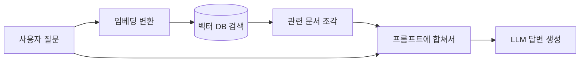

RAG (Retrieval-Augmented Generation) 라는 말, 작년부터 진짜 자주 듣게 됐다. 한 마디로 풀면 — LLM 한테 답하기 전에 외부 문서를 먼저 찾아서 같이 던져주는 구조.

내가 처음 이걸 본격적으로 만져본 건 회사 내부 문서 챗봇을 붙일 때였는데, 그때 깨달은 게 하나 있어. ChatGPT 든 Claude 든 기본 모델은 "어제 우리 팀 회의록" 같은 건 알 도리가 없다. 학습 시점에서 끊겨 있고, 사내 위키는 절대 본 적이 없으니까.

근데 사용자는 그런 걸 묻는다. "지난주 OO 프로젝트 결정사항 정리해줘." 모델이 모르는 걸 짜내면 그게 곧 환각(hallucination) — 그럴싸하지만 틀린 답.

RAG 는 이걸 우회하는 방법이라고 보면 된다. 질문이 들어오면, 모델한테 바로 묻기 전에 먼저 사내 문서 더미에서 관련된 조각 몇 개를 끌어와. 그 조각을 프롬프트 앞에 붙여서 "이 자료를 참고해서 답해줘" 식으로 모델한테 넘긴다. 그러면 모델은 자기 학습 지식 + 방금 받은 문서를 같이 보고 답한다.

비유하자면 — 도서관에서 시험 보는 학생. 머릿속에 있는 지식만으로 답하라 하면 못 푸는 문제도, 옆에 책 펴 놓고 풀면 정답률이 확 오르잖아. 그 책 펴주는 역할.

*[AI generated (Pollinations · Flux)](https://pollinations.ai/)*

흐름은 대충 이렇게 굴러간다.

핵심은 가운데 벡터 DB. 사내 문서를 미리 작은 조각(chunk)으로 자른 다음, 각 조각을 임베딩 — 의미를 숫자 벡터로 바꿔 — 저장해둔다. 질문도 같은 방식으로 벡터로 바꿔서, 의미가 비슷한 조각을 코사인 유사도로 끌어오는 식.

*[Photo by Lightsaber Collection on Unsplash](https://unsplash.com/@lightsabercollection?utm_source=blogmaker&utm_medium=referral)*

근데 솔직히 이게 만능은 아니더라. 내 환경에선 검색이 제대로 안 잡히면 모델이 엉뚱한 조각을 보고 오히려 더 자신있게 헛소리를 한다. 검색 품질이 곧 답변 품질이라, 청크 크기를 어떻게 자를지 / 어떤 임베딩 모델 쓸지 / 몇 개 끌어올지 — 이런 게 다 튜닝 포인트.

왜 이게 중요하냐. 회사 입장에선 LLM 을 자기 데이터에 붙이는 가장 현실적인 방법이라서. 파인튜닝은 비싸고 느리고, 데이터 새로 들어올 때마다 다시 학습하기도 어려운데, RAG 는 문서만 인덱스에 추가하면 즉시 반영. 그래서 사내 챗봇, 고객 지원 봇, 코드 검색 같은 데서 거의 표준처럼 자리잡았다.

다만 RAG 가 모든 문제를 풀어주진 않는다 — 이건 좀 더 써보고 다음 글에서 풀어볼 생각.