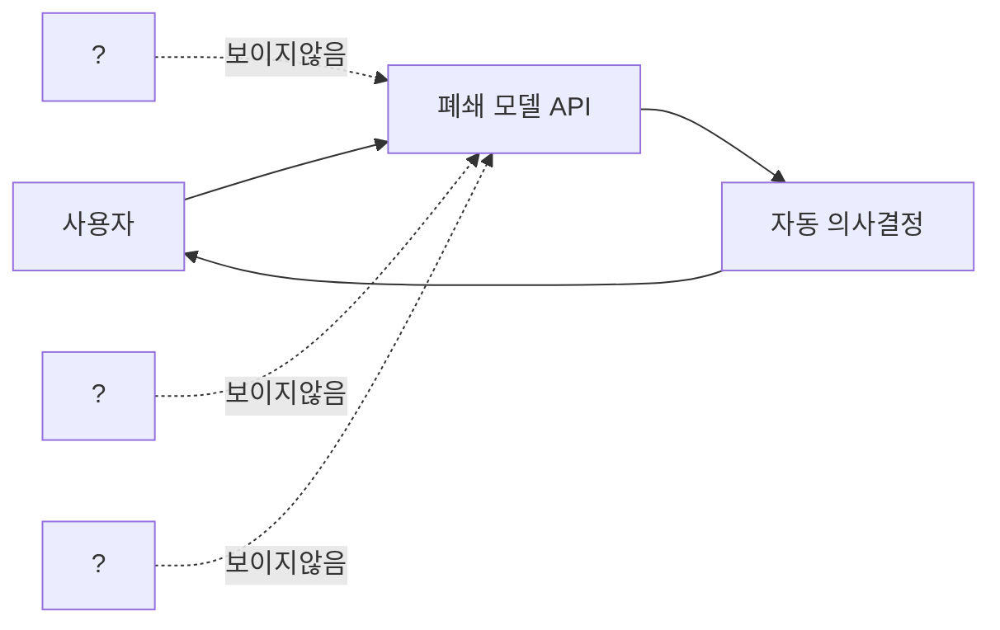

교황이 AI 이야기를 직접 꺼냈다는 소식을 보고 좀 의외였다. 레오 14세 — 작년에 즉위한 새 교황 — 가 며칠 전 "AI 는 소수 권력자가 아니라 인류 전체에 봉사해야 한다" 고 못박았다는 보도. 종교 지도자가 기술 거버넌스에 발을 들이는 건 새삼스럽지 않지만, 이번엔 표현이 꽤 직설적이라 눈에 들어왔다.

원문 중에서 가장 무거운 단어는 "new forms of dehumanization" 였다. 소수 기업이 굴리는 불투명한 AI 가 결국 새로운 비인간화를 만들 수 있다는 경고.

이 말이 왜 마음에 남았나. 내가 회사에서 LLM 을 제품에 붙이는 일을 하다 보니까, 매일 부딪히는 게 똑같은 질문이거든. 이 모델이 왜 이런 답을 냈지? 누가 학습 데이터를 골랐지? 어떤 가드레일이 켜져 있지? 솔직히 나도 절반은 모른다. 폐쇄 모델을 API 로 받아쓰는 입장에선 안쪽이 안 보이니까.

근데 여기서 재밌는 건, 교황의 비판이 단순히 "AI 가 무섭다" 가 아니라는 점이지. "소수가 운영하는 불투명한 AI" 라고 굳이 못박았어. 이게 핵심이라고 본다. AI 자체가 문제라기보단 **누가, 어떻게, 어떤 책임 구조 아래에서** 굴리느냐가 문제라는 시선. 체감상 이건 EU AI Act 나 미국의 NIST AI RMF 같은 거버넌스 프레임이 이미 향하고 있던 방향과 거의 같다. 다만 교황이 말하면 도달 범위가 다르지 — 가톨릭 신자만 13억 명 정도라고 알고 있고, 거기에 일반 매체 헤드라인까지 타니까.

위 그림이 좀 단순하긴 한데, 교황이 말한 "불투명함" 의 구조가 대충 이런 모양이다. 사용자 입장에선 입력하고 출력 받는 두 점만 보이고, 그 사이는 전부 블랙박스. 채용 심사, 대출 심사, 의료 분류 같은 데에 이런 모델이 들어가면 — 그리고 실제로 이미 들어가 있다 — 결정의 근거가 누구에게도 설명되지 않는 상태가 된다. 비인간화라는 표현이 좀 과한가 싶다가도, 이 그림 보면 그렇게 과하지도 않다 싶더라.

*[Photo by 2H Media on Unsplash](https://unsplash.com/@2hmedia?utm_source=blogmaker&utm_medium=referral)*

물론 반론도 있다. 모든 모델을 오픈하면 악용이 쉬워지고, 가드레일 자체가 영업 비밀이라 공개 못 하는 부분도 있고. 나도 이 부분은 단정 못 한다. 오픈소스 진영(Llama, Mistral, Qwen 같은 것들) 이 답을 일부 제시하긴 하는데, 가중치만 공개되고 학습 데이터 출처는 여전히 흐릿한 경우가 대부분이라 완전한 해답은 아니야.

내가 더 흥미롭게 본 건, 교황 발언이 **윤리 담론을 다시 기업 바깥으로 끌어내려는 움직임** 의 한 자락이라는 점. 지난 몇 년 동안 AI 윤리 이야기는 사실상 빅테크 사내 윤리팀과 학계 일부가 끌고 갔거든. 거기에 종교계, 시민 사회, 국제 기구가 더 큰 목소리로 끼어드는 흐름이 점점 굵어진다고 느낀다. 누구 한 명이 결론을 내는 분야가 아니라는 걸 기억하기 좋은 신호 같음.

엔지니어 입장에서 내가 당장 할 수 있는 건 거창하지 않더라. 내가 붙인 LLM 호출 한 줄에 로그를 남기는 것, 어떤 모델 버전을 썼는지 기록하는 것, 모델 출력이 사용자에게 닿기 전에 어떤 후처리가 끼어드는지 문서로 정리하는 것. 그 정도가 내 손이 닿는 범위지. 거대한 거버넌스 그림은 정치와 국제기구 몫이고, 나는 내 코드 안에 작은 투명성이라도 박아두는 수밖에.

이게 어떻게 굴러갈진 좀 더 봐야 할 것 같다. 종교계가 한 번 말했다고 빅테크 거버넌스가 바로 바뀌진 않겠지만, 적어도 "기술은 가치 중립적이다" 같은 게으른 변명이 점점 더 안 통하게 되는 분위기는 분명한 듯.

***

**참고**

- [Pope Leo XIV says AI must serve humanity, not the powerful few](https://religionnews.com/2026/05/25/in-his-first-encyclical-pope-leo-xiv-says-ai-must-serve-humanity-not-the-powerful-few/)
- [Pope Leo: opaque AI run by few firms risks "New Forms of Dehumanization"](https://variety.com/2026/biz/global/pope-leo-ai-encyclical-algorithms-threaten-dehumanisation-1236758186/)