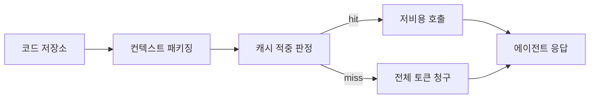

딥시크가 플래그십 모델 가격을 75% 깎은 채로 그대로 굳혔다는 소식이 어제 HN 메인에 올라왔다. 일시적 프로모션이 아니라 영구 정책으로 박아버린 거다. 같은 날 'reasonix' 라는 네이티브 코딩 에이전트도 공개했는데, 캐싱 효율과 저비용을 전면에 내세웠다. 가격하고 도구를 한꺼번에 던진 셈.

솔직히 처음 헤드라인을 봤을 때 좀 멍했다. 75% 면 거의 4분의 1 가격인데, 보통 이런 할인은 한두 달짜리 캠페인이지 영구 정책으로 박는 게 아니다. 한 번 내린 가격은 다시 올리기가 굉장히 힘드니까. 그래서 이건 "우리는 이 가격으로도 마진 나온다" 라는 시그널에 가깝다. 적어도 외부엔 그렇게 읽힌다.

재밌는 건 같이 던진 reasonix 다. '캐싱 효율' 을 카피 맨 앞에 박은 코딩 에이전트는 흔치 않다. LLM 코딩 도구 — 클로드 코드, 커서, 코파일럿 같은 — 의 청구서를 한 번이라도 본 적 있으면 알겠지만, 토큰 비용의 대부분은 컨텍스트를 매번 새로 보내는 데서 나온다. 같은 파일 트리, 같은 import, 같은 시스템 프롬프트가 매 호출마다 다시 들어간다. 여기서 prompt caching 이 잘 박히면 체감 비용이 절반 아래로 떨어진다. 내 환경에선 그렇더라.

근데 딥시크가 이걸 '네이티브' 라고 강조한 게 묘하다. OpenAI, Anthropic 의 캐싱은 SDK 레벨에서 옵트인이고, 에이전트 프레임워크가 따로 끼면 캐시 히트가 깨지기 쉽다. 그걸 모델·서버·에이전트 한 스택에서 일관되게 묶었다는 얘기로 들린다. 사실인지 직접 돌려봐야 알겠지만.

*[AI generated (Pollinations · Flux)](https://pollinations.ai/)*

가격을 영구로 내린 쪽이 결국 시장을 가져갔던 사례는 클라우드 초창기 AWS S3 가 했던 짓이다. 경쟁사가 따라 내리든 안 내리든 자기네 비용 곡선이 더 가파르게 떨어진다는 자신감. 딥시크가 정말 그 자리에 있는지는 모르겠다. 다만 미국 빅테크가 추론 비용을 어떻게 정당화할지는 한 분기 안에 답을 내야 할 것 같다. 가만히 있기엔 격차가 너무 벌어진다.

이 글을 쓰는 시점에 reasonix 는 아직 못 돌려봤다. 벤치마크는 나중에 따라잡으면 되고, 우선 캐싱이 진짜로 깊게 들어가 있는지 — 그게 가장 궁금하다. 한 번 붙여보고 토큰 청구서가 실제로 얼마나 가벼워지는지 봐야 이 가격이 단순한 출혈 경쟁인지, 아니면 구조가 정말 달라진 건지 가닥이 잡힐 것 같다.

***

**참고**

- [DeepSeek reasonix, DeepSeek native coding agent with high caching and low cost](https://esengine.github.io/DeepSeek-Reasonix/)
- [DeepSeek to Make Permanent 75% Discount on Flagship AI Model](https://www.bloomberg.com/news/articles/2026-05-23/deepseek-to-make-permanent-75-discount-on-flagship-ai-model)
- [DeepSeek makes the V4 Pro price discount permanent](https://api-docs.deepseek.com/quick_start/pricing)