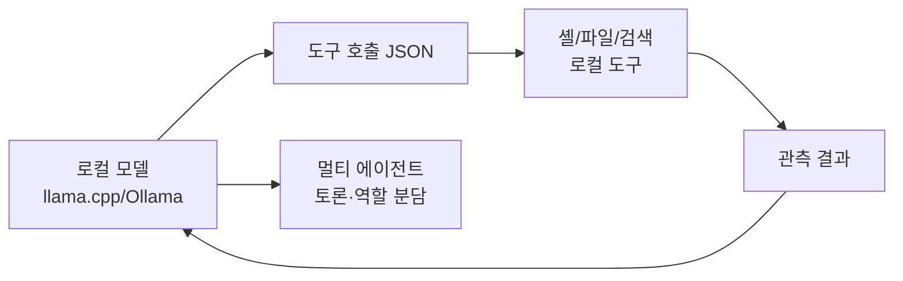

며칠 사이에 로컬 LLM 에이전트 쪽에서 두 가지 흐름이 동시에 튀어나왔다. 하나는 llama.cpp — 모델을 노트북 CPU나 게이밍 GPU에서 돌리게 해 주는 그 C++ 추론 엔진 — 의 서버 모드에 셸 실행이나 파일 편집 같은 도구가 기본 탑재됐다는 거. 다른 하나는 TradingAgents라는 멀티 에이전트 주식 분석 프레임워크의 로컬 GUI가 Ollama 연동으로 풀렸다는 소식이고.

r/LocalLLaMA에서 처음 봤을 때 약간 의아했다. 도구 호출(tool calling)은 보통 OpenAI나 Anthropic 같은 클라우드 API에 얹어 쓰는 패턴이었거든. 모델이 "이 함수를 이런 인자로 호출해" 라고 JSON을 뱉으면, 클라이언트 쪽 코드가 실제 함수를 돌리고 결과를 다시 모델에 먹이는 식. 근데 llama.cpp가 이 루프 안쪽으로 셸 실행기나 파일 편집기를 직접 박아 둔 거다. 굳이 외부 orchestrator 없이도 서버 자체가 도구를 들고 있는 셈.

이게 좀 묘한 건, 그동안 로컬 LLM 진영은 "모델은 우리가 돌리지만 에이전트 프레임워크는 LangChain이나 LlamaIndex 빌려 쓰자" 분위기였거든. 한 단계 더 내려와서 추론 엔진 자체가 "내가 셸도 칠 수 있어"라고 하는 건 결이 좀 다르다.

*[AI generated (Pollinations · Flux)](https://pollinations.ai/)*

TradingAgents 쪽도 비슷한 결의 변화로 읽힌다. 원본 프로젝트(TauricResearch/TradingAgents)는 분석가·리서처·트레이더·리스크 매니저 같은 역할을 여러 LLM 에이전트로 나눠서 한 종목을 토론시키는 구조. 논문에서 봤을 땐 재밌긴 한데 GPT-4 API 쓰면 한 종목 분석에 토큰값이 꽤 나가는 — 그래서 "이거 누가 실제로 굴리겠어" 싶었던 류였다.

근데 이번에 공개된 GUI는 Ollama 백엔드를 붙여서 로컬 모델로 같은 멀티 에이전트 토론을 돌린다. r/singularity에 같은 글이 올라온 것도 그 의미를 사람들이 알아본 거지. 클라우드 비용 0원으로 분석가 4~5명을 동시에 굴린다고 생각하면 좀 다른 그림이지.

내가 본 한에선 흐름이 이렇게 정리되더라.

도구 호출 루프가 통째로 자기 PC 안에서 닫힌다는 게 핵심. 인터넷 끊겨도, API 키 만료돼도, 회사 보안팀이 외부 LLM 막아도, 일단 돌긴 돈다는 얘기.

*[AI generated (Pollinations · Flux)](https://pollinations.ai/)*

물론 한계도 보이는데, 솔직히 적지 않다. 첫째, 도구 호출 정확도. 7B~13B급 로컬 모델은 함수 시그니처를 자주 어그러뜨린다. 인자 이름을 슬쩍 바꾸거나, 필수 필드를 빼먹거나. 내 환경에선 Qwen2.5 Coder 14B 정도는 돼야 좀 봐줄 만하더라.

둘째, 셸 실행 도구를 모델한테 그냥 쥐여 주는 게 보안적으로 무섭다. `exec_shell` 같은 게 기본 enable이면 프롬프트 인젝션 한 방에 `rm -rf` 가는 시나리오가 진짜 가능해진다. llama.cpp 쪽 변경을 잠깐 훑어보니 화이트리스트나 샌드박싱 옵션이 같이 들어가긴 했던데, 기본값을 어떻게 잡느냐가 관건일 듯.

셋째, TradingAgents 같은 멀티 에이전트 시스템은 토큰을 무지막지하게 먹는다. 4~5명이 토론하면 한 종목당 컨텍스트가 수만 토큰. 로컬 모델로 돌리면 비용은 0이지만 시간이 든다. 내 4080으로 14B 모델 돌릴 때 한 종목 분석에 10분 넘게 걸린 적 있다. 클라우드 GPT-4가 30초에 끝낼 일을.

그래도 이 방향 자체는 의미가 있다고 본다. 코드 인터프리터를 클라우드에 양도하지 않고 내 PC 안에서 닫는 패턴은, 코파일럿 류 도구를 회사 내부망에서만 굴려야 하는 팀들한테 특히 그렇고. AI 안전 관점에서도 — 모델이 도구로 뭘 하는지 전부 내 디스크 위에서 일어나는 게 보이는 건 꽤 다른 신뢰 모델일 거.

이게 어느 시점에 "일반 사용자도 쓰는 표준"이 될지는 좀 더 봐야 할 것 같네. 적어도 지금은 얼리어답터들의 장난감 단계.

***

**참고**

- [llama.cpp server have built-in native tools (exec_shell, edit_file, etc.)](https://www.reddit.com/r/LocalLLaMA/comments/1tluma3/llamacpp_server_have_builtin_native_tools_exec/)
- [I built a local GUI for the TradingAgents framework — works with Ollama](https://www.reddit.com/r/LocalLLaMA/comments/1tm2ct0/i_built_a_local_gui_for_the_tradingagents/)
- [I built a local GUI for the TradingAgents framework for Multi Agent stock analysis.](https://www.reddit.com/r/singularity/comments/1tmg6mp/i_built_a_local_gui_for_the_tradingagents/)