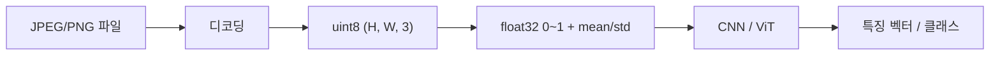

이미지가 컴퓨터 안에선 어떻게 숫자로 바뀌는지 — 사실은 이게 vision 분야 전체의 첫 단추다. 모델이 고양이를 알아보든, 자율주행차가 횡단보도를 인식하든, 처음 단계는 똑같다. 사진 한 장을 거대한 숫자 덩어리로 만들어 메모리에 올려놓는 거.

근데 이게 처음 보면 좀 이상하다. 우리 눈엔 그냥 풍경이나 얼굴인데, GPU 입장에선 그게 그냥 `(3, 1024, 1024)` 짜리 행렬 한 덩어리거든. 솔직히 나도 처음엔 이게 잘 와닿지 않았다.

## 픽셀 = 작은 숫자 칸 하나

가장 밑바닥부터 풀면, 사진은 격자다. 가로 1024개, 세로 1024개의 작은 칸으로 쪼개고, 각 칸을 픽셀(pixel)이라고 부른다. 줌인을 끝까지 땡기면 모자이크처럼 네모가 보이는데, 그게 진짜 그렇게 생긴 거다.


*[Photo by Bernard Hermant on Unsplash](https://unsplash.com/@bernardhermant?utm_source=blogmaker&utm_medium=referral)*


각 픽셀은 색을 가지고 있고, 색은 다시 세 개 숫자로 표현된다 — 빨강(R), 초록(G), 파랑(B). 각각 0~255 사이 정수. 빨강 255, 초록 0, 파랑 0 이면 순수한 빨강. 셋 다 255 면 흰색, 셋 다 0 이면 검정. 이 RGB 조합으로 대략 1670만 가지 색이 나온다.

그러니까 1024×1024 짜리 컬러 사진 한 장은, 가로 1024 × 세로 1024 × 채널 3개 = 약 314만 개의 숫자. 진짜 그게 다다. 사진이라는 게.

## 모델은 0~255 가 아니라 0~1 을 좋아함

체감상 이걸 처음 만지는 사람들이 가장 헷갈리는 부분이 여기다. 픽셀 원본은 0~255 정수인데, 신경망에 넣을 땐 보통 0~1 사이 실수 또는 -1~1 사이 실수로 변환한다.

```python
import numpy as np
from PIL import Image

img = Image.open("cat.jpg")
arr = np.array(img)                    # (H, W, 3), dtype=uint8, 값 0~255
arr = arr.astype(np.float32) / 255.0   # 값 0~1
print(arr.shape, arr.dtype, arr.min(), arr.max())
```

왜 굳이 0~1 로? 신경망 안에서 곱셈·덧셈이 수십~수백 번 일어나는데, 입력 값이 너무 크면 중간 계산이 폭주한다 — gradient 가 터지거나 사라지거나. 작은 범위로 맞춰주는 게 학습 안정성에 압도적으로 유리하더라.

ImageNet 같은 데이터셋으로 학습된 모델은 한 발 더 나아가서 채널별로 평균·표준편차로 정규화한다. torchvision 기본 transform 에 박혀 있는 그 매직 넘버 — `mean=[0.485, 0.456, 0.406], std=[0.229, 0.224, 0.225]` — 가 그거다. ImageNet 전체 평균 색감을 0 근처로 끌어내리는 보정.

## 그 다음에 일어나는 일

여기까지 오면 사진은 더 이상 사진이 아니라 그냥 부동소수점 텐서다. 모델 입장에선 픽셀이라는 개념도 없고, 그냥 `(3, 1024, 1024)` 모양의 숫자 큐브.



CNN(합성곱 신경망) 이라면 작은 필터(3×3, 5×5) 가 이 숫자 큐브 위를 슬라이딩하면서 가장자리·색 변화·패턴 같은 걸 잡아낸다. ViT(Vision Transformer) 면 이걸 16×16 같은 작은 패치로 잘라서, 각 패치를 하나의 토큰처럼 다룬다. 어쨌든 입구는 똑같다 — 숫자 큐브.


*[Photo by Boicu Andrei on Unsplash](https://unsplash.com/@boiq_an?utm_source=blogmaker&utm_medium=referral)*


## 직접 만져보면 빨리 친해진다

내가 처음 vision 모델을 만질 때 가장 도움 됐던 건, Jupyter 켜서 `plt.imshow(arr[:, :, 0], cmap='gray')` 처럼 R 채널만, G 채널만 따로 회색조로 띄워보는 거였다. 빨강이 강한 부분(사람 입술, 토마토) 이 R 채널에선 밝게 나오고 다른 채널에선 어둡게 나오는 걸 눈으로 확인하면 — 아 진짜 이게 그냥 숫자 세 장이구나, 가 체감된다.

또 하나 권장하고 싶은 거 — 0~255 정수 그대로 모델에 넣어보고 일부러 망가뜨려 보기. loss 가 엉뚱하게 튀거나 그라디언트가 NaN 나오는 걸 보면 "왜 정규화가 필수인지" 가 머리가 아니라 손에 박힌다.

## 한계랄까, 주의점

이건 픽셀 기반 표현의 가장 단순한 버전이고, 실제로는 더 많은 게 끼어든다. JPEG 압축 아티팩트, sRGB vs Linear 색공간, HEIC, EXIF 회전 정보, 알파 채널, 16비트 의료영상... 그래도 모델 학습 단계의 입구는 거의 다 "정수 텐서 → 실수 텐서 → 정규화" 흐름을 따른다.

재밌는 건 vision 의 화려한 결과 — Stable Diffusion 의 그림 생성, CLIP 의 이미지-텍스트 매칭, YOLO 의 객체 탐지 — 들이 다 이 314만 개 숫자에서 시작한다는 점이다. 별 거 아닌 변환이지만, 이게 없으면 그 위에 뭘 쌓을 수가 없다. 다음번엔 이 숫자 큐브 위에서 CNN 의 필터가 실제로 뭘 보는지 한 번 더 들여다봐야겠다.