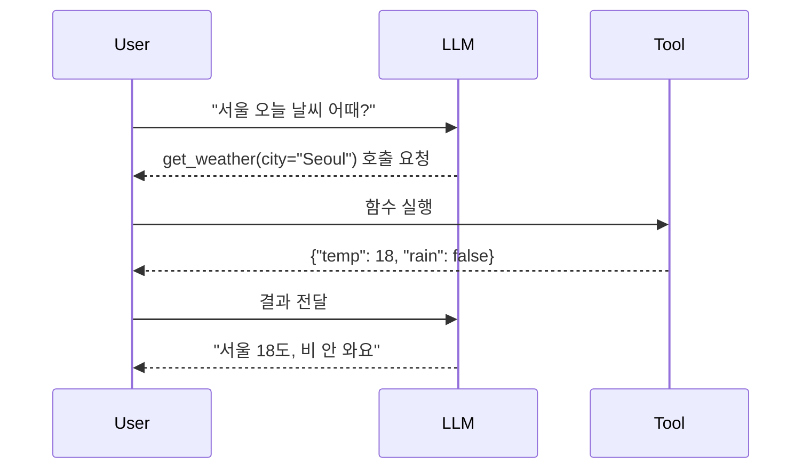

함수 호출(function calling) 이 LLM 에 처음 붙은 게 GPT-4 시절인 걸로 기억하는데, 그땐 솔직히 "이게 그렇게 큰 일인가?" 싶었던 게 사실이다. 근데 1~2년 직접 만져 보니 생각이 좀 바뀌었지 — 이게 LLM 을 "말 잘하는 친구"에서 "일 시킬 수 있는 동료"로 격을 올린 결정적 포인트더라.

핵심 아이디어는 의외로 단순하다. LLM 이 답을 그냥 자연어로 뱉는 대신, **"이 함수를 이 인자로 좀 불러줘"** 라는 구조화된 JSON 을 같이 뱉도록 만든 것. 그게 끝이야. 모델이 직접 함수를 실행하는 게 아니라, "내가 보기엔 이 도구를 써야 할 것 같은데" 라고 의견을 내는 정도. 실제 실행은 우리 wrapper 가 한다.

흐름을 그림으로 보면 빠르다:

재밌는 건 LLM 이 한 번 호출하고 끝나는 게 아니라 **여러 번 도구를 부르며 사고를 이어 갈 수 있다**는 점. 검색 결과가 부족하면 키워드를 바꿔 다시 검색하고, 그 결과로 계산기를 또 부르고… 이걸 흔히 "agentic loop" 라고 부르더라.

*[Photo by Chris Ried on Unsplash](https://unsplash.com/@cdr6934?utm_source=blogmaker&utm_medium=referral)*

내가 직접 써 보며 부딪힌 패턴 몇 개만 짚자면:

**1) single-shot tool use** — 사용자 질문 → 도구 1번 → 답변. 가장 흔하고 가장 안정적. 챗봇에 계산기 하나 붙이는 정도면 이걸로 충분.

**2) parallel tool calls** — 한 턴에 도구 여러 개를 동시에 호출. Claude 나 GPT-4 계열은 "오늘 서울이랑 도쿄 날씨"라고 물으면 `get_weather` 를 두 번 한꺼번에 부르는 식. 체감상 토큰도 줄고 latency 도 좋아짐.

**3) multi-step / ReAct** — "생각 → 행동 → 관찰 → 생각" 을 반복. 깊이 있는 작업엔 강한데 무한 루프에 잘 빠진다. 그래서 **max_iterations 같은 가드는 반드시 걸어야 함**. 내가 한 번 잘못 풀어놨다가 한 요청에 도구를 30번쯤 부른 적 있는데 — 다음 날 비용 청구서 보고 정신 차렸지.

*[Photo by Luke Chesser on Unsplash](https://unsplash.com/@lukechesser?utm_source=blogmaker&utm_medium=referral)*

JSON schema 를 얼마나 엄격히 정의하느냐도 의외로 큰 변수. 필드 설명을 두루뭉술하게 쓰면 모델이 인자를 이상하게 채워 넣는다. 예를 들어 `date` 필드를 그냥 "날짜" 라고만 적어 두면 어떤 날은 `"2026-05-25"`, 어떤 날은 `"오늘"`, 어떤 날은 `"5월 25일"` 이 꽂힘. 포맷을 `"YYYY-MM-DD"` 로 박고 예시 한 줄 넣어 주면 정확도가 눈에 띄게 올라가더라.

또 하나 — 모델이 **schema 에 없는 함수를 호출하는 환각**도 있다. 분명히 `search_docs` 만 정의했는데 갑자기 `query_database` 를 부르는 식. 빈도는 낮지만 한 번씩 튀어나오니, wrapper 쪽에서 "정의되지 않은 함수" 분기를 깔끔하게 처리해 둬야 함.

마지막으로 production 에 붙일 때 가장 신경 쓰는 건 결국 **재시도와 timeout**. 도구가 느린 외부 API 면 LLM 의 응답 시간이 통째로 끌려가니까, 도구 단에서 5초 timeout, 실패 시 모델에 `tool_result` 로 에러를 넘기고 모델이 알아서 우회하게 두는 식으로 설계하는 게 그나마 안정적이었다.

이게 어디까지 갈진 좀 더 봐야겠지. 도구 100개 묶어 자율로 돌리는 agent 가 정말 production-grade 가 될지, 아니면 결국 사람이 한 줄씩 schema 점검하며 살살 다듬는 형태로 남을지 — 솔직히 아직 잘 모르겠음.