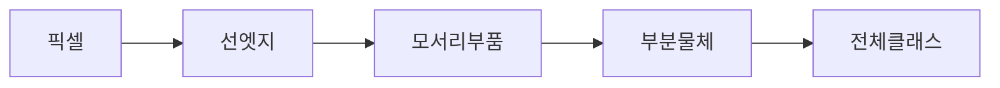

CNN — 이미지 분류 얘기 나오면 거의 첫 번째로 등장하는 그 모델 — 이 사진을 '본다'는 게 뭔지, 처음엔 솔직히 잘 안 와닿았다. 픽셀 덩어리에서 어떻게 "고양이"라는 라벨이 튀어나오는 건지.

내가 이해한 핵심은 의외로 단순하다. **작은 도장이 사진 위를 미끄러져 다닌다.** 정식 이름은 필터(또는 커널). 3x3 짜리 작은 행렬이 이미지 왼쪽 위부터 오른쪽 아래까지 한 칸씩 옮겨가며, 그 자리 픽셀들과 곱해서 더한다. 합이 크면 "여기에 이 도장이 찾는 패턴이 있다"는 신호.

도장 한 개는 한 가지만 본다. 어떤 도장은 세로선, 어떤 도장은 가로선, 어떤 도장은 오른쪽으로 기울어진 모서리. 이걸 수십~수백 개 깔아두고 사진 한 장 위를 동시에 훑게 한다. 결과는 도장 개수만큼의 지도(feature map) — "이 자리에 세로선이 얼마나 강하게 있는지"를 보여주는 지도가 한 장, "가로선 지도" 한 장, 이런 식으로 쌓인다.


재밌는 건 이걸 한 번 하고 끝나는 게 아니라는 점. 첫 층의 출력 — 즉 선·모서리 지도들 — 위에 또 도장을 굴린다. 그러면 두 번째 층 도장은 "세로선과 가로선이 ㄱ자로 만나는 자리"를 잡고, 세 번째 층은 그 ㄱ자들이 모여 만드는 눈·바퀴·창문 같은 부품, 네 번째쯤 가면 얼굴·자동차·고양이가 슬슬 보이기 시작한다. 단순한 패턴에서 복잡한 패턴으로 한 단계씩 추상화가 쌓이는 구조.



여기서 두 가지가 더 중요하다. 첫째 **풀링(pooling)** — 지도가 너무 커지지 않게 2x2 영역에서 가장 강한 값만 뽑아 절반 크기로 줄인다. 정보를 압축하면서 "위치가 조금 달라도 같은 패턴은 같은 패턴" 이라는 성질(translation invariance)도 살짝 얻는다. 둘째, 도장 값을 사람이 정하는 게 아니라 **학습으로 찾아낸다**는 점. 처음엔 랜덤 숫자였던 3x3 행렬이, 라벨 맞히는 과정을 수만 번 반복하면서 알아서 "세로선 찾는 도장"으로 수렴한다. 이게 처음 들었을 때 제일 멍해졌던 지점.

PyTorch 로 짜면 한 줄이다.

```python
import torch.nn as nn
conv = nn.Conv2d(in_channels=3, out_channels=64, kernel_size=3, padding=1)
```

`out_channels=64` 가 "도장 64개를 동시에 굴린다"는 뜻. 학습이 끝나면 그 64개가 각자 다른 패턴으로 분화돼 있다.

체감상 ViT(Vision Transformer)가 뜬 뒤로 "CNN 은 이제 옛날 거 아니냐" 분위기도 있다. 근데 내가 production 에서 본 한에선, 작은 모델로 빠르게 돌려야 하는 자리 — 모바일 OCR, 실시간 검수, edge 디바이스 — 에선 여전히 CNN 계열(MobileNet, EfficientNet)이 디폴트더라. ViT 는 데이터·연산 양쪽 부담이 만만치 않다 보니.


*[Photo by Alicia Christin Gerald on Unsplash](https://unsplash.com/@allysphotos?utm_source=blogmaker&utm_medium=referral)*


원리 자체는 이렇게 단순한 발상에서 출발했는데, 그 단순함이 십 년 넘게 vision 분야 중심을 잡았다는 게 가끔 묘하게 느껴진다. 다음 십 년엔 또 뭐가 그 자리에 와있을지.