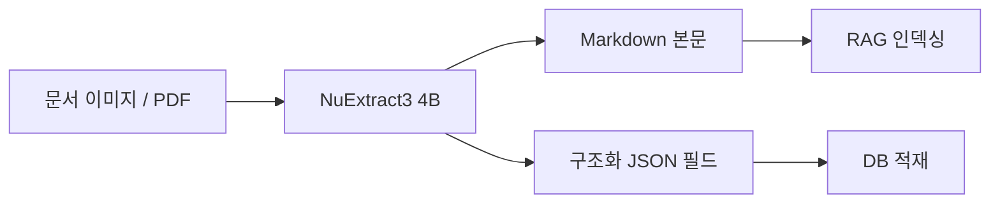

문서를 통째로 마크다운으로 뽑아주는 4B 짜리 비전-언어 모델 NuExtract3 가 어제 풀렸다. 만든 곳은 Numind — 정보 추출(information extraction) 분야에서 오픈웨이트 모델을 꾸준히 내놓던 프랑스 스타트업이고, 이번엔 Qwen3 계열 4B 위에 얹어서 Apache-2.0 으로 풀었더라.

내가 이 카테고리, 그러니까 문서 이해용 VLM(vision-language model — 이미지랑 텍스트를 같이 받는 모델) 을 따라보는 이유는 따로 있다. 회사에서 PDF·스캔 이미지를 구조화 JSON 으로 떨어뜨리는 파이프라인을 굴리는데, 여태까지는 OCR(Tesseract 또는 PaddleOCR) → 레이아웃 파서 → LLM 후처리, 이렇게 세 단계로 잘라 놨던 거. 단계마다 에러가 누적되고, 표(table) 가 한 번 끼면 거의 무너지는 수준.

근데 NuExtract3 카드 설명을 보면 — 이미지 한 장 받아서 마크다운을 통째로 뽑고, 동시에 "이 필드만 뽑아줘" 같은 구조화 요청도 같은 모델 안에서 처리한다. 즉 OCR + 레이아웃 + 추출이 한 모델로 합쳐진 형태. 사실 이런 통합형 접근은 작년부터 Nougat, ColPali, Qwen2.5-VL 쪽에서 계속 나오던 흐름이고, **4B 라는 크기에 Apache-2.0** 이 같이 묶인 게 이번 포인트라고 본다.

*[Photo by Devin Pickell on Unsplash](https://unsplash.com/@nextiva?utm_source=blogmaker&utm_medium=referral)*

4B 면 양자화해서 8GB VRAM 카드에 올라가는 사이즈. 내 RTX 4080 (16GB) 으론 fp16 그대로 올려도 여유. 자체 호스팅이 된다는 건 사내 문서 — 계약서나 의료 기록처럼 외부 API 로 못 내보내는 데이터 — 도 안에서 처리할 수 있다는 얘기고, 이게 제품팀이 "GPT-4o 좋은 건 아는데 데이터를 못 보낸다" 라고 막혀 있던 지점을 풀어줄 여지가 있다.

대충 굴러가는 흐름을 그림으로 그리면 이런 모양:

기존 3단계 파이프라인이 1단계로 줄어드는 그림. 물론 모델 카드만 보고 그린 거니까, 실측 들어가면 다를 수 있어.

*[Photo by Ales Nesetril on Unsplash](https://unsplash.com/@alesnesetril?utm_source=blogmaker&utm_medium=referral)*

아직 확신 못 하는 부분 — Numind 자체 벤치(NuExtract bench, MMLongDoc 일부 등) 에선 강하다고 적혀 있는데, 이런 자체 벤치는 거의 항상 자기네한테 유리한 셋팅. 진짜로 한국어 표·도장·손글씨가 섞인 한국 문서에서 어디까지 버티는지가 관건이고, 이건 직접 굴려봐야 알 일이라 주말에 한 번 돌려볼 생각.

라이선스가 Apache-2.0 인 게 새삼 고맙게 느껴진 건, 한 달쯤 전에 비슷한 사이즈로 풀린 다른 도큐먼트 VLM 이 "research only" 라이선스라 제품에 못 박았던 기억 때문. 4B 짜리 문서 VLM 이 진짜로 production 에 올릴 수 있는 라이선스로 풀린 게 흔치 않은 일이고, 이게 몇 개 더 쌓이면 PDF 처리 시장에서 폐쇄형 API 의 가격 협상력이 좀 깎일 수도 있겠다 싶더라.

일단 weight 는 받아놨다. 주말에 한국 문서 몇 장 던져보고, 결과가 쓸 만하면 별도 글로 한 번 더 정리할 듯.

***

**참고**

- [NuExtract3 released: open-weight 4B VLM for Markdown, OCR and structured extraction (self-hostable)](https://www.reddit.com/gallery/1tn8utn)
- [numind/NuExtract3 · Hugging Face](https://huggingface.co/numind/NuExtract3)