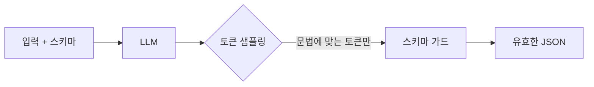

LLM 한테 구조화된 출력을 강제하는 일 — 이게 production 에서 LLM 쓰는 사람 대부분이 한 번씩 부딪히는 지점이다. 모델은 자유 텍스트로 답하고 싶어 하는데, 그 다음 단계의 파이프라인은 JSON 한 줄을 기다리고 있다.

내가 처음 이걸 제대로 부딪힌 건 회사에서 사용자 리뷰를 카테고리·감정·키워드 세 필드로 자동 추출하는 작업이었다. 프롬프트에 "JSON 으로 답해줘" 라고 정중히 부탁했더니, 10번 중 9번은 잘 줬다. 문제는 그 1번. 앞에 "네! 결과는 다음과 같습니다:" 가 붙거나, JSON 끝에 갑자기 "추가로 설명드리자면..." 이 따라붙거나, 따옴표를 `"` 가 아니라 `"` 같은 스마트 쿼트로 써버린다든가.

처음엔 정규식으로 JSON 부분만 뽑아내려 했다. 근데 모델이 점점 창의적으로 깨먹기 시작하면 정규식은 진다. 며칠 디버깅하고 깨달았다 — 이건 파싱으로 풀 문제가 아니라 **생성 단계에서 막아야** 하는 문제더라.


*[Photo by Shahadat Rahman on Unsplash](https://unsplash.com/@hishahadat?utm_source=blogmaker&utm_medium=referral)*


요즘은 보통 세 가지 방법 중 하나로 처리한다.

첫째, **프롬프트 + 재시도**. 가장 단순. "JSON 으로만 답해. 다른 텍스트 금지." 라고 시키고, `json.loads` 실패하면 에러 메시지를 붙여서 한 번 더 던진다. Anthropic 이든 OpenAI 든 요즘 모델은 이 정도면 95% 는 잘 따라준다. 작은 작업엔 이거면 충분.

둘째, **function calling / tool use / JSON mode**. API 차원에서 모델이 사전에 정의된 스키마에 맞춰 응답하게 강제한다. Anthropic 의 tool use, OpenAI 의 function calling — 여기 해당하는 그 기능들. 내부적으로는 모델이 학습 때부터 이런 형식에 노출돼서, 일반 프롬프트보다 형식을 훨씬 안정적으로 지킨다. 체감상 실패율이 한 자릿수에서 거의 0% 근처로 떨어지더라.

셋째, **constrained decoding** — 이게 좀 재밌다. 모델이 다음 토큰을 뽑을 때, 스키마에 맞지 않는 토큰의 확률을 아예 0으로 깎아버린다. JSON 이 시작되는 자리에선 `{` 만 가능하고, 그 다음엔 `"` 만, key 이름은 미리 정의된 것만 — 식으로 문법(grammar) 으로 강제한다. outlines, llguidance, xgrammar 같은 라이브러리들이 이걸 한다.

```python
from outlines import models, generate
from pydantic import BaseModel

class Review(BaseModel):
    category: str
    sentiment: str
    keywords: list[str]

model = models.openai("gpt-4o-mini")
result = generate.json(model, Review)("리뷰 본문...")
```

흐름을 그림으로 보면 대충 이렇다.



다만 constrained decoding 도 공짜는 아니다. 매 토큰마다 가능한 다음 토큰 집합을 계산해야 해서 latency 가 약간 더 붙고, vocab 이 큰 모델일수록 이 오버헤드가 무시 못 할 정도가 된다. 그리고 — 이게 좀 미묘한데 — 형식을 너무 강하게 묶으면 **내용 품질이 떨어지는** 케이스가 보고된다. 모델이 "이 자리엔 이 키만" 으로 강제당하면, 자연스러운 사고 흐름을 끊고 형식부터 맞춰버리니까. 내가 직접 A/B 한 수치는 아니라 단정은 못 하는데, 커뮤니티에서 자주 나오는 얘기다.


*[AI generated (Pollinations · Flux)](https://pollinations.ai/)*


내 경험상 가이드라인은 대충 이렇다. 카테고리 분류처럼 출력이 단순하면 그냥 프롬프트 + `json.loads` 재시도. 필드가 많거나 nested 면 function calling. 문법이 엄격하고 실패가 절대 안 되는 시스템 — 가령 SQL 생성, 외부 시스템으로 바로 흘러가는 명령 같은 — 이면 constrained decoding 을 고민한다.

재밌는 건, "JSON 강제" 라는 단순해 보이는 문제가 사실 LLM 을 신뢰할 수 있는 컴포넌트로 만드는 거의 첫 관문이라는 점이다. 모델이 아무리 똑똑해도 출력 형식이 매번 흔들리면 그 위에 시스템을 못 쌓는다. 구조화 출력은 그래서 단순한 trick 이 아니라, **LLM 을 라이브러리화하는 과정** 의 일부에 가깝다고 본다.

체감상 1년 전과 비교해도 이 영역은 빠르게 정리되는 중. 작년만 해도 outlines 가 화제였는데 이제 vLLM 같은 추론 엔진 안에도 grammar 모드가 들어가 있고, tool use API 들도 점점 매끄러워졌다. 다음 라운드는 아마 grammar 자체를 더 표현력 있게 — 단순 JSON schema 너머로 — 가져가는 쪽이 될 것 같은데, 이건 좀 더 지켜봐야 할 것 같다.