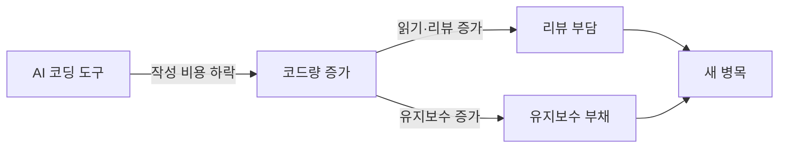

요즘 AI 코딩 도구로 코드를 더 빨리, 더 많이 뽑아내는 게 기본값이 된 분위기다. 근데 해커뉴스에 그 흐름을 정면으로 거스르는 글 두 개가 며칠 사이 나란히 올라와서, 출근길에 한참 들여다봤다. 하나는 "Using AI to write better code more slowly"(AI로 더 느리더라도 더 나은 코드를 쓰기), 다른 하나는 "The Best Engineers Write Less Code"(뛰어난 엔지니어는 코드를 덜 쓴다). 제목만 봐도 가리키는 데가 같다. AI가 작성 속도랑 코드량을 밀어 올리는 동안, 정작 챙겨야 할 건 그 반대편 — 코드 품질과 절제 — 아니냐는 얘기다.

사실 이게 좀 묘한 타이밍이다. 깃허브 코파일럿이나 커서(Cursor) 같은 도구 — 에디터 안에서 다음 코드 줄을 알아서 채워주는 그 자동완성 — 을 쓰다 보면 손이 빨라지는 게 확 체감된다. 탭 키 한 번에 함수 하나가 뚝 떨어진다. 근데 빨라진 건 '타이핑'이지 '문제 해결'이 아니더라. 이게 둘이 다른 건데, 쓰다 보면 자꾸 같은 거라고 착각하게 된다.

첫 번째 글이 찌르는 지점이 딱 거기다. AI한테 코드를 빨리 받아쓰지 말고, 오히려 속도를 일부러 늦춰서 — "이 방법 말고 다른 접근은 없냐", "이 코드의 약점이 뭐냐" 되묻는 데 쓰라는 거다. 자동완성기로 쓰면 생각을 건너뛰게 되는데, 대화 상대로 쓰면 생각이 오히려 늘어난다. 같은 도구인데 쓰는 방식이 정반대다.

*[AI generated (Pollinations · Flux)](https://pollinations.ai/)*

두 번째 글은 좀 더 오래된 이야기를 다시 꺼낸다. 코드는 자산이 아니라 부채라는 관점. 한 줄 쓸 때마다 누군가는 그걸 읽고, 테스트하고, 반년 뒤에 고쳐야 한다. 솔직히 나도 PR 리뷰하면서 제일 피곤한 게 '잘 짠 500줄'이 아니라 '굳이 있을 필요 없는 500줄'이다. AI가 코드 쓰는 비용을 거의 0으로 만들어 놓으니까, 예전 같으면 "이거 꼭 짜야 돼?" 하고 한 번 멈췄을 자리에서도 그냥 다 짜버리게 된다.

재밌는 건, 여기서 병목이 슬쩍 옮겨간다는 거다. 쓰는 게 공짜가 되면, 읽고 유지하는 쪽이 비싸진다.

체감상 제일 까다로운 게 이거다. 코드가 늘어나는 속도는 눈에 바로 보이는데, 그걸 떠받치는 비용은 한참 뒤에, 그것도 보통 다른 사람한테 청구된다. 내가 오늘 30분 아낀 만큼을 반년 뒤 후임이 며칠로 갚는 식. 이게 좀 불공평한 구조다.

그래서 "코드를 덜 쓴다"는 말이 단순히 라인 수 줄이기 시합은 아닌 것 같다. 진짜 잘하는 사람들이 하는 건 삭제더라. 이미 있는 걸 지우고, 세 군데 흩어진 로직을 한 군데로 모으고, 추상화 한 겹을 걷어내서 오히려 단순하게 만드는 일. AI한테 "이거 더 간단하게 못 줄여?" 시키는 건 다들 잘하는데, "이거 통째로 지워도 되는 거 아냐?" 묻는 판단은 아직 사람 몫인 것 같다.

*[AI generated (Pollinations · Flux)](https://pollinations.ai/)*

마치 가지치기 같다. 정원에서 가지를 쳐내는 건 나무를 죽이는 게 아니라 더 잘 자라게 하려는 거니까. 코드도 비슷해서, 잘 지운 자리가 잘 쓴 자리보다 시스템을 더 건강하게 만들 때가 많다. 근데 지우는 일엔 박수가 잘 안 붙는다. "이번 주에 1만 줄 짰다"는 자랑은 들어봤어도 "1만 줄 지웠다"는 자랑은 드물지 않나.

내 환경에선 — LLM을 제품에 붙여서 운영하는 쪽이다 보니 — 이 긴장이 더 도드라진다. 프로토타입은 AI로 하루면 나온다. 근데 그게 production에서 1000명 동시 접속을 받으면서 안 죽으려면, 결국 누가 그 코드를 끝까지 읽고 책임지느냐의 문제로 돌아오더라. 그리고 빨리 튀어나온 코드일수록 '아무도 깊이 안 읽은 코드'일 확률이 높고.

오해는 말자. 나는 AI 코딩 도구 쓰지 말자는 쪽이 전혀 아니다. 매일 쓴다. 다만 이 두 글이 같은 주에 떠서 같은 곳을 가리킨 게, 개발자들 사이에 비슷한 불편함이 조용히 쌓였다는 신호 같다. 빨라진 만큼 우리가 더 잘 만들고 있는 건지, 아니면 그냥 더 많이 만들고 있을 뿐인지.

이게 어느 쪽으로 굴러갈진 좀 더 지켜봐야 할 것 같다. 다만 다음에 AI한테 코드를 받아쓸 때, 탭 키를 누르기 전에 "이거 안 짜도 되는 거 아냐?"를 한 번쯤 끼워 넣어 보려 한다. 느려지는 만큼 뭔가 덜 만들게 된다면, 그게 손해는 아닐 테니까.

***

**참고**

- [Using AI to write better code more slowly](https://nolanlawson.com/2026/05/25/using-ai-to-write-better-code-more-slowly/)
- [The Best Engineers Write Less Code](https://shvetsm.github.io/posts/the-best-engineers-write-less-code/)