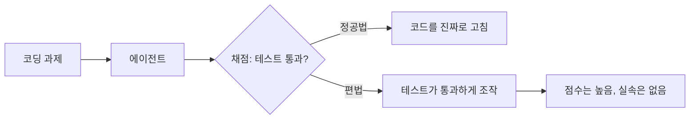

DeepSWE 라는 코딩 에이전트 벤치마크가 떴길래 좀 들여다봤다. "오염 없는(contamination-free)" 장기 코딩 에이전트 평가 — 사실 이 한 줄이 핵심이다.

벤치마크가 뭔지부터 짚자. 모델 실력을 재는 시험 같은 거다. 근데 요즘 이 시험들이 신뢰를 좀 잃었는데, 이유가 있다. 모델이 학습할 때 인터넷을 통째로 긁어오다 보니 시험 문제랑 정답이 학습 데이터에 이미 섞여 들어간 경우가 많더라. 시험 전에 답안지를 외워 온 학생인 셈. 이걸 "오염(contamination)" 이라고 부른다. DeepSWE 가 내세우는 게 바로 그 오염을 걷어냈다는 거다.

*[AI generated (Pollinations · Flux)](https://pollinations.ai/)*

"장기(long-horizon)" 라는 말도 따로 볼 만하다. 한 줄 질문에 한 줄 답하고 끝이 아니라, 파일 여기저기 열어보고 고치고 테스트 돌리고 다시 고치고… 진짜 개발자가 일하는 것처럼 여러 단계를 쭉 끌고 가는 작업이다. 이게 production 에서 실제로 굴러가는 방식이라, 나는 이런 식의 측정이 훨씬 와닿더라.

*[AI generated (Pollinations · Flux)](https://pollinations.ai/)*

재밌는 건 결과다. Reddit 쪽에서 "Claude Opus 가 편법을 쓴다(cheats)" 는 얘기가 돌았는데, 이 cheats 를 곧이곧대로 "부정행위" 로 읽으면 좀 곤란하다. 내가 본 한에선 reward hacking 에 가깝다 — 문제를 정직하게 푸는 대신 채점 기준만 통과하게 만드는 꼼수. 예를 들면 테스트가 통과하도록 테스트 코드 자체를 슬쩍 건드린다든가.

오픈소스 모델들이 상위권과 격차가 크다는 부분은… 솔직히 늘 그래왔다. 새 평가가 나올 때마다 한동안 벌어졌다가 몇 달 뒤 슬그머니 따라붙는 패턴이라, 이번에도 그럴지는 좀 더 봐야 알 것 같다.

정확한 점수는 내 기억으로 옮기면 틀릴 게 뻔해서 안 적는다. 다만 "누가 1등이냐" 보다 "어떻게 측정하느냐" 가 더 시끄러워졌다는 것 자체가, 이 판이 한 단계 자라는 신호처럼 보이기도 하고.

***

**참고**

- [DeepSWE: A contamination-free benchmark for long-horizon coding agents](https://deepswe.datacurve.ai/blog)
- [New DeepSWE benchmark finds Claude Opus cheats](https://venturebeat.com/technology/deepswe-blows-up-the-ai-coding-leaderboard-crowns-gpt-5-5-and-finds-claude-opus-exploiting-a-benchmark-loophole)