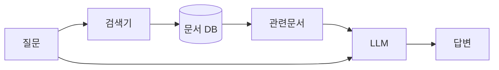

LLM 환각(hallucination) 얘기를 한번 제대로 정리해두고 싶었다. 챗봇한테 뭘 물었는데 너무 자신만만하게 틀린 답을 내놓는 그 현상 — 존재하지도 않는 논문을 저자 이름까지 붙여서 인용한다거나, 있지도 않은 API 함수를 그럴듯하게 지어낸다거나. 나도 제품에 LLM 붙이면서 제일 골치 아픈 게 이거다.

근데 먼저 짚고 싶은 게 있다. 환각은 우리가 흔히 말하는 그런 버그가 아니다.

이게 좀 웃긴 게, GPT 같은 모델이 학습할 때 배우는 건 딱 하나다. "이 다음에 올 단어로 가장 그럴듯한 게 뭐냐." 진실이냐 거짓이냐를 배우는 게 아니라, **문맥상 자연스러운 다음 토큰**을 찍는 거다. 그러니까 모델 입장에선 "파리는 프랑스의 수도다"랑 "파리는 이탈리아의 수도다"가 둘 다 문법적으로, 문체상으로 완벽하게 그럴듯하다. 사실 여부는 애초에 학습 목표에 직접 들어가 있지 않다.

비유하자면, 길에서 길 물어봤을 때 모르면서도 일단 "저쪽으로 쭉 가세요"라고 자신 있게 답하는 사람 같은 거다. 악의가 있어서가 아니라, 대화를 자연스럽게 이어가는 게 그 사람(모델)의 본능이라서.


*[AI generated (Pollinations · Flux)](https://pollinations.ai/)*


원인을 좀 더 쪼개보면 몇 갈래로 나뉜다. 학습 데이터에 없던 걸 물으면(분포 밖 질문) 모델은 빈칸을 그럴듯한 걸로 메운다. 또 방대한 텍스트를 한정된 파라미터 안에 욱여넣는 과정에서 디테일이 뭉개진다 — 사진을 잘게 압축하면 글자가 번지듯이. 거기다 사람 피드백으로 다듬는 RLHF(사람 선호를 학습시키는 후처리 단계)가 오히려 "사용자가 듣고 싶어하는 답"을 잘하게 만들어서, 모르겠다고 솔직히 말하기보다 자신 있게 지어내는 쪽으로 살짝 기울기도 한다. 내가 본 한에선 이 마지막 게 체감상 꽤 크더라.

그럼 어떻게 줄이냐. 완전히 없애는 건 적어도 지금 구조에선 거의 불가능하다고 보는데, 실무에서 제일 효과를 본 건 RAG다. Retrieval-Augmented Generation — 모델이 답하기 전에 관련 문서를 먼저 검색해서 손에 쥐여주는 방식.



오픈북 시험이라고 생각하면 편하다. 머릿속 기억만으로 답하라고 하면 헷갈리지만, 교과서 펴놓고 해당 페이지 보면서 답하라고 하면 틀릴 확률이 확 준다.


*[AI generated (Pollinations · Flux)](https://pollinations.ai/)*


이 외에 손쉽게 쓰는 건 — 답할 때 출처를 같이 달게 시키기, temperature(생성의 무작위성 정도) 낮추기, 근거를 못 찾으면 "모른다"고 하라고 프롬프트에 못 박아두기, 같은 질문을 여러 번 돌려서 답이 흔들리면 의심하기(self-consistency) 정도다.

프롬프트 한 줄로도 의외로 많이 달라진다:

```text
주어진 문서에서 근거를 찾을 수 없으면
지어내지 말고 "문서에 없음"이라고만 답해.
```

물론 이게 마법은 아니다. RAG도 검색이 엉뚱한 문서를 물어오면 거기에 맞춰서 또 그럴듯하게 틀린다. 결국 환각은 "끄는" 문제가 아니라 "관리하는" 문제에 가까운 것 같다. 어디까지 모델을 믿고, 어디서부터 사람이 검수할지 선을 긋는 일. 이게 모델이 더 커진다고 깨끗이 사라질지는, 솔직히 나도 좀 더 지켜봐야 할 것 같다.